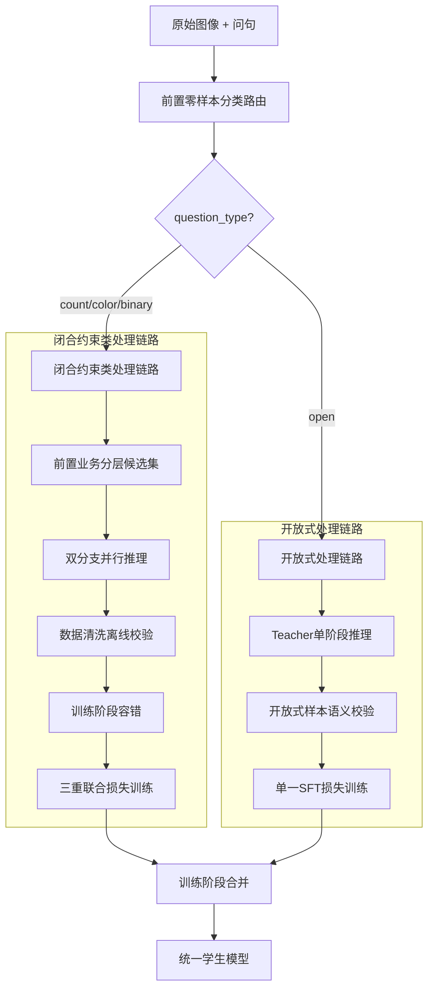

# VQA 数据蒸馏完整技术方案

> 版本：v2.0  
> 更新日期：2026-07-27  
> 状态：已确认

---

## 📋 目录

1. [方案概述](#1-方案概述)
2. [核心洞察：两类问句的差异化处理](#2-核心洞察两类问句的差异化处理)
3. [完整架构设计](#3-完整架构设计)
4. [闭合约束类问句处理链路](#4-闭合约束类问句处理链路)
5. [开放式问句处理链路](#5-开放式问句处理链路)
6. [训练阶段合并](#6-训练阶段合并)
7. [多Token答案处理方案](#7-多token答案处理方案)
8. [数据结构设计](#8-数据结构设计)
9. [关键设计确认](#9-关键设计确认)
10. [避坑规则](#10-避坑规则)

---

## 1. 方案概述

本方案针对VQA（Visual Question Answering）数据蒸馏任务，提出了基于问句类型的差异化处理策略。核心思想是：**根据问句类型的不同，采用完全不同的处理逻辑和蒸馏策略**。

### 核心创新点

1. **前置分类路由**：使用零样本分类器（bart-large-mnli）先判断问句类型
2. **差异化处理**：闭合约束类和开放式问句走完全不同的处理链路
3. **多Token答案支持**：完整的多Token答案概率计算方案
4. **四层防护体系**：前置分类 → 候选集限定 → 双分支推理 → 训练容错

---

## 2. 核心洞察：两类问句的差异化处理

### 维度对比

| 维度 | 闭合约束类 | 开放式 |
|------|-----------|--------|
| **问句类型** | 计数/颜色/是非 | 描述/物体识别/开放式问答 |
| **答案空间** | 有限封闭集（几十个词） | 无限开放集（整个词表） |
| **软标签生成** | ✅ 需要（分类分布） | ❌ 不需要 |
| **CoT生成** | ✅ 需要（推理过程） | ❌ 不需要（或简化版） |
| **蒸馏损失** | CE + KL + SFT 三重损失 | 仅 SFT 单一损失 |
| **校验方式** | 闭合集token校验 | 语义校验（幻觉/长度/重复） |

### 为什么需要区分？

**闭合约束类问句**：
- 答案空间有限且明确（如计数：zero, one, two...）
- 可以构建候选答案集，引导模型生成精准的logits
- 软标签分布有明确意义（表示模型对不同答案的不确定性）

**开放式问句**：
- 答案空间无限（可以是任意文本描述）
- 无法构建有效候选集，候选集可能遗漏正确答案
- 软标签分布无意义（无法枚举所有可能答案）

---

## 3. 完整架构设计



### ASCII架构图

```
┌─────────────────────────────────────────────────────────────────────────────────┐
│                           VQA 数据蒸馏流水线                                      │
├─────────────────────────────────────────────────────────────────────────────────┤
│                                                                                 │
│                        ┌─────────────────┐                                      │
│                        │  原始图像 + 问句  │                                      │
│                        └────────┬────────┘                                      │
│                                 ↓                                               │
│              ┌──────────────────────────────────────────┐                       │
│              │  【第零层】前置零样本分类路由（bart-large-mnli）│                       │
│              │  classify_question(question)              │                       │
│              └──────────────────────────────────┬───────┘                       │
│                                                 ↓                               │
│                           ┌─────────────────────────────────────┐               │
│                           │  question_type = count|color|binary|open|           │
│                           └─────────────────────────────────────┘               │
│                                    ↓                ↓                           │
│                    ┌───────────────┴───────┐    ┌──┴──────────────┐            │
│                    ↓                       ↓    ↓                 ↓            │
│         ┌──────────────────┐    ┌──────────────────┐    ┌──────────────────┐   │
│         │     计数问句      │    │     颜色问句      │    │     是非问句      │   │
│         │ question_type=    │    │ question_type=    │    │ question_type=    │   │
│         │     'count'       │    │     'color'       │    │     'binary'      │   │
│         └────────┬─────────┘    └────────┬─────────┘    └────────┬─────────┘   │
│                  │                       │                       │              │
│                  └───────────────────────┬───────────────────────┘              │
│                                          ↓                                      │
│                    ┌─────────────────────────────────────────┐                  │
│                    │     【闭合约束类问句处理链路】              │                  │
│                    │  question_type ∈ {count, color, binary}  │                  │
│                    └─────────────────────────────────────────┘                  │
│                                          │                                      │
│                                          ↓                                      │
│         ┌────────────────────────────────────────────────────────────────────┐  │
│         │                    第一层：前置业务分层候选集                        │  │
│         │  ┌──────────────┐  ┌──────────────┐  ┌──────────────┐             │  │
│         │  │ 计数候选集    │  │ 颜色候选集    │  │ 是非候选集    │             │  │
│         │  │ ['zero',     │  │ ['red',      │  │ ['yes',      │             │  │
│         │  │  'one', ...] │  │  'green'...] │  │  'no']       │             │  │
│         │  └──────────────┘  └──────────────┘  └──────────────┘             │  │
│         └────────────────────────────────────────────────────────────────────┘  │
│                                          │                                      │
│                                          ↓                                      │
│         ┌────────────────────────────────────────────────────────────────────┐  │
│         │                    第二层：双分支并行推理                            │  │
│         │                                                                    │  │
│         │     Teacher Model 推理                                             │  │
│         │           ↓                                                        │  │
│         │   ┌───────────────┐         ┌───────────────┐                      │  │
│         │   │ 分支A：闭合集  │         │ 分支B：全局    │                      │  │
│         │   │ 提取候选集logits│        │ 保留全部logits │                      │  │
│         │   │ 生成软硬标签   │         │ 记录global_top1│                      │  │
│         │   └───────────────┘         └───────────────┘                      │  │
│         │           ↓                           ↓                            │  │
│         │           └───────────┬───────────────┘                            │  │
│         │                       ↓                                              │  │
│         │              ┌─────────────────────┐                                 │  │
│         │              │ global_top1 ∈       │                                 │  │
│         │              │ allowed_answers?    │                                 │  │
│         │              └─────────────────────┘                                 │  │
│         │                  ↓           ↓                                        │  │
│         │               [是]         [否]                                       │  │
│         │                ↓            ↓                                         │  │
│         │          正常生成CoT   拦截+写入脏样本日志                              │  │
│         └────────────────────────────────────────────────────────────────────┘  │
│                                          │                                      │
│                                          ↓                                      │
│         ┌────────────────────────────────────────────────────────────────────┐  │
│         │                    第三层：数据清洗离线校验                          │  │
│         │  漏标样本回流 → 人工复核 → 扩充候选集 → 重新推理                      │  │
│         └────────────────────────────────────────────────────────────────────┘  │
│                                          │                                      │
│                                          ↓                                      │
│         ┌────────────────────────────────────────────────────────────────────┐  │
│         │                    第四层：训练阶段容错                              │  │
│         │  DataCollator检查 hard_label ∈ allowed_answers                     │  │
│         │  不在则跳过样本，不参与loss计算                                       │  │
│         └────────────────────────────────────────────────────────────────────┘  │
│                                          │                                      │
│                                          ↓                                      │
│         ┌────────────────────────────────────────────────────────────────────┐  │
│         │                    【闭合类样本训练】                                │  │
│         │                                                                    │  │
│         │  Loss_total = α * CE(hard_label) + β * KL(soft_label) + γ * CoT   │  │
│         │                                                                    │  │
│         │  三重联合损失：                                                     │  │
│         │  - CE硬标签损失（仅闭合集token）                                    │  │
│         │  - KL软标签分布蒸馏                                                 │  │
│         │  - CoT三段式SFT推理损失                                             │  │
│         └────────────────────────────────────────────────────────────────────┘  │
│                                                                                 │
│                                                                                 │
│         ┌────────────────────────────────────────────────────────────────────┐  │
│         │                    【开放式问句处理链路】                            │  │
│         │  question_type = 'open'                                             │  │
│         └────────────────────────────────────────────────────────────────────┘  │
│                                          │                                      │
│                                          ↓                                      │
│         ┌────────────────────────────────────────────────────────────────────┐  │
│         │                    Teacher单阶段推理                                 │  │
│         │                                                                    │  │
│         │  Prompt: "Question: {question}                                     │  │
│         │           Rules: Answer truthfully, no word limit"                 │  │
│         │                                                                    │  │
│         │  输出：自由文本回答（无软硬标签，无CoT）                              │  │
│         └────────────────────────────────────────────────────────────────────┘  │
│                                          │                                      │
│                                          ↓                                      │
│         ┌────────────────────────────────────────────────────────────────────┐  │
│         │                    开放式样本语义校验                                │  │
│         │                                                                    │  │
│         │  1. 长度过滤：8 < len(answer) < 300 tokens                          │  │
│         │  2. 幻觉过滤：文本描述与图像冲突检测                                 │  │
│         │  3. 重复过滤：大面积重复语句丢弃                                     │  │
│         └────────────────────────────────────────────────────────────────────┘  │
│                                          │                                      │
│                                          ↓                                      │
│         ┌────────────────────────────────────────────────────────────────────┐  │
│         │                    【开放式样本训练】                                │  │
│         │                                                                    │  │
│         │  Loss_open = SFT(answer)                                           │  │
│         │                                                                    │  │
│         │  仅单一SFT损失：                                                     │  │
│         │  - 输入：图像 + 问题                                                │  │
│         │  - 监督：教师输出的自由回答文本                                       │  │
│         │  - 无闭合集token截断                                                │  │
│         └────────────────────────────────────────────────────────────────────┘  │
│                                                                                 │
│                                                                                 │
│         ┌────────────────────────────────────────────────────────────────────┐  │
│         │                    【训练阶段合并】                                  │  │
│         │                                                                    │  │
│         │  两类样本交替采样，加权融合损失：                                     │  │
│         │                                                                    │  │
│         │  Loss_total = w_close * (α*CE + β*KL + γ*CoT) + w_open * SFT       │  │
│         │                                                                    │  │
│         │  一个学生模型同时支持：                                              │  │
│         │  - 约束型VQA（计数/颜色/是非）                                       │  │
│         │  - 开放型VQA（描述/物体识别）                                        │  │
│         └────────────────────────────────────────────────────────────────────┘  │
│                                                                                 │
└─────────────────────────────────────────────────────────────────────────────────┘
```

---

## 4. 闭合约束类问句处理链路

闭合约束类问句包括：计数（count）、颜色（color）、是非（binary）三类。这类问句的答案是有限且明确的，可以构建候选答案集进行引导。

### 4.1 第一层：前置业务分层候选集

根据问句类型，预先定义候选答案集：

```yaml
# configs/candidate_sets.yaml
candidate_sets:
  count:
    answers: ['zero', 'one', 'two', 'three', 'four', 'five', 'six', 'seven', 'eight', 'nine', 'ten']
    max_answers: 11
    
  color:
    answers: ['red', 'blue', 'green', 'yellow', 'orange', 'purple', 'pink', 'black', 'white', 'brown', 'gray']
    max_answers: 11
    
  binary:
    answers: ['yes', 'no']
    max_answers: 2
```

### 4.2 第二层：双分支并行推理

#### 分支A：闭合集提取候选集logits

```python
def inference_with_candidate_closure(
    model,
    image,
    question,
    candidate_answers,
    temperature=4.0
):
    """
    闭合集推理：提取候选答案的logits
    
    Args:
        model: Teacher模型
        image: 输入图像
        question: 问题文本
        candidate_answers: 候选答案列表
        temperature: 温度参数
    
    Returns:
        hard_label: 硬标签
        soft_label: 软标签分布
    """
    # Step 1: 推理并保存每步logits
    outputs = model.generate(
        image=image,
        prompt=question,
        max_new_tokens=max_token_length,
        output_scores=True,
        return_dict_in_generate=True,
        temperature=0.0  # 贪婪解码
    )
    
    # Step 2: 计算每个候选答案的联合logit
    joint_logits = compute_joint_logits(
        outputs.scores,
        candidate_answers,
        answer_token_map
    )
    
    # Step 3: 归一化得到软标签
    hard_label, soft_label = compute_soft_label(joint_logits, temperature)
    
    return hard_label, soft_label
```

#### 分支B：全局开放校验

```python
def global_validation(outputs, allowed_answers):
    """
    全局校验：检查global_top1是否在候选集中
    
    Args:
        outputs: 模型输出
        allowed_answers: 候选答案集
    
    Returns:
        is_valid: 是否有效
        global_top1: 全局最高概率答案
    """
    global_top1 = decode(outputs.sequences[0])
    
    is_valid = global_top1.lower() in [a.lower() for a in allowed_answers]
    
    if not is_valid:
        log_dirty_sample(
            global_top1=global_top1,
            allowed_answers=allowed_answers,
            reason="global_top1_not_in_allowed_set"
        )
    
    return is_valid, global_top1
```

### 4.3 第三层：数据清洗离线校验

对于漏标样本（global_top1不在候选集中），执行离线校验：

```python
class OfflineValidator:
    """离线校验器"""
    
    def __init__(self):
        self.dirty_samples = []
        self.new_candidates = defaultdict(int)
    
    def validate(self, samples):
        """校验样本"""
        for sample in samples:
            if not sample['validation']['is_valid']:
                self.dirty_samples.append(sample)
                
                # 记录漏标答案
                global_top1 = sample['validation']['global_top1']
                self.new_candidates[global_top1] += 1
    
    def generate_candidate_expansion_report(self):
        """生成候选集扩充报告"""
        return {
            'dirty_samples_count': len(self.dirty_samples),
            'candidate_expansion_suggestions': [
                {'answer': ans, 'count': count}
                for ans, count in sorted(
                    self.new_candidates.items(),
                    key=lambda x: x[1],
                    reverse=True
                )
                if count >= 3  # 出现3次以上建议扩充
            ]
        }
```

### 4.4 第四层：训练阶段容错

```python
class VQADataCollator:
    """VQA数据收集器"""
    
    def __call__(self, batch):
        """处理批次数据"""
        valid_samples = []
        
        for sample in batch:
            # 检查hard_label是否在allowed_answers中
            hard_label = sample.get('hard_label', {}).get('answer')
            allowed_answers = sample.get('soft_label', {}).get('allowed_answers', [])
            
            if hard_label and allowed_answers:
                if hard_label.lower() not in [a.lower() for a in allowed_answers]:
                    logger.warning(
                        f"Sample {sample['image_id']} filtered: "
                        f"hard_label '{hard_label}' not in allowed_answers"
                    )
                    continue
            
            valid_samples.append(sample)
        
        return valid_samples
```

---

## 5. 开放式问句处理链路

开放式问句包括：描述（description）、物体识别（object recognition）、开放式问答（open-ended QA）等。这类问句的答案空间无限，无法构建有效候选集。

### 5.1 Teacher单阶段推理

```python
def inference_open_question(
    model,
    image,
    question
):
    """
    开放式问句推理：生成自由文本回答
    
    Args:
        model: Teacher模型
        image: 输入图像
        question: 问题文本
    
    Returns:
        answer: 自由文本回答
    """
    prompt = f"""Question: {question}
    
Rules:
- Answer truthfully based on the image
- No word limit
- Be specific and detailed"""

    outputs = model.generate(
        image=image,
        prompt=prompt,
        max_new_tokens=300,
        temperature=0.7,  # 开放式问句可以使用稍高温度
        top_p=0.9
    )
    
    answer = decode(outputs.sequences[0])
    
    return {'answer': answer}
```

### 5.2 开放式样本语义校验

#### 长度过滤

```python
def validate_length(answer, min_tokens=8, max_tokens=300):
    """长度过滤"""
    token_count = len(tokenizer.encode(answer))
    
    if token_count < min_tokens:
        return False, "Answer too short"
    
    if token_count > max_tokens:
        return False, "Answer too long"
    
    return True, "OK"
```

#### 幻觉过滤

```python
def detect_hallucination(image, answer_text, threshold=0.3):
    """
    检测开放式回答中的幻觉
    
    原理：
    1. 提取回答中的关键物体词（名词）
    2. 用CLIP计算图像与每个物体的相似度
    3. 如果相似度过低，判定为幻觉
    """
    # Step 1: 提取关键词（使用词性标注）
    nouns = extract_nouns(answer_text)  # ['car', 'dog', 'tree', ...]
    
    # Step 2: 用CLIP计算相似度
    clip_model = load_clip_model()
    image_features = clip_model.encode_image(image)
    
    hallucination_score = 0
    for noun in nouns:
        text_features = clip_model.encode_text(noun)
        similarity = cosine_similarity(image_features, text_features)
        
        if similarity < threshold:  # 相似度过低
            hallucination_score += 1
    
    # Step 3: 计算幻觉比例
    hallucination_ratio = hallucination_score / len(nouns) if nouns else 0
    
    return hallucination_ratio > 0.5  # 超过50%的词是幻觉
```

#### 重复过滤

```python
def detect_repetition(answer, max_repeat_ratio=0.3):
    """检测大面积重复"""
    words = answer.split()
    
    # 检测连续重复
    consecutive_repeats = 0
    for i in range(1, len(words)):
        if words[i] == words[i-1]:
            consecutive_repeats += 1
    
    repeat_ratio = consecutive_repeats / len(words) if words else 0
    
    return repeat_ratio > max_repeat_ratio
```

---

## 6. 训练阶段合并

### 6.1 混合数据集

```python
class MixedVQADataset:
    """混合VQA数据集：闭合类 + 开放类"""
    
    def __init__(self, close_samples, open_samples, close_ratio=0.6):
        """
        Args:
            close_samples: 闭合类样本列表
            open_samples: 开放类样本列表
            close_ratio: 闭合类样本采样比例（默认60%）
        """
        self.close_samples = close_samples
        self.open_samples = open_samples
        self.close_ratio = close_ratio
    
    def __getitem__(self, idx):
        # 交替采样
        if random.random() < self.close_ratio:
            sample = random.choice(self.close_samples)
            sample['loss_type'] = 'close'  # 三重损失
        else:
            sample = random.choice(self.open_samples)
            sample['loss_type'] = 'open'   # 单一SFT损失
        
        return sample
    
    def __len__(self):
        return max(len(self.close_samples), len(self.open_samples))
```

### 6.2 混合损失函数

```python
def compute_mixed_loss(batch, model, close_weight=0.6, open_weight=0.4):
    """
    混合损失计算
    
    Args:
        batch: 包含close和open两类样本
        model: 学生模型
        close_weight: 闭合类损失权重
        open_weight: 开放类损失权重
    
    Returns:
        total_loss: 总损失
    """
    close_samples = [s for s in batch if s['question_type'] == 'close']
    open_samples = [s for s in batch if s['question_type'] == 'open']
    
    total_loss = 0
    
    # 闭合类样本：三重损失
    if close_samples:
        ce_loss = compute_ce_loss(close_samples, model)
        kl_loss = compute_kl_loss(close_samples, model)
        cot_loss = compute_cot_loss(close_samples, model)
        
        # α=0.3, β=0.3, γ=0.4
        close_loss = 0.3 * ce_loss + 0.3 * kl_loss + 0.4 * cot_loss
        total_loss += close_weight * close_loss
    
    # 开放类样本：单一SFT损失
    if open_samples:
        sft_loss = compute_sft_loss(open_samples, model)
        total_loss += open_weight * sft_loss
    
    return total_loss
```

---

## 7. 多Token答案处理方案

### 7.1 问题分析

原有方案只取第一个token的logits，对于多Token答案存在致命缺陷：

**示例**：
- 问题：What food is this?
- 真实答案：hotdog
- 模型分词：hotdog → ["hot", "dog"]

**❌ 原有方案**：
- 只取第一个token "hot" 的概率
- 可能错误匹配到 "hot" (形容词)
- soft_label 分布失真

**✅ 改进方案**：
- 计算完整序列联合概率 P("hot") × P("dog"|"hot")
- 准确代表 "hotdog" 的概率

### 7.2 完整处理流程

```
┌─────────────────────────────────────────────────────────────────────────────────┐
│                      多 Token 答案处理流程                                        │
├─────────────────────────────────────────────────────────────────────────────────┤
│                                                                                 │
│  ┌─────────────────────────────────────────────────────────────────────────┐   │
│  │               Step 1: 预处理 - 建立映射表                                 │   │
│  │                                                                         │   │
│  │   allowed_answers = ['yes', 'no', 'red', 'hotdog', 'kitchen', ...]      │   │
│  │                              ↓                                          │   │
│  │   answer_token_map = {                                                  │   │
│  │       'yes': [8677],              # 单Token                             │   │
│  │       'no': [1274],               # 单Token                             │   │
│  │       'red': [2232],              # 单Token                             │   │
│  │       'hotdog': [3456, 2345],     # 多Token: ["hot", "dog"]             │   │
│  │       'kitchen': [5678, 9012],    # 多Token: ["kitch", "en"]            │   │
│  │       'twenty': [7890, 1234],     # 多Token: ["twen", "ty"]             │   │
│  │   }                                                                     │   │
│  └─────────────────────────────────────────────────────────────────────────┘   │
│                                      ↓                                          │
│  ┌─────────────────────────────────────────────────────────────────────────┐   │
│  │               Step 2: 推理 - 保存每一步logits                             │   │
│  │                                                                         │   │
│  │   Teacher Model 推理配置:                                               │   │
│  │   - output_scores=True          # 保存每步logits                        │   │
│  │   - return_dict_in_generate=True # 返回完整生成信息                      │   │
│  │   - max_new_tokens=N            # N ≥ 最长答案的token数                  │   │
│  │                                                                         │   │
│  │   输出结构:                                                             │   │
│  │   outputs.scores = [                                                    │   │
│  │       step_0_logits,  # shape: [vocab_size]                             │   │
│  │       step_1_logits,  # shape: [vocab_size]                             │   │
│  │       step_2_logits,  # shape: [vocab_size]                             │   │
│  │       ...                                                               │   │
│  │   ]                                                                     │   │
│  └─────────────────────────────────────────────────────────────────────────┘   │
│                                      ↓                                          │
│  ┌─────────────────────────────────────────────────────────────────────────┐   │
│  │               Step 3: 计算联合对数概率                                    │   │
│  │                                                                         │   │
│  │   遍历每个候选答案:                                                       │   │
│  │                                                                         │   │
│  │   单Token答案 (如 'yes'):                                               │   │
│  │       token_ids = [8677]                                                │   │
│  │       score = outputs.scores[0][8677]                                   │   │
│  │                                                                         │   │
│  │   多Token答案 (如 'hotdog'):                                            │   │
│  │       token_ids = [3456, 2345]  # ["hot", "dog"]                        │   │
│  │       score_0 = outputs.scores[0][3456]                                 │   │
│  │       score_1 = outputs.scores[1][2345]                                 │   │
│  │       total_score = score_0 + score_1                                   │   │
│  └─────────────────────────────────────────────────────────────────────────┘   │
│                                      ↓                                          │
│  ┌─────────────────────────────────────────────────────────────────────────┐   │
│  │               Step 4: 归一化得到软标签分布                                │   │
│  │                                                                         │   │
│  │   logits = [2.34, -1.56, 1.89, -0.45]                                  │   │
│  │   logits_scaled = logits / temperature                                  │   │
│  │   soft_label = softmax(logits_scaled)                                  │   │
│  │                                                                         │   │
│  │   soft_label = {                                                        │   │
│  │       'yes': 0.62,                                                      │   │
│  │       'no': 0.05,                                                       │   │
│  │       'hotdog': 0.30,                                                   │   │
│  │       'kitchen': 0.03                                                   │   │
│  │   }                                                                     │   │
│  │                                                                         │   │
│  │   hard_label = 'yes'  # 概率最高的答案                                  │   │
│  └─────────────────────────────────────────────────────────────────────────┘   │
│                                                                                 │
└─────────────────────────────────────────────────────────────────────────────────┘
```

### 7.3 实现代码

#### Step 1: 建立映射表

```python
class CandidateAnswerMapper:
    """候选答案映射器"""
    
    def __init__(self, allowed_answers, tokenizer):
        self.tokenizer = tokenizer
        self.answer_token_map = {}
        self.single_token_answers = []
        self.multi_token_answers = []
        
        self._build_mapping(allowed_answers)
    
    def _build_mapping(self, allowed_answers):
        """建立「完整答案字符串 ↔ 子Token序列」映射"""
        for answer in allowed_answers:
            token_ids = self.tokenizer.encode(answer, add_special_tokens=False)
            self.answer_token_map[answer] = token_ids
            
            if len(token_ids) == 1:
                self.single_token_answers.append(answer)
            else:
                self.multi_token_answers.append(answer)
        
        logger.info(f"候选答案映射完成:")
        logger.info(f"  单Token答案: {len(self.single_token_answers)}个")
        logger.info(f"  多Token答案: {len(self.multi_token_answers)}个")
        logger.info(f"  最长答案长度: {max(len(ids) for ids in self.answer_token_map.values())} tokens")
```

#### Step 2: 推理并保存logits

```python
def inference_with_step_logits(
    model,
    image,
    prompt,
    max_new_tokens=10
):
    """
    推理并保存每一步的logits
    
    Args:
        image: 输入图像
        prompt: 输入提示
        max_new_tokens: 最大生成长度（需 ≥ 最长答案token数）
    
    Returns:
        outputs: 包含每步logits的输出
    """
    outputs = model.generate(
        image=image,
        prompt=prompt,
        max_new_tokens=max_new_tokens,
        output_scores=True,              # ✅ 保存每步logits
        return_dict_in_generate=True,    # ✅ 返回完整字典
        temperature=0.0                  # 贪婪解码
    )
    
    return outputs
```

#### Step 3: 计算联合对数概率

```python
def compute_joint_logits(
    step_logits_list,
    allowed_answers,
    answer_token_map,
    temperature=4.0
):
    """
    计算所有候选答案的联合对数概率
    
    Args:
        step_logits_list: 每步的logits列表
        allowed_answers: 候选答案列表
        answer_token_map: 答案到token ids的映射
        temperature: 温度参数
    
    Returns:
        答案到logit的映射字典
    """
    result = {}
    
    for answer in allowed_answers:
        token_ids = answer_token_map[answer]
        
        if len(token_ids) == 1:
            # 单Token：取第一步对应token的logit
            logit = step_logits_list[0][token_ids[0]].item()
            result[answer] = logit
        else:
            # 多Token：计算联合对数概率
            total_logit = 0.0
            
            for step, token_id in enumerate(token_ids):
                if step < len(step_logits_list):
                    logit = step_logits_list[step][token_id].item()
                    total_logit += logit
                else:
                    # 超出长度，赋极小值
                    total_logit = -100.0
                    break
            
            result[answer] = total_logit
    
    return result
```

#### Step 4: 归一化得到软标签

```python
def compute_soft_label(joint_logits, temperature=4.0):
    """
    归一化得到软标签分布和硬标签
    
    Args:
        joint_logits: 答案到logit的映射
        temperature: 温度参数
    
    Returns:
        hard_label: 硬标签（概率最高的答案）
        soft_label: 软标签分布
    """
    import torch.nn.functional as F
    
    # 转换为tensor
    answers = list(joint_logits.keys())
    logits = torch.tensor([joint_logits[a] for a in answers])
    
    # 温度缩放
    logits_scaled = logits / temperature
    
    # Softmax归一化
    probs = F.softmax(logits_scaled, dim=0)
    
    # 构建软标签分布
    soft_label = {a: probs[i].item() for i, a in enumerate(answers)}
    
    # 硬标签
    hard_label_idx = probs.argmax().item()
    hard_label = answers[hard_label_idx]
    
    return hard_label, soft_label
```

### 7.4 边界约束

```python
# ✅ 截断长度限制
max_new_tokens = max(len(token_ids) for token_ids in answer_token_map.values())

# ✅ 子词序列强匹配
if len(token_ids) > len(step_logits_list):
    joint_logits[answer] = -100.0  # 无法计算完整序列

# ✅ 过滤无效序列
for step, token_id in enumerate(token_ids):
    prob = softmax(step_logits_list[step])[token_id]
    if prob < 1e-6:  # 概率极低
        joint_logits[answer] = -100.0
        break
```

---

## 8. 数据结构设计

### 8.1 闭合类样本数据格式

```json
{
  "image_id": "COCO_val2014_000000123456",
  "image_path": "data/coco/val2014/COCO_val2014_000000123456.jpg",
  "question": "How many people are wearing headphones?",
  "question_type": "close",
  "subtype": "count",
  
  "classification": {
    "type": "count",
    "confidence": 0.95
  },
  
  "allowed_answers": ["zero", "one", "two", "three", "four", "five"],
  
  "hard_label": {
    "answer": "two",
    "confidence": 0.92
  },
  
  "soft_label": {
    "distribution": {
      "one": 0.08,
      "two": 0.85,
      "three": 0.05,
      "four": 0.02
    },
    "temperature": 4.0
  },
  
  "cot": {
    "reasoning": "Looking at the image, I can see...",
    "steps": ["...", "...", "..."]
  },
  
  "validation": {
    "global_top1": "two",
    "global_top1_prob": 0.92,
    "is_valid": true
  }
}
```

### 8.2 开放式样本数据格式

```json
{
  "image_id": "COCO_val2014_000000789012",
  "image_path": "data/coco/val2014/COCO_val2014_000000789012.jpg",
  "question": "What is the person doing in this image?",
  "question_type": "open",
  
  "classification": {
    "type": "open",
    "confidence": 0.65
  },
  
  "answer": "The person is sitting on a bench in the park, reading a book while wearing a red jacket.",
  
  "validation": {
    "length_tokens": 23,
    "is_hallucination": false,
    "is_repetitive": false,
    "is_valid": true
  }
}
```

---

## 9. 关键设计确认

### 9.1 ✅ 闭合类问句：四层防护体系

1. **第一层**：前置业务分层候选集
2. **第二层**：双分支并行推理（分支A + 分支B）
3. **第三层**：数据清洗离线校验
4. **第四层**：训练阶段容错

### 9.2 ✅ 开放式问句：无约束SFT

关键点：
- ❌ 不使用闭合候选集 - 避免正确答案不在集合的问题
- ✅ 仅做SFT训练 - 无KL/CE分类损失
- ✅ 语义校验代替token校验 - 幻觉/长度/重复过滤

### 9.3 ✅ 数据隔离与标记

```json
{
  "question_type": "close",  // 或 "open"
  "subtype": "count",        // 仅close类型有
  ...
}
```

### 9.4 ✅ 多Token答案处理

关键设计点：
- ✅ 预处理映射表 - 建立「完整答案 ↔ Token序列」映射
- ✅ 保存每步logits - `output_scores=True`
- ✅ 联合对数概率 - 多Token答案需要序列相加
- ✅ 边界约束 - 截断长度、强匹配、过滤无效序列

---

## 10. 避坑规则

### ❌ 绝对禁止

1. **❌ 绝对不对开放式问句使用闭合候选集**
   - 原因：开放式问句答案空间无限，候选集必然遗漏正确答案
   - 后果：学生模型学习到错误的知识

2. **❌ 闭合类问句不放开约束**
   - 原因：闭合类问句答案空间有限，放开约束会引入噪声
   - 后果：软标签分布失真，蒸馏效果下降

3. **❌ 不对开放式问句生成软标签**
   - 原因：无法枚举所有可能答案，软标签无意义
   - 后果：KL散度计算错误，训练失败

### ✅ 必须遵守

1. **✅ 两类样本全程数据隔离生成**
   - 从分类开始就分开
   - 存储时标记`question_type`
   - 训练时根据类型走不同loss逻辑

2. **✅ 训练时根据 question_type 走不同loss逻辑**
   ```python
   if sample['question_type'] == 'close':
       loss = compute_close_loss(sample)
   else:
       loss = compute_open_loss(sample)
   ```

3. **✅ 多Token答案必须计算联合概率**
   - 单Token：直接取logit
   - 多Token：序列相加得到联合logit

---

## 附录A：配置文件示例

```yaml
# configs/distillation_config.yaml
distillation:
  # 前置分类配置
  question_classifier:
    model: "models/bart-large-mnli"
    device: "cuda"
    
  # 闭合约束类问句配置
  close_questions:
    enabled: true
    types: ['count', 'color', 'binary']
    
    # 候选集配置
    candidate_sets:
      count: ['zero', 'one', 'two', 'three', 'four', 'five', 'six', 'seven', 'eight', 'nine', 'ten']
      color: ['red', 'blue', 'green', 'yellow', 'orange', 'purple', 'pink', 'black', 'white', 'brown', 'gray']
      binary: ['yes', 'no']
    
    # 软标签配置
    soft_labels:
      enabled: true
      temperature: 4.0
      
    # CoT配置
    cot:
      enabled: true
      max_length: 512
      
  # 开放式问句配置
  open_questions:
    enabled: true
    
    # 语义校验配置
    validation:
      min_length_tokens: 8
      max_length_tokens: 300
      hallucination_detection: true
      hallucination_threshold: 0.3
      
  # 训练配置
  training:
    close_weight: 0.6
    open_weight: 0.4
    
    # 损失权重（闭合类）
    close_loss_weights:
      ce: 0.3
      kl: 0.3
      cot: 0.4
```

---

## 附录B：代码文件结构

```
src/
├── distillation/
│   ├── __init__.py
│   ├── distiller.py                    # 主蒸馏器
│   ├── hard_label_gen.py               # 硬标签生成
│   ├── vqa_soft_label_gen.py           # VQA软标签生成
│   ├── cot_generator.py                # CoT生成
│   ├── question_classifier.py          # 问句分类器
│   └── candidate_closure.py            # 候选集封闭
│
├── preprocessing/
│   ├── __init__.py
│   ├── candidate_mapper.py             # 候选答案映射器
│   └── multi_token_handler.py          # 多Token答案处理
│
├── training/
│   ├── __init__.py
│   ├── mixed_dataset.py                # 混合数据集
│   ├── loss_functions.py               # 损失函数
│   └── data_collator.py                # 数据收集器
│
└── utils/
    ├── __init__.py
    ├── validation.py                   # 校验工具
    └── hallucination_detector.py       # 幻觉检测
```

---

**文档结束**

> 最后更新：2026-07-27  
> 维护者：VQA数据蒸馏团队