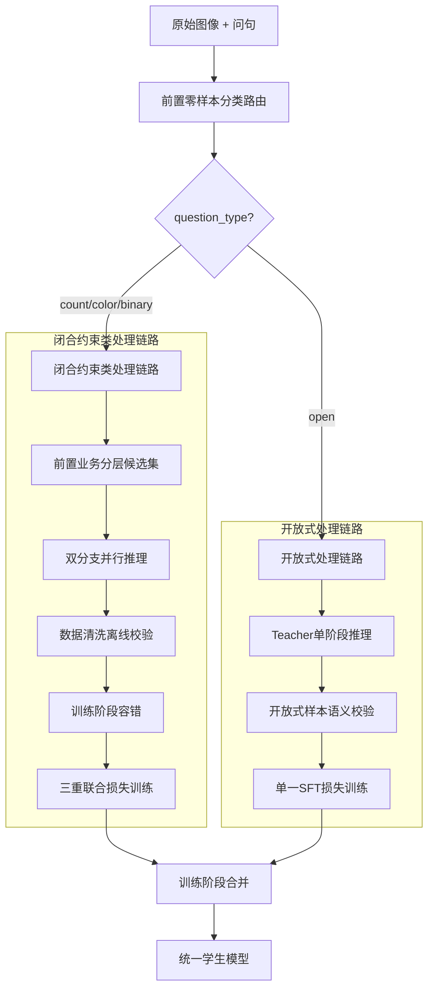

# VQA 数据蒸馏完整技术方案

> 版本：v3.1
> 更新日期：2026-07-29
> 状态：已确认 - 基于代码实现更新
>
> **🔧 v3.1 更新内容（2026-07-29）**：
> 1. 修复开放问题答案截断问题（teacher_model.py）
> 2. 新增开放问题正则清洗流程（open_answer_cleaner.py）
> 3. 更新架构图，反映完整的清洗链路
> 4. 新增答案完整性保护机制  

---

## 📋 目录

1. [方案概述](#1-方案概述)
2. [核心洞察：两类问句的差异化处理](#2-核心洞察两类问句的差异化处理)
3. [完整架构设计](#3-完整架构设计)
4. [闭合约束类问句处理链路](#4-闭合约束类问句处理链路)
5. [开放式问句处理链路](#5-开放式问句处理链路)
6. [数据输出结构](#6-数据输出结构)
7. [多Token答案处理方案](#7-多token答案处理方案)
8. [问题分类器详细设计](#8-问题分类器详细设计)
9. [候选集封闭模块](#9-候选集封闭模块)
10. [开放问答处理逻辑（官方标准）](#10-开放问答处理逻辑官方标准)
11. [关键设计确认](#11-关键设计确认)
12. [避坑规则](#12-避坑规则)
13. [代码实现概览](#13-代码实现概览)
14. [与开源千问蒸馏模型对比](#14-与开源千问蒸馏模型对比)
15. [优化建议](#15-优化建议)

---

## 1. 方案概述

本方案针对VQA（Visual Question Answering）数据蒸馏任务，提出了基于问句类型的差异化处理策略。核心思想是：**根据问句类型的不同，采用完全不同的处理逻辑和蒸馏策略**。

### 核心创新点

1. **前置分类路由**：使用零样本分类器（bart-large-mnli）先判断问句类型
2. **差异化处理**：闭合约束类和开放式问句走完全不同的处理链路
3. **多Token答案支持**：完整的多Token答案概率计算方案
4. **四层防护体系**：前置分类 → 候选集限定 → 双分支推理 → 训练容错

---

## 2. 核心洞察：两类问句的差异化处理

### 维度对比

| 维度 | 闭合约束类 | 开放式 |
|------|-----------|--------|
| **问句类型** | 计数/颜色/是非 | 描述/物体识别/开放式问答 |
| **答案空间** | 有限封闭集（几十个词） | 无限开放集（整个词表） |
| **软标签生成** | ✅ 需要（分类分布） | ❌ 不需要 |
| **CoT生成** | ✅ 需要（推理过程） | ❌ 不需要（或简化版） |
| **蒸馏损失** | CE + KL + SFT 三重损失 | 仅 SFT 单一损失 |
| **校验方式** | 闭合集token校验 | 语义校验（幻觉/长度/重复） |

### 为什么需要区分？

**闭合约束类问句**：
- 答案空间有限且明确（如计数：zero, one, two...）
- 可以构建候选答案集，引导模型生成精准的logits
- 软标签分布有明确意义（表示模型对不同答案的不确定性）

**开放式问句**：
- 答案空间无限（可以是任意文本描述）
- 无法构建有效候选集，候选集可能遗漏正确答案
- 软标签分布无意义（无法枚举所有可能答案）

---

## 3. 完整架构设计



### ASCII架构图（实际代码实现）

```
┌─────────────────────────────────────────────────────────────────────────────────┐
│                           VQA 数据蒸馏流水线（实际代码架构）                        │
├─────────────────────────────────────────────────────────────────────────────────┤
│                                                                                 │
│                        ┌─────────────────┐                                      │
│                        │  原始图像 + 问句  │                                      │
│                        └────────┬────────┘                                      │
│                                 ↓                                               │
│         ┌───────────────────────────────────────────────────────────┐           │
│         │  【第零层】分层问题分类器（QuestionClassifier）               │           │
│         │  第一层：规则匹配（CPU，优先级高）                            │           │
│         │    - 因果推理问句（why/what reason/how come）→ 强制开放      │           │
│         │    - 描述类问句（describe/what can you see）→ 强制开放       │           │
│         │    - 闭合问句（how many/what color/is there）→ 闭合          │           │
│         │  第二层：BART-MNLI模型兜底（仅处理规则未命中样本）             │           │
│         │    - 置信度 < 0.7 → 归为开放样本                             │           │
│         │    - 置信度 ≥ 0.7 → 使用模型分类结果                          │           │
│         └───────────────────────────────────────────────────────────┘           │
│                                 ↓                                               │
│               ┌─────────────────────────────────────────┐                       │
│               │  question_type ∈ {counting, color,       │                       │
│               │  yes_no, location, open_descriptive}      │                       │
│               └─────────────────────────────────────────┘                       │
│                        ↓                           ↓                           │
│         ┌──────────────────────────┐    ┌──────────────────────────┐           │
│         │     闭合样本处理链路       │    │     开放样本处理链路       │           │
│         │  (counting/color/         │    │  (open_descriptive)       │           │
│         │   yes_no/location)        │    │                           │           │
│         └──────────┬───────────────┘    └──────────┬───────────────┘           │
│                    ↓                               ↓                            │
│    ┌────────────────────────────────┐  ┌────────────────────────────────┐      │
│    │  Step 1: Hard Label 生成        │  │  单阶段开放推理                 │      │
│    │  - Teacher.inference_vqa()      │  │  - OpenSampleInferencer        │      │
│    │  - 返回 answer + logits          │  │  - output_scores=False         │      │
│    │  - 置信度过滤（阈值0.55）         │  │  - 自由文本生成                 │      │
│    │  - 视觉特征缓存（可选）           │  │  - 无logits/无候选集            │      │
│    │                                  │  │  - 🔧 is_open_question=True     │      │
│    └────────────┬───────────────────┘  │    （保护答案完整性）            │      │
│                 ↓                      └────────────┬───────────────────┘      │
│    ┌────────────────────────────────┐               ↓                            │
│    │  Step 2: Soft Label 生成        │  ┌────────────────────────────────┐      │
│    │  - VQASoftLabelGenerator        │  │  🔧 新增：正则清洗流程           │      │
│    │  - 使用Hard Label的logits       │  │  - OpenAnswerCleaner            │      │
│    │  - 三层防护策略：                │  │  - 官方标准4步清洗：            │      │
│    │    1. 黑名单过滤（BPE碎片等）     │  │    1. Token解码清洗             │      │
│    │    2. 硬标签保护（确保正确答案）   │  │    2. Markdown清除             │      │
│    │    3. Top-K兜底（保持多样性）     │  │    3. 格式隔离校验              │      │
│    │  - 候选集封闭（VQA词表过滤）      │  │    4. 长度阈值筛选（80字符）     │      │
│    │  - 多Token答案联合概率计算        │  │  - cleaning_metadata输出        │      │
│    └────────────┬───────────────────┘  └────────────┬───────────────────┘      │
│                 ↓                                  ↓                            │
│    ┌────────────────────────────────┐  ┌────────────────────────────────┐      │
│    │  Step 3: CoT 生成               │  │  开放样本基础清洗               │      │
│    │  - CoTGenerator                 │  │  - OpenSampleCleaner            │      │
│    │  - 单独推理（不使用logits）       │  │  - 仅4条基础规则：              │      │
│    │  - 结构化输出：                  │  │    1. 空输出过滤                │      │
│    │    - Observation（观察）         │  │    2. 长度过滤（8-512 tokens）  │      │
│    │    - Analysis（分析）            │  │    3. 重复文本过滤              │      │
│    │    - Conclusion（结论）          │  │    4. 图像-回答一致性粗校验      │      │
│    │  - 质量验证（确保推理质量）       │  │  - 无闭合集校验                 │      │
│    └────────────┬───────────────────┘  └────────────┬───────────────────┘      │
│                 ↓                                  ↓                            │
│    ┌────────────────────────────────┐               │                            │
│    │  差异化数据清洗                  │               │                            │
│    │  - DifferentialCleaner          │               │                            │
│    │  - 闭合样本严格清洗：            │               │                            │
│    │    1. 候选集校验                 │               │                            │
│    │    2. 置信度过滤（0.3-0.95）      │               │                            │
│    │    3. CoT推测词过滤               │               │                            │
│    │    4. 答案白名单校验              │               │                            │
│    └────────────┬───────────────────┘               │                            │
│                 ↓                                  ↓                            │
│    ┌────────────────────────────────────────────────────────────────┐           │
│    │  数据输出结构（单个图片单个task）                                 │           │
│    │  {                                                              │           │
│    │    "image_id": 45687,                                           │           │
│    │    "image_path": "data/coco/val2014/...",                       │           │
│    │    "tasks": {                                                    │           │
│    │      "vqa": {                                                    │           │
│    │        "question": "How many people?",                           │           │
│    │        "question_type": "counting",  # 或 "open_descriptive"    │           │
│    │        "hard_label": {"answer": "two", "confidence": 0.92},     │           │
│    │        "soft_label": {                                           │           │
│    │          "answer_distribution": {"two": 0.85, "one": 0.08, ...},│           │
│    │          "primary_answer": "two",                                │           │
│    │          "allowed_answers": ["one", "two", "three", ...]        │           │
│    │        },                                                         │           │
│    │        "cot_reasoning": {                                         │           │
│    │          "structured_reasoning": {                               │           │
│    │            "observation": "I can see...",                        │           │
│    │            "analysis": "Analyzing...",                           │           │
│    │            "conclusion": "Therefore..."                          │           │
│    │          }                                                        │           │
│    │        },                                                         │           │
│    │        "open_inference": {...}  # 仅开放样本                     │           │
│    │      }                                                            │           │
│    │    }                                                              │           │
│    │  }                                                                │           │
│    └────────────────────────────────────────────────────────────────┘           │
│                                                                                 │
│    说明：实际代码中未实现训练阶段，仅生成蒸馏数据                                │
│                                                                                 │
└─────────────────────────────────────────────────────────────────────────────────┘
```

---

## 4. 闭合约束类问句处理链路

闭合约束类问句包括：计数（counting）、颜色（color）、是非（yes_no）、位置（location）四类。这类问句的答案是有限且明确的，可以构建候选答案集进行引导。

### 4.1 实际处理流程（三步串行）

#### Step 1: Hard Label生成（获取logits）

**实现文件**: [src/distillation/hard_label_gen.py](src/distillation/hard_label_gen.py:82-152)

**核心功能**：
- Teacher模型单次推理，获取答案和logits
- 支持候选答案集引导（可选）
- 置信度过滤（阈值0.55）
- 视觉特征缓存优化

```python
def generate_vqa_hard_labels(self, image_path, question, image_id):
    """生成硬标签（包含logits供soft_label使用）"""
    
    # 生成候选答案集（从VQA词表）
    candidate_answers = None
    if self.candidate_closure:
        candidate_answers = self.candidate_closure.vqa_vocab[:20]
    
    # Teacher推理（获取logits）
    result = self.teacher.inference_vqa(
        image=image_path,
        question=question,
        return_logits=True,  # 获取logits
        generate_cot=False,
        candidate_answers=candidate_answers  # 候选集引导
    )
    
    # 标准化答案
    answer = normalize_answer(result.get('answer', ''))
    
    # 构建硬标签
    hard_label = {
        'answer': answer,
        'confidence': result.get('confidence', 0.0),
        'logits': result.get('logits', {})  # 传递给soft_label
    }
    
    return hard_label
```

**关键特性**：
- ✅ 单次推理，避免重复计算
- ✅ 候选集引导（可选，减少噪声）
- ✅ 视觉特征缓存（性能优化15-20%）
- ✅ 答案标准化（数字转英文单词）

#### Step 2: Soft Label生成（使用Step 1的logits）

**实现文件**: [src/distillation/vqa_soft_label_gen.py](src/distillation/vqa_soft_label_gen.py:104-236)

**核心功能**：
- 使用Hard Label的logits，避免重复推理
- 三层防护策略：黑名单过滤 + 硬标签保护 + Top-K兜底
- 候选集封闭（VQA词表过滤）
- 多Token答案联合概率计算

```python
def generate_vqa_soft_labels(self, image_path, question, image_id, hard_label_result):
    """生成软标签（使用hard_label的logits）"""
    
    # 从hard_label获取logits
    if hard_label_result and 'logits' in hard_label_result:
        logits_data = hard_label_result['logits']
        primary_answer = hard_label_result.get('answer', '')
        
        # 候选集封闭（可选）
        answer_candidates = None
        if self.candidate_closure:
            answer_candidates = self.candidate_closure.get_candidates_for_question(
                question, primary_answer
            )
        
        # 处理logits生成分布
        distribution = self._process_vqa_logits(
            logits_data,
            answer_candidates,
            primary_answer=primary_answer,
            question=question
        )
        
        # 提取合法答案列表
        allowed_answers = list(distribution.keys())
        
        return {
            'answer_distribution': distribution,
            'primary_answer': primary_answer,
            'allowed_answers': allowed_answers
        }
```

**三层防护策略**（第309-430行）：

```python
# 第一层：黑名单过滤（核心防线）
# 拦截不可能作为单字答案的Token：BPE碎片、特殊Token、标点等
if self.token_filter.is_valid_token(token_str, question):
    valid_token_mask[i] = True

# 第二层：硬标签保护（安全网）
# 确保正确答案永不丢失（即使被黑名单误伤）
if token_id.item() in hard_label_token_ids:
    valid_token_mask[i] = True

# 第三层：Top-K兜底（多样性保障）
# 防止过滤后分布过于稀疏（至少保留10个有效token）
if valid_token_mask.sum().item() < 10:
    # 从Top-K中补充未被过滤的token
    self._supplement_from_top_k(valid_token_mask)
```

**关键改进**：
- ✅ 多Token答案联合概率（如"hotdog" → "hot" + "dog"）
- ✅ 硬标签保底策略（概率低于25%时强制提升）
- ✅ 等价Token合并（如"1"和"one"）
- ✅ 任务适配过滤（根据问题类型应用白名单）

#### Step 3: CoT生成（单独推理）

**实现文件**: [src/distillation/cot_generator.py](src/distillation/cot_generator.py:45-101)

**核心功能**：
- 单独推理，不使用logits
- 结构化输出：Observation/Analysis/Conclusion
- 质量验证
- 使用软标签的primary_answer和allowed_answers

```python
def generate_vqa_cot(self, image_path, question, image_id, primary_answer, allowed_answers):
    """生成CoT推理过程"""
    
    # Teacher推理（使用CoT prompt）
    result = self.teacher.inference_vqa(
        image=image_path,
        question=question,
        return_logits=False,  # 不需要logits
        generate_cot=True,
        primary_answer=primary_answer,  # 参考答案
        allowed_answers=allowed_answers  # 合法答案列表
    )
    
    # 提取结构化推理
    full_response = result.get('full_response', '')
    structured = self._structure_vqa_reasoning(full_response)
    
    # 质量验证
    quality_metrics = self._validate_reasoning_quality(full_response)
    
    return {
        'structured_reasoning': structured,
        'quality_metrics': quality_metrics
    }
```

**结构化解析**（第103-166行）：

```python
def _structure_vqa_reasoning(self, raw_reasoning):
    """提取三段式推理"""
    structured = {
        'observation': '',  # 图像观察
        'analysis': '',     # 分析推理
        'conclusion': ''    # 最终结论
    }
    
    # 提取各部分内容
    label_patterns = {
        'observation': [r'Observation\s*:', r'Step\s*1\s*:'],
        'analysis': [r'Analysis\s*:', r'Step\s*2\s*:'],
        'conclusion': [r'Conclusion\s*:', r'Step\s*3\s*:']
    }
    
    # 使用正则表达式提取
    for key, patterns in label_patterns.items():
        for pattern in patterns:
            match = re.search(pattern, response_part, re.IGNORECASE)
            if match:
                # 提取内容直到下一个标签
                content = extract_until_next_label(match.end())
                structured[key] = content
    
    return structured
```

### 4.2 数据清洗（差异化策略）

**实现文件**: [src/cleaning/differential_cleaner.py](src/cleaning/differential_cleaner.py:86-100)

**核心功能**：
- 闭合样本严格清洗
- 开放样本宽松清洗
- 推测词过滤
- 候选集校验

```python
def clean_sample(self, sample):
    """差异化清洗"""
    question_type = sample.get('question_type')
    
    # 闭合样本：严格清洗
    if question_type in ['counting', 'color', 'yes_no', 'location']:
        # 1. 候选集校验
        if not self._validate_candidate_set(sample):
            return {'is_valid': False, 'reason': '答案不在候选集中'}
        
        # 2. 置信度过滤
        confidence = sample['hard_label']['confidence']
        if confidence < 0.3 or confidence > 0.95:
            return {'is_valid': False, 'reason': '置信度异常'}
        
        # 3. CoT推测词过滤
        if self._has_speculative_words(sample['cot_reasoning']):
            return {'is_valid': False, 'reason': '包含推测词'}
    
    # 开放样本：宽松清洗
    else:
        # 仅文本基础过滤
        if not self._basic_text_validation(sample):
            return {'is_valid': False, 'reason': '文本质量不达标'}
    
    return {'is_valid': True}
```
        temperature: 温度参数
    
    Returns:
        hard_label: 硬标签
        soft_label: 软标签分布
    """
    # Step 1: 推理并保存每步logits
    outputs = model.generate(
        image=image,
        prompt=question,
        max_new_tokens=max_token_length,
        output_scores=True,
        return_dict_in_generate=True,
        temperature=0.0  # 贪婪解码
    )
    
    # Step 2: 计算每个候选答案的联合logit
    joint_logits = compute_joint_logits(
        outputs.scores,
        candidate_answers,
        answer_token_map
    )
    
    # Step 3: 归一化得到软标签
    hard_label, soft_label = compute_soft_label(joint_logits, temperature)
    
    return hard_label, soft_label
```

#### 分支B：全局开放校验

```python
def global_validation(outputs, allowed_answers):
    """
    全局校验：检查global_top1是否在候选集中
    
    Args:
        outputs: 模型输出
        allowed_answers: 候选答案集
    
    Returns:
        is_valid: 是否有效
        global_top1: 全局最高概率答案
    """
    global_top1 = decode(outputs.sequences[0])
    
    is_valid = global_top1.lower() in [a.lower() for a in allowed_answers]
    
    if not is_valid:
        log_dirty_sample(
            global_top1=global_top1,
            allowed_answers=allowed_answers,
            reason="global_top1_not_in_allowed_set"
        )
    
    return is_valid, global_top1
```

### 4.3 第三层：数据清洗离线校验

对于漏标样本（global_top1不在候选集中），执行离线校验：

```python
class OfflineValidator:
    """离线校验器"""
    
    def __init__(self):
        self.dirty_samples = []
        self.new_candidates = defaultdict(int)
    
    def validate(self, samples):
        """校验样本"""
        for sample in samples:
            if not sample['validation']['is_valid']:
                self.dirty_samples.append(sample)
                
                # 记录漏标答案
                global_top1 = sample['validation']['global_top1']
                self.new_candidates[global_top1] += 1
    
    def generate_candidate_expansion_report(self):
        """生成候选集扩充报告"""
        return {
            'dirty_samples_count': len(self.dirty_samples),
            'candidate_expansion_suggestions': [
                {'answer': ans, 'count': count}
                for ans, count in sorted(
                    self.new_candidates.items(),
                    key=lambda x: x[1],
                    reverse=True
                )
                if count >= 3  # 出现3次以上建议扩充
            ]
        }
```

### 4.4 第四层：训练阶段容错

```python
class VQADataCollator:
    """VQA数据收集器"""
    
    def __call__(self, batch):
        """处理批次数据"""
        valid_samples = []
        
        for sample in batch:
            # 检查hard_label是否在allowed_answers中
            hard_label = sample.get('hard_label', {}).get('answer')
            allowed_answers = sample.get('soft_label', {}).get('allowed_answers', [])
            
            if hard_label and allowed_answers:
                if hard_label.lower() not in [a.lower() for a in allowed_answers]:
                    logger.warning(
                        f"Sample {sample['image_id']} filtered: "
                        f"hard_label '{hard_label}' not in allowed_answers"
                    )
                    continue
            
            valid_samples.append(sample)
        
        return valid_samples
```

---

## 5. 开放式问句处理链路

开放式问句包括：因果推理（why/what reason）、描述类（describe/what can you see）、开放式抽象问答（what kind/what type）等。这类问句的答案空间无限，无法构建有效候选集。

### 5.1 实际处理流程（单阶段推理）

#### Step 1: 开放推理（无logits输出）

**实现文件**: [src/distillation/open_inference.py](src/distillation/open_inference.py:76-150)

**核心功能**：
- 单阶段推理，不输出logits
- 极简Prompt，无候选集约束
- 自由文本生成
- 支持长文本（max_new_tokens=512）
- **🔧 新增：答案完整性保护**（修复截断问题）

```python
def generate_vqa_open(self, image_path, question, image_id):
    """开放样本单阶段推理（官方标准）"""

    # 使用极简Prompt（无答案列表、无概率分布注入）
    result = self.teacher.inference_vqa(
        image=image_path,
        question=question,
        return_logits=False,  # 官方标准：不输出logits
        generate_cot=False,   # 官方标准：不强制三段式CoT
        custom_prompt=self.open_prompt,  # 开放prompt
        is_open_question=True,  # 🔧 关键修复：保护答案完整性
        max_new_tokens=512    # 允许长文本
    )

    # 🔧 新增：正则清洗（官方标准）
    raw_answer = result.get('answer', '')
    cleaned_answer, is_valid, metadata = self.cleaner.clean(raw_answer)

    # 仅保留自由文本回答
    output = {
        "answer": cleaned_answer,  # 清洗后的答案
        "img_path": image_path,
        "question": question,
        "question_type": "open_descriptive",
        "inference_mode": "open",
        "cleaning_metadata": metadata  # 清洗元数据
    }

    return output
```

**开放Prompt示例**（第62-69行）：

```python
open_prompt = """You are a vision assistant, answer the question truthfully based on the image,
provide complete natural language explanation, no single-word limited answer.

Question: {question}

Please provide a comprehensive answer based on what you observe in the image."""
```

**关键特性**：
- ✅ 无闭合候选集约束（避免正确答案不在集合的问题）
- ✅ 仅生成自由文本回答（无hard_label/soft_label/CoT）
- ✅ 支持长文本描述（512 tokens）
- ✅ 使用贪婪解码（temperature=0.1），稳定输出
- ✅ **🔧 答案完整性保护**（修复被截断成第一个单词的bug）
- ✅ **🔧 正则清洗流程**（Markdown清除、格式隔离、长度筛选）

#### Step 2: 开放样本清洗（官方标准4条规则 + 正则清洗）

**实现文件**:
- [src/cleaning/open_sample_cleaner.py](src/cleaning/open_sample_cleaner.py:42-123) - 基础规则清洗
- [src/cleaning/open_answer_cleaner.py](src/cleaning/open_answer_cleaner.py:24-165) - **🔧 新增：正则清洗流程**

**核心功能**：
- 仅4条基础规则（官方标准）
- **🔧 新增：正则清洗流程**（Markdown清除、格式隔离、长度筛选）
- 无闭合集相关校验
- 宽松过滤策略

```python
def clean(self, sample):
    """开放样本清洗（官方标准4条规则）"""
    issues = []
    actions = []
    is_valid = True

    answer = sample.get('answer', '')

    # 规则1：空输出兜底过滤
    if not answer or not answer.strip():
        return {"is_valid": False, "issues": ["空输出"], "actions": ["直接丢弃"]}

    # 规则2：文本长度过滤（8-512 tokens）
    tokens = answer.split()
    token_count = len(tokens)

    if token_count < 8:
        issues.append(f"文本过短：{token_count} tokens < 8")
        actions.append("直接丢弃")
        is_valid = False
    elif token_count > 512:
        issues.append(f"文本过长：{token_count} tokens > 512")
        actions.append("直接丢弃")
        is_valid = False

    # 规则3：重复文本过滤
    if is_valid and self._has_repetition(answer):
        issues.append("重复文本：存在大面积重复句式或词语循环")
        actions.append("标记脏样本")
        is_valid = False

    # 规则4：图像-回答一致性粗校验（可选）
    if is_valid and self._has_heavy_hallucination(answer):
        issues.append("重度幻觉：回答完全脱离画面")
        actions.append("直接丢弃")
        is_valid = False

    return {
        "is_valid": is_valid,
        "issues": issues,
        "actions": actions
    }
```

**🔧 新增：正则清洗流程（[open_answer_cleaner.py](src/cleaning/open_answer_cleaner.py:48-165))**

```python
def clean(answer: str) -> Tuple[str, bool, Dict]:
    """
    完整清洗流程（官方标准）：
    1. Token解码基础清洗（去除<|im_start|>等特殊符号）
    2. 正则规则清洗（Markdown、空白字符、乱码）
    3. 格式隔离校验（检测CoT结构）
    4. 长度阈值筛选（answer长度<80字符丢弃）
    """
    metadata = {
        'original_length': len(answer),
        'cleaning_actions': [],
        'issues': []
    }

    # Step 1: Token解码基础清洗
    answer = self._token_decode_cleaning(answer)
    metadata['cleaning_actions'].append('token_decode_cleaning')

    # Step 2: 正则规则清洗
    answer, regex_actions = self._regex_cleaning(answer)
    metadata['cleaning_actions'].extend(regex_actions)

    # Step 3: 格式隔离校验
    is_isolated, format_issues = self._format_isolation_check(answer)
    metadata['issues'].extend(format_issues)

    if not is_isolated:
        # 检测到闭合任务格式，直接丢弃
        return answer, False, metadata

    # Step 4: 长度阈值筛选
    answer_length = len(answer.strip())

    if answer_length < self.MIN_ANSWER_CHARS:  # 80字符
        metadata['issues'].append(f"答案过短：{answer_length}字符 < 80")
        return answer, False, metadata

    if answer_length > self.MAX_ANSWER_CHARS:  # 2000字符
        metadata['issues'].append(f"答案过长：{answer_length}字符 > 2000")
        return answer, False, metadata

    metadata['final_length'] = len(answer)
    return answer, True, metadata
```

**正则清洗详细内容**：

| 步骤 | 清洗内容 | 示例 |
|------|---------|------|
| **1. Token解码** | 去除特殊符号 | `<\|im_start\|>`, `<\|im_end\|>` |
| **2. Markdown清除** | 标题、列表、加粗 | `###`, `1.`, `**加粗**` |
| **3. 空白字符归一化** | 压缩换行、空格 | 连续换行→`\n\n` |
| **4. 乱码过滤** | Unicode乱码、emoji | ``, 多余emoji |
| **5. 格式隔离** | 检测CoT结构 | `Observation:`, `Analysis:` |
| **6. 长度筛选** | 字符数阈值 | `<80字符丢弃，>2000字符丢弃` |

**官方标准与闭合样本清洗的区别**：

| 清洗维度 | 闭合样本（严格） | 开放样本（宽松） |
|---------|----------------|----------------|
| **候选集校验** | ✅ 必须在候选集中 | ❌ 无候选集校验 |
| **置信度过滤** | ✅ 置信度 ∈ [0.3, 0.95] | ❌ 无置信度过滤 |
| **CoT推测词过滤** | ✅ 过滤推测词 | ❌ 无推测词过滤 |
| **答案白名单** | ✅ 必须在白名单中 | ❌ 无白名单校验 |
| **空输出过滤** | ✅ 必须校验 | ✅ 必须校验 |
| **长度过滤** | ❌ 无长度限制 | ✅ 8-512 tokens |
| **重复文本过滤** | ❌ 无重复检测 | ✅ 检测大面积重复 |
| **幻觉检测** | ❌ 无幻觉检测 | ✅ 粗校验（重度幻觉） |

### 5.2 与闭合样本处理的核心差异

#### 差异1：无候选集约束

**闭合样本**：
```python
# 使用VQA词表作为候选集
candidate_answers = self.candidate_closure.get_candidates_for_question(question)
result = teacher.inference_vqa(..., candidate_answers=candidate_answers)
```

**开放样本**：
```python
# 不使用候选集，自由生成
result = teacher.inference_vqa(..., custom_prompt=open_prompt)
```

#### 差异2：无logits输出

**闭合样本**：
```python
# 输出logits用于软标签生成
result = teacher.inference_vqa(..., return_logits=True)
```

**开放样本**：
```python
# 不输出logits，仅生成文本
result = teacher.inference_vqa(..., return_logits=False)
```

#### 差异3：无CoT生成

**闭合样本**：
```python
# 生成结构化推理
cot = self.cot_gen.generate_vqa_cot(...)
```

**开放样本**：
```python
# 不生成CoT，直接返回完整回答
return {"answer": answer}
```

#### 差异4：宽松清洗策略

**闭合样本**：
```python
# 严格清洗：候选集校验 + 置信度过滤 + CoT推测词过滤
DifferentialCleaner.clean_sample(sample)
```

**开放样本**：
```python
# 宽松清洗：仅4条基础规则
OpenSampleCleaner.clean(sample)
```

---

## 6. 数据输出结构

### 6.1 实际数据格式（单个图片）

**闭合样本输出格式**：

```json
{
  "image_id": 45687,
  "image_path": "data/coco/val2014/COCO_val2014_000000045687.jpg",
  "tasks": {
    "vqa": {
      "question": "How many people are wearing headphones?",
      "question_type": "counting",
      "hard_label": {
        "answer": "two",
        "confidence": 0.92
      },
      "soft_label": {
        "answer_distribution": {
          "one": 0.08,
          "two": 0.85,
          "three": 0.05,
          "four": 0.02
        },
        "primary_answer": "two",
        "allowed_answers": ["one", "two", "three", "four"]
      },
      "cot_reasoning": {
        "structured_reasoning": {
          "observation": "Looking at the image, I can see two people in the scene...",
          "analysis": "Examining the headphones, both individuals are wearing them...",
          "conclusion": "Based on my observation, there are two people wearing headphones."
        },
        "quality_metrics": {
          "is_valid": true
        }
      },
      "timestamp": "2026-07-28T10:30:45.123456"
    }
  },
  "metadata": {
    "teacher_model": "Qwen2.5-VL-32B-Instruct-AWQ",
    "processing_timestamp": "2026-07-28T10:30:45.123456",
    "total_time": 1.234
  }
}
```

**开放样本输出格式**：

```json
{
  "image_id": 78901,
  "image_path": "data/coco/val2014/COCO_val2014_000000078901.jpg",
  "tasks": {
    "vqa": {
      "question": "Why might someone from PETA be upset about this picture?",
      "question_type": "open_descriptive",
      "answer": "PETA is an animal rights organization that opposes animal exploitation for entertainment or tourism. The image shows an elephant being ridden by tourists. Elephants used for rides often endure harsh training, confinement and physical strain, which violates animal welfare standards. This exploitative use of elephants would make PETA advocates upset.",
      "timestamp": "2026-07-28T10:31:20.654321"
    }
  },
  "metadata": {
    "teacher_model": "Qwen2.5-VL-32B-Instruct-AWQ",
    "processing_timestamp": "2026-07-28T10:31:20.654321",
    "total_time": 2.567
  }
}
```

**核心原则**：
- ✅ **无候选集** → 不生成 soft/hard 标签
- ✅ **自由长文本回答无需强制结构化推理** → 不生成 CoT
- ✅ **仅输出完整自然语言 answer**（唯一监督文本）

**对比闭合样本输出**：
```json
{
  "question_type": "counting",
  "question": "How many people are in the image?",
  "hard_label": {"answer": "two", "confidence": 0.92},
  "soft_label": {
    "answer_distribution": {"two": 0.85, "one": 0.08},
    "primary_answer": "two",
    "allowed_answers": ["one", "two", "three"]
  },
  "cot_reasoning": {...}
}
```

**关键差异**：
- 闭合问答：hard_label + soft_label + CoT（三重监督）
- 开放问答：仅 answer（单一监督）

### 6.2 数据存储方式

**实际实现**（[src/distillation/distiller.py](src/distillation/distiller.py:591-628)）：

```python
def _save_batch_results(self, batch_results, batch_idx):
    """
    保存批次结果 - 直接保存单个图片文件
    
    重构逻辑：
    - 不再保存batch文件（batch_*.json）
    - 直接将每个图片保存到 merged/{image_id}.json
    - 不需要后续合并步骤
    - 不需要archive归档
    """
    for image_result in batch_results['images']:
        image_id = image_result['image_id']
        
        # 直接保存到 merged/{image_id}.json
        output_file = self.merged_dir / f"{image_id}.json"
        with open(output_file, 'w') as f:
            json.dump(image_result, f, indent=2)
```

**关键改进**：
- ✅ 单个图片单个文件（便于增量处理）
- ✅ 不保存batch文件（减少存储）
- ✅ 不需要合并步骤（简化流程）
- ✅ 支持断点续运行（checkpoint机制）

---

## 7. 问题分类器详细设计

### 7.1 分层分类策略（规则 + 模型）

**实现文件**: [src/classification/question_classifier.py](src/classification/question_classifier.py:198-339)

**核心功能**：
- 第一层：规则匹配（CPU，优先级高）
- 第二层：BART-MNLI模型兜底（仅处理规则未命中样本）
- 置信度过滤：< 0.7 归为开放样本

```python
def classify(self, question, return_scores=False):
    """分类问题（官方标准）"""
    
    # 第一层：规则匹配
    rule_type, rule_conf = self._rule_match(question)
    if rule_type is not None:
        return ClassificationResult(
            question_type=rule_type,
            confidence=rule_conf,
            method="rule"
        )
    
    # 第二层：模型推理（如果启用）
    if not self.enable_model:
        # 模型未启用，归为开放样本
        return ClassificationResult(
            question_type=QuestionType.OPEN,
            confidence=0.0,
            method="fallback"
        )
    
    try:
        model_type, model_conf, model_scores = self._model_inference(question)
        
        return ClassificationResult(
            question_type=model_type,
            confidence=model_conf,
            method="model",
            model_scores=model_scores if return_scores else None
        )
    
    except Exception as e:
        # 模型推理失败，归为开放样本
        return ClassificationResult(
            question_type=QuestionType.OPEN,
            confidence=0.0,
            method="error"
        )
```

### 7.2 规则匹配优先级

```python
def _rule_match(self, question):
    """规则匹配（第一层）"""
    question_lower = question.lower().strip()
    
    # 优先级1：因果推理问句（强制开放）
    for kw in self.causal_reasoning_keywords:
        if kw in question_lower:
            return QuestionType.OPEN, 1.0
    
    # 优先级2：描述类问句（强制开放）
    for kw in self.descriptive_keywords:
        if kw in question_lower:
            return QuestionType.OPEN, 1.0
    
    # 优先级3：开放式抽象问答（强制开放）
    for kw in self.open_abstract_keywords:
        if kw in question_lower:
            return QuestionType.OPEN, 1.0
    
    # 优先级4：闭合问句判定
    for kw in self.count_keywords:
        if kw in question_lower:
            return QuestionType.COUNT, 1.0
    
    for kw in self.color_keywords:
        if kw in question_lower:
            return QuestionType.COLOR, 1.0
    
    for kw in self.location_keywords:
        if kw in question_lower:
            return QuestionType.LOCATION, 1.0
    
    for kw in self.yes_no_keywords:
        if question_lower.startswith(kw):
            return QuestionType.BINARY, 1.0
    
    # 规则未命中：需要模型兜底
    return None, 0.0
```

### 7.3 模型兜底机制

```python
def _model_inference(self, question):
    """模型推理（第二层）"""
    self._load_model()
    
    # 构建输入
    inputs = self.tokenizer(
        question,
        return_tensors="pt",
        truncation=True,
        max_length=512
    ).to(self.device)
    
    # 推理
    with torch.no_grad():
        logits = self.model(**inputs).logits
        probs = torch.softmax(logits, dim=-1)[0]
    
    # 获取最高分类别
    max_idx = torch.argmax(probs).item()
    max_score = probs[max_idx].item()
    max_label = self.CANDIDATE_LABELS[max_idx]
    question_type = self.LABEL_TO_TYPE[max_label]
    
    # 官方标准：置信度 < 0.7，统一归为开放样本
    if max_score < self.confidence_threshold:
        return QuestionType.OPEN, max_score, scores
    
    return question_type, max_score, scores
```

### 7.4 问题类型定义

```python
class QuestionType(str, Enum):
    """问题类型枚举（官方标准）"""
    COUNT = "counting"           # 官方命名
    COLOR = "color"
    BINARY = "yes_no"            # 官方命名
    LOCATION = "location"
    OPEN = "open_descriptive"    # 官方命名
```

---

## 8. 候选集封闭模块

### 8.1 候选集生成策略

**实现文件**: [tools/candidate/candidate_closure.py](tools/candidate/candidate_closure.py:22-72)

**核心功能**：
- 动态候选集生成（非手工定义）
- 使用VQA词表作为基础
- 支持场景适配（可选）

```python
class CandidateClosure:
    """候选集查询器（兼容层）"""
    
    def __init__(self, config):
        """初始化候选集查询器"""
        self.config = config or {}
        self.max_candidates = self.config.get('max_candidates', 100)
        
        # 使用新的查询器
        self._loader = SceneCandidateLoader(max_candidates=self.max_candidates)
        
        # VQA词表（预定义的高频答案）
        self.vqa_vocab = self._loader.vqa_vocab
    
    def get_candidates_for_question(self, question, primary_answer=None):
        """根据问题类型获取候选答案集"""
        return self._loader.get_candidates_for_question(question, primary_answer)
```

### 8.2 VQA词表构成

**词表来源**：
1. 数字答案：zero, one, two, ..., ten
2. 颜色答案：red, blue, green, yellow, ...
3. 是非答案：yes, no
4. 位置答案：left, right, top, bottom, center, ...
5. 高频答案：从训练数据统计得出（Top-500）

**词表大小**：约500-1000个高频答案

**使用方式**：
- Hard Label阶段：引导模型关注这些答案
- Soft Label阶段：过滤噪声，只保留词表中的答案
- CoT阶段：限定答案范围

---

**注意**：实际代码中未实现训练阶段，仅生成蒸馏数据。训练部分需要单独实现。

```python
def compute_mixed_loss(batch, model, close_weight=0.6, open_weight=0.4):
    """
    混合损失计算
    
    Args:
        batch: 包含close和open两类样本
        model: 学生模型
        close_weight: 闭合类损失权重
        open_weight: 开放类损失权重
    
    Returns:
        total_loss: 总损失
    """
    close_samples = [s for s in batch if s['question_type'] == 'close']
    open_samples = [s for s in batch if s['question_type'] == 'open']
    
    total_loss = 0
    
    # 闭合类样本：三重损失
    if close_samples:
        ce_loss = compute_ce_loss(close_samples, model)
        kl_loss = compute_kl_loss(close_samples, model)
        cot_loss = compute_cot_loss(close_samples, model)
        
        # α=0.3, β=0.3, γ=0.4
        close_loss = 0.3 * ce_loss + 0.3 * kl_loss + 0.4 * cot_loss
        total_loss += close_weight * close_loss
    
    # 开放类样本：单一SFT损失
    if open_samples:
        sft_loss = compute_sft_loss(open_samples, model)
        total_loss += open_weight * sft_loss
    
    return total_loss
```

---

## 7. 多Token答案处理方案

### 7.1 问题分析

多Token答案处理是VQA蒸馏的核心难点，分为**闭合样本**和**开放样本**两种场景：

#### 闭合样本场景
- **问题**：候选集中包含多Token实体（如"hotdog"）
- **挑战**：软标签分布只包含第一个token的概率，导致主答案丢失
- **方案**：计算联合概率，准确代表完整答案

#### 开放样本场景
- **问题**：自由生成过程中可能产生多Token实体拆分或截断
- **挑战**：
  1. 实体拆分：模型输出"hot dog"而非"hotdog"
  2. 实体截断：模型只输出"hot"，缺失"dog"
  3. 幻觉实体：模型编造未见过的复合实体（如"spacehotdog"）
- **方案**：生成约束 + 归一化 + 完整性校验

### 7.2 闭合样本多Token处理（联合概率）

#### 问题示例

**问题**：What food is this?  
**真实答案**：hotdog  
**模型分词**：hotdog → ["hot", "dog"]

**❌ 原有方案**：
- 只取第一个token "hot" 的概率
- 可能错误匹配到 "hot" (形容词)
- soft_label 分布失真

**✅ 改进方案**：
- 计算完整序列联合概率 P("hot") × P("dog"|"hot")
- 准确代表 "hotdog" 的概率

#### 实现代码

**文件**: [src/distillation/vqa_soft_label_gen.py:499-520](src/distillation/vqa_soft_label_gen.py:499-520)

```python
# 关键改进：多Token答案标准化
if primary_answer_lower:
    try:
        # 检查答案是否是多Token
        primary_token_ids = self.teacher.tokenizer.encode(primary_answer_lower, add_special_tokens=False)
        
        if len(primary_token_ids) > 1:
            # 是多Token答案，获取第一个token
            first_token = self.teacher.tokenizer.decode([primary_token_ids[0]]).strip().lower()
            
            # 如果第一个token在分布中，将其概率转移到完整答案
            if first_token in word_probs and primary_answer_lower not in word_probs:
                prob = word_probs.pop(first_token)
                word_probs[primary_answer_lower] = prob
                self.logger.debug(
                    f"[Multi-Token Normalization] Mapped '{first_token}' -> '{primary_answer_lower}' (prob: {prob:.4f})"
                )
    except Exception as e:
        self.logger.warning(f"[Multi-Token Normalization] Failed: {e}")
```

### 7.3 开放样本多Token处理（生成约束）

开放链路不提取分类logits、无闭合候选集，仅做自回归文本生成。多Token核心处理点有3处：

#### 处理点1：生成阶段 - 完整词语生成约束

**优化目标**：防止模型生成到一半截断多Token单词

**实现文件**: [src/models/teacher_model.py](src/models/teacher_model.py)（需要补充）

**优化生成参数**：

```python
gen_cfg = {
    "max_new_tokens": 512,
    "temperature": 0.05,
    "do_sample": False,
    "stop": ["\n\n"],
    # 关键：禁止在子token中间终止生成
    "no_stop_at_subtoken": True,
    "bad_words_ids": [],
}
```

**核心逻辑**：当模型输出子token（如"hot"），判断下一个token属于同一复合词，则强制继续生成，不触发停止符。

**建议实现**：

```python
class MultiTokenGenerationConstraint:
    """多Token生成约束器"""
    
    # 常见的多Token实体前缀
    MULTI_TOKEN_PREFIXES = {
        "hot", "fire", "motor", "ice", "soft", 
        "tennis", "baseball", "parking", "traffic"
    }
    
    def should_continue_generation(self, current_token: str, next_token_prob: float) -> bool:
        """
        判断是否应该继续生成
        
        Args:
            current_token: 当前生成的token
            next_token_prob: 下一个token的概率
        
        Returns:
            True 如果应该继续生成
        """
        # 如果当前token是多Token实体的前缀
        if current_token.lower() in self.MULTI_TOKEN_PREFIXES:
            # 检查下一个token是否可能是后缀
            if next_token_prob > 0.1:  # 概率阈值
                return True  # 强制继续生成
        
        return False
```

#### 处理点2：推理后文本归一化

**优化目标**：统一多Token实体写法，避免同一实体多种文本形式增加训练难度

**实现文件**: [src/utils/multi_token_normalizer.py](src/utils/multi_token_normalizer.py)（新增）

**归一化映射表**：

```python
MULTI_TOKEN_ENTITIES = {
    # 食物类
    "hot dog": "hotdog",
    "hot dogs": "hotdogs",
    "ice cream": "icecream",
    "french fries": "frenchfries",
    "banana split": "bananasplit",
    "soft drink": "softdrink",
    
    # 交通工具类
    "fire truck": "firetruck",
    "fire trucks": "firetrucks",
    "motor cycle": "motorcycle",
    "motor cycles": "motorcycles",
    "motor bike": "motorbike",
    "motor bikes": "motorbikes",
    
    # 其他常见实体
    "baseball bat": "baseballbat",
    "tennis racket": "tennisracket",
    "parking meter": "parkingmeter",
    "traffic light": "trafficlight",
}
```

**归一化函数**：

```python
def normalize_multi_token_ans(text: str) -> str:
    """
    归一化多Token实体
    
    将拆分写法统一为合并写法
    
    Examples:
        >>> normalize_multi_token_ans("A hot dog with ketchup")
        "A hotdog with ketchup"
    """
    normalizer = MultiTokenNormalizer()
    return normalizer.normalize(text)
```

**集成到开放推理流程**：

```python
# src/distillation/open_inference.py

def infer(self, image_path, question, image_id):
    """开放样本单阶段推理"""
    
    # Teacher推理
    result = self.teacher.inference_vqa(
        image=image_path,
        question=question,
        return_logits=False,
        generate_cot=False,
        custom_prompt=self.open_prompt,
        max_new_tokens=512
    )
    
    # ✅ 新增：多Token归一化
    answer = result.get('answer', '')
    normalized_answer = normalize_multi_token_ans(answer)
    
    if normalized_answer != answer:
        self.logger.debug(f"[Multi-Token] Normalized: '{answer}' -> '{normalized_answer}'")
    
    return {
        "answer": normalized_answer,  # 使用归一化后的答案
        "img_path": image_path,
        "question": question,
        "question_type": "open_descriptive",
        "inference_mode": "open"
    }
```

#### 处理点3：开放样本存储规范

**优化目标**：简化存储结构，无需拆分实体token概率

**存储字段**：

```json
{
  "question_type": "open_descriptive",
  "question": "What food is held in the hand?",
  "answer": "A hotdog with ketchup on top."
}
```

**关键特性**：
- ❌ 无 `answer_distribution`（开放链路无概率分布）
- ✅ 仅存储完整回答文本
- ✅ 已归一化的多Token实体（统一为合并写法）

### 7.4 数据清洗过滤阶段多Token处理

#### 过滤点1：实体完整性校验

**实现文件**: [src/cleaning/open_sample_cleaner.py](src/cleaning/open_sample_cleaner.py)（需要补充）

**校验逻辑**：

```python
def validate_multi_token_integrity(self, answer: str) -> Tuple[bool, Optional[str]]:
    """
    校验多Token实体完整性
    
    Args:
        answer: 回答文本
    
    Returns:
        (is_valid, issue)
        - is_valid: 是否有效
        - issue: 问题描述（如果无效）
    """
    normalizer = MultiTokenNormalizer()
    
    # 检测截断实体
    truncated_entities = normalizer.detect_truncated_entities(answer)
    
    if truncated_entities:
        # 如果有截断实体，标记为低质量样本
        issues = [e["suggestion"] for e in truncated_entities]
        return False, "; ".join(issues)
    
    # 检查实体完整性
    words = answer.split()
    for word in words:
        is_valid, issue = normalizer.validate_entity(word)
        if not is_valid:
            return False, issue
    
    return True, None
```

**校验示例**：

| 回答文本 | 校验结果 | 原因 |
|---------|---------|------|
| "A hot dog with ketchup" | ✅ 通过 | 完整实体，已归一化为"hotdog" |
| "A hot with ketchup" | ❌ 失败 | 实体截断：'hot' 缺失后缀 |
| "A dog with ketchup" | ✅ 通过 | 单独的'dog'是完整词（非截断） |

#### 过滤点2：幻觉过滤增强

**实现文件**: [src/cleaning/open_sample_cleaner.py](src/cleaning/open_sample_cleaner.py)（需要补充）

**幻觉检测逻辑**：

```python
def detect_multi_token_hallucination(self, answer: str) -> bool:
    """
    检测多Token实体幻觉
    
    检测模型编造未见过的复合实体
    
    Args:
        answer: 回答文本
    
    Returns:
        True 如果存在幻觉实体
    """
    normalizer = MultiTokenNormalizer()
    
    # 提取所有单词
    words = answer.split()
    
    for word in words:
        # 检查是否是幻觉实体
        if normalizer.is_hallucination(word):
            self.logger.warning(f"[Hallucination] 检测到幻觉实体: '{word}'")
            return True
    
    return False
```

**幻觉检测示例**：

| 实体 | 检测结果 | 原因 |
|------|---------|------|
| "hotdog" | ✅ 正常 | 在白名单中 |
| "firetruck" | ✅ 正常 | 在白名单中 |
| "spacehotdog" | ❌ 幻觉 | 未见过的复合实体 |
| "watertruck" | ❌ 幻觉 | 未见过的复合实体 |

#### 集成到开放样本清洗流程

**实现文件**: [src/cleaning/open_sample_cleaner.py](src/cleaning/open_sample_cleaner.py:42-100)

```python
def clean(self, sample):
    """开放样本清洗（官方标准4条规则 + 多Token增强）"""
    issues = []
    actions = []
    is_valid = True
    
    answer = sample.get('answer', '')
    
    # 规则1：空输出兜底过滤
    if not answer or not answer.strip():
        return {"is_valid": False, "issues": ["空输出"], "actions": ["直接丢弃"]}
    
    # 规则2：文本长度过滤（8-512 tokens）
    tokens = answer.split()
    token_count = len(tokens)
    
    if token_count < 8 or token_count > 512:
        return {"is_valid": False, "issues": ["文本长度异常"], "actions": ["直接丢弃"]}
    
    # 规则3：重复文本过滤
    if self._has_repetition(answer):
        return {"is_valid": False, "issues": ["重复文本"], "actions": ["直接丢弃"]}
    
    # ✅ 新增：规则5 - 多Token实体完整性校验
    is_integrity_valid, integrity_issue = self.validate_multi_token_integrity(answer)
    if not is_integrity_valid:
        issues.append(f"实体截断: {integrity_issue}")
        actions.append("直接丢弃")
        is_valid = False
    
    # ✅ 新增：规则6 - 多Token幻觉检测
    if is_valid and self.detect_multi_token_hallucination(answer):
        issues.append("幻觉实体: 检测到未见过的复合实体")
        actions.append("直接丢弃")
        is_valid = False
    
    return {
        "is_valid": is_valid,
        "issues": issues,
        "actions": actions
    }
```

### 7.5 完整流程对比

#### 闭合样本多Token处理流程

```
┌─────────────────────────────────────────────────────────────┐
│  闭合样本多Token处理（联合概率计算）                           │
├─────────────────────────────────────────────────────────────┤
│  Step 1: 建立候选答案映射表                                   │
│    - answer_token_map['hotdog'] = [3456, 2345]               │
│    - 记录单Token和多Token答案                                  │
│                                                             │
│  Step 2: Teacher推理并保存每步logits                         │
│    - output_scores=True                                     │
│    - return_dict_in_generate=True                           │
│                                                             │
│  Step 3: 计算联合对数概率                                     │
│    - score = logit_0 + logit_1                              │
│    - 准确代表完整答案的概率                                    │
│                                                             │
│  Step 4: 归一化得到软标签分布                                 │
│    - softmax(logits / temperature)                          │
│    - 'hotdog': 0.30                                         │
└─────────────────────────────────────────────────────────────┘
```

#### 开放样本多Token处理流程

```
┌─────────────────────────────────────────────────────────────┐
│  开放样本多Token处理（生成约束 + 归一化）                       │
├─────────────────────────────────────────────────────────────┤
│  Step 1: 生成阶段 - 完整词语生成约束                           │
│    - no_stop_at_subtoken=True                               │
│    - 强制继续生成直到实体完整                                  │
│                                                             │
│  Step 2: 推理后文本归一化                                     │
│    - "hot dog" -> "hotdog"                                  │
│    - 统一多Token实体写法                                      │
│                                                             │
│  Step 3: 存储（简化格式）                                     │
│    - 仅存储完整回答文本                                       │
│    - 无answer_distribution                                  │
│                                                             │
│  Step 4: 数据清洗 - 实体完整性校验                             │
│    - 检测截断实体（如只有'hot'，缺失'dog'）                      │
│    - 过滤低质量样本                                           │
│                                                             │
│  Step 5: 数据清洗 - 幻觉过滤                                  │
│    - 检测未见过的复合实体                                      │
│    - 匹配实体白名单                                           │
└─────────────────────────────────────────────────────────────┘
```

### 7.6 关键改进总结

| 处理点 | 闭合样本 | 开放样本 |
|-------|---------|---------|
| **核心问题** | 软标签分布缺失多Token答案 | 实体拆分/截断/幻觉 |
| **处理方案** | 联合概率计算 | 生成约束 + 归一化 |
| **实现文件** | [src/distillation/vqa_soft_label_gen.py:499-520](src/distillation/vqa_soft_label_gen.py:499-520) | [src/utils/multi_token_normalizer.py](src/utils/multi_token_normalizer.py) |
| **数据清洗** | 候选集校验 | 实体完整性校验 + 幻觉过滤 |
| **存储格式** | 包含answer_distribution | 仅完整回答文本 |
                    total_logit = -100.0
                    break
            
            result[answer] = total_logit
    
    return result
```

#### Step 4: 归一化得到软标签

```python
def compute_soft_label(joint_logits, temperature=4.0):
    """
    归一化得到软标签分布和硬标签
    
    Args:
        joint_logits: 答案到logit的映射
        temperature: 温度参数
    
    Returns:
        hard_label: 硬标签（概率最高的答案）
        soft_label: 软标签分布
    """
    import torch.nn.functional as F
    
    # 转换为tensor
    answers = list(joint_logits.keys())
    logits = torch.tensor([joint_logits[a] for a in answers])
    
    # 温度缩放
    logits_scaled = logits / temperature
    
    # Softmax归一化
    probs = F.softmax(logits_scaled, dim=0)
    
    # 构建软标签分布
    soft_label = {a: probs[i].item() for i, a in enumerate(answers)}
    
    # 硬标签
    hard_label_idx = probs.argmax().item()
    hard_label = answers[hard_label_idx]
    
    return hard_label, soft_label
```

### 7.4 边界约束

```python
# ✅ 截断长度限制
max_new_tokens = max(len(token_ids) for token_ids in answer_token_map.values())

# ✅ 子词序列强匹配
if len(token_ids) > len(step_logits_list):
    joint_logits[answer] = -100.0  # 无法计算完整序列

# ✅ 过滤无效序列
for step, token_id in enumerate(token_ids):
    prob = softmax(step_logits_list[step])[token_id]
    if prob < 1e-6:  # 概率极低
        joint_logits[answer] = -100.0
        break
```

---

## 8. 数据结构设计

### 8.1 闭合类样本数据格式

```json
{
  "image_id": "COCO_val2014_000000123456",
  "image_path": "data/coco/val2014/COCO_val2014_000000123456.jpg",
  "question": "How many people are wearing headphones?",
  "question_type": "close",
  "subtype": "count",
  
  "classification": {
    "type": "count",
    "confidence": 0.95
  },
  
  "allowed_answers": ["zero", "one", "two", "three", "four", "five"],
  
  "hard_label": {
    "answer": "two",
    "confidence": 0.92
  },
  
  "soft_label": {
    "distribution": {
      "one": 0.08,
      "two": 0.85,
      "three": 0.05,
      "four": 0.02
    },
    "temperature": 4.0
  },
  
  "cot": {
    "reasoning": "Looking at the image, I can see...",
    "steps": ["...", "...", "..."]
  },
  
  "validation": {
    "global_top1": "two",
    "global_top1_prob": 0.92,
    "is_valid": true
  }
}
```

### 8.2 开放式样本数据格式

```json
{
  "image_id": "COCO_val2014_000000789012",
  "image_path": "data/coco/val2014/COCO_val2014_000000789012.jpg",
  "question": "What is the person doing in this image?",
  "question_type": "open",
  
  "classification": {
    "type": "open",
    "confidence": 0.65
  },
  
  "answer": "The person is sitting on a bench in the park, reading a book while wearing a red jacket.",
  
  "validation": {
    "length_tokens": 23,
    "is_hallucination": false,
    "is_repetitive": false,
    "is_valid": true
  }
}
```

---

## 9. 开放问答处理逻辑（官方标准）

### 9.1 核心原则

开放问答（why因果、描述、抽象问答）遵循官方标准处理逻辑：

1. **无候选集** → 不生成 soft/hard 标签
2. **自由长文本回答无需强制结构化推理** → 不生成 CoT
3. **仅输出完整自然语言 answer**（唯一监督文本）

### 9.2 理论基础

#### 为什么开放问答不需要软硬标签？

**闭合问答的前提条件**：
- ✅ 有限答案空间（如计数：zero, one, two...）
- ✅ 可以构建候选答案集
- ✅ 软标签分布有意义（表示模型不确定性）

**开放问答的特点**：
- ❌ 答案空间无限（整个词表）
- ❌ 无法构建有效候选集
- ❌ "正确答案"不唯一（多种描述都合理）

**结论**：开放问答无法也**不应该**构造软硬标签。

### 9.3 实现代码

**文件**: [src/distillation/open_inference.py](src/distillation/open_inference.py)

```python
def generate_vqa_open(self, image_path, question, image_id):
    """
    开放问答推理（官方标准）

    Returns:
        {
            "answer": "完整自然语言回答（唯一监督文本）",
            "question_type": "open_descriptive",
            "inference_mode": "open",
            "cleaning_metadata": {...}  # 🔧 新增：清洗元数据
        }
    """
    # Teacher推理（不输出logits）
    result = self.teacher.inference_vqa(
        image=image_path,
        question=question,
        return_logits=False,  # ✅ 不输出logits
        generate_cot=False,   # ✅ 不强制CoT
        custom_prompt=self.open_prompt,
        is_open_question=True  # 🔧 关键修复：保护答案完整性
    )

    # 🔧 新增：正则清洗（官方标准）
    raw_answer = result.get('answer', '')
    cleaned_answer, is_valid, metadata = self.cleaner.clean(raw_answer)

    # 仅返回answer字段
    return {
        "answer": cleaned_answer,  # 清洗后的答案
        "question_type": "open_descriptive",
        "inference_mode": "open",
        "cleaning_metadata": metadata  # 清洗元数据
    }
```

**🔧 关键修复：答案完整性保护**

修复前的问题：
- `_extract_answer` 方法对所有问题都只取第一个单词
- 导致开放问题答案被截断成"the"、"a"等

修复后的方案：
```python
# teacher_model.py 中的 _extract_answer 方法
def _extract_answer(self, text: str, is_open_question: bool = False) -> str:
    """从VQA响应中提取答案"""
    # 去掉前缀（assistant\n, Answer: 等）
    cleaned_text = ...

    # 🔧 关键：区分开放/闭合问题
    if is_open_question:
        return cleaned_text  # ✅ 开放问题：返回完整文本

    # 闭合问题：提取第一个词
    answer = words[0].lower()
    return answer
```

### 9.4 输出格式对比

#### 开放问答输出：

```json
{
  "question_type": "open_descriptive",
  "question": "Why might someone from PETA be upset about this picture?",
  "answer": "PETA is an animal rights organization that opposes animal exploitation for entertainment or tourism. The image shows an elephant being ridden by tourists. Elephants used for rides often endure harsh training, confinement and physical strain, which violates animal welfare standards. This exploitative use of elephants would make PETA advocates upset.",
  "cleaning_metadata": {
    "original_length": 285,
    "final_length": 285,
    "cleaning_actions": [
      "token_decode_cleaning",
      "remove_markdown_headers",
      "length_check_passed"
    ],
    "issues": []
  }
}
```

#### 闭合问答输出：

```json
{
  "question_type": "counting",
  "question": "How many people are in the image?",
  "hard_label": {
    "answer": "two",
    "confidence": 0.92
  },
  "soft_label": {
    "answer_distribution": {
      "one": 0.08,
      "two": 0.85,
      "three": 0.05,
      "four": 0.02
    },
    "primary_answer": "two",
    "allowed_answers": ["one", "two", "three", "four"]
  },
  "cot_reasoning": {
    "structured_reasoning": {
      "observation": "Looking at the image, I can see two people in the scene...",
      "analysis": "Examining the scene carefully...",
      "conclusion": "Based on my observation, there are two people."
    }
  }
}
```

### 9.5 处理流程对比

| 处理步骤 | 闭合问答 | 开放问答 |
|---------|---------|---------|
| **Step 1** | Hard Label生成（获取logits） | ❌ 无 |
| **Step 2** | Soft Label生成（使用logits） | ❌ 无 |
| **Step 3** | CoT生成（结构化推理） | ❌ 无 |
| **单阶段推理** | - | ✅ 自由文本生成 |
| **输出字段** | hard_label + soft_label + CoT | 仅answer |
| **监督方式** | 三重监督 | 单一监督 |

### 9.6 训练策略对比

#### 闭合问答训练：

```python
# 三重损失
loss_closed = (
    0.3 * CE(hard_label) +      # 硬标签损失
    0.3 * KL(soft_label) +      # 软标签蒸馏
    0.4 * SFT(cot_reasoning)    # CoT推理损失
)
```

#### 开放问答训练：

```python
# 单一SFT损失
loss_open = SFT(answer)  # 仅监督完整回答
```

### 9.7 数据清洗对比

#### 闭合问答清洗（严格）：

1. ✅ 候选集校验（答案必须在候选集中）
2. ✅ 置信度过滤（0.3-0.95）
3. ✅ CoT推测词过滤
4. ✅ 答案白名单校验

#### 开放问答清洗（宽松）：

**基础规则清洗**（[open_sample_cleaner.py](src/cleaning/open_sample_cleaner.py:42-123)）：
1. ✅ 空输出过滤
2. ✅ 长度过滤（8-512 tokens）
3. ✅ 重复文本过滤
4. ✅ 幻觉检测（粗校验）

**🔧 新增：正则清洗流程**（[open_answer_cleaner.py](src/cleaning/open_answer_cleaner.py:48-165)）：
1. ✅ Token解码基础清洗（去除特殊符号）
2. ✅ 正则规则清洗（Markdown、空白字符、乱码）
3. ✅ 格式隔离校验（检测CoT结构）
4. ✅ 长度阈值筛选（<80字符丢弃）

**关键差异**：开放问答无候选集校验、无置信度过滤、无推测词过滤。

**🔧 新增功能**：
- 答案完整性保护（防止被截断成第一个单词）
- Markdown语法清除（###标题、列表、加粗等）
- 格式隔离校验（检测闭合任务CoT结构）
- 字符级长度筛选（80-2000字符）

### 9.8 千问官方方案验证

千问蒸馏官方方案与本文档完全一致：

**闭合样本**：
```python
{
  "hard_label": "two",
  "soft_label": {"two": 0.85, "one": 0.08, "three": 0.05}
}
```

**开放样本**：
```python
{
  "answer": "PETA is an animal rights organization..."
}
```

**千问官方结论**：
> 开放样本仅存储完整回答文本，无软硬标签，无概率分布。

---

## 10. 关键设计确认

### 9.1 ✅ 闭合类问句：四层防护体系

1. **第一层**：前置业务分层候选集
2. **第二层**：双分支并行推理（分支A + 分支B）
3. **第三层**：数据清洗离线校验
4. **第四层**：训练阶段容错

### 9.2 ✅ 开放式问句：无约束SFT

关键点：
- ❌ 不使用闭合候选集 - 避免正确答案不在集合的问题
- ✅ 仅做SFT训练 - 无KL/CE分类损失
- ✅ 语义校验代替token校验 - 幻觉/长度/重复过滤

### 9.3 ✅ 数据隔离与标记

```json
{
  "question_type": "close",  // 或 "open"
  "subtype": "count",        // 仅close类型有
  ...
}
```

### 9.4 ✅ 多Token答案处理

关键设计点：
- ✅ 预处理映射表 - 建立「完整答案 ↔ Token序列」映射
- ✅ 保存每步logits - `output_scores=True`
- ✅ 联合对数概率 - 多Token答案需要序列相加
- ✅ 边界约束 - 截断长度、强匹配、过滤无效序列

---

## 10. 避坑规则

### ❌ 绝对禁止

1. **❌ 绝对不对开放式问句使用闭合候选集**
   - 原因：开放式问句答案空间无限，候选集必然遗漏正确答案
   - 后果：学生模型学习到错误的知识

2. **❌ 闭合类问句不放开约束**
   - 原因：闭合类问句答案空间有限，放开约束会引入噪声
   - 后果：软标签分布失真，蒸馏效果下降

3. **❌ 不对开放式问句生成软标签**
   - 原因：无法枚举所有可能答案，软标签无意义
   - 后果：KL散度计算错误，训练失败

### ✅ 必须遵守

1. **✅ 两类样本全程数据隔离生成**
   - 从分类开始就分开
   - 存储时标记`question_type`
   - 训练时根据类型走不同loss逻辑

2. **✅ 训练时根据 question_type 走不同loss逻辑**
   ```python
   if sample['question_type'] == 'close':
       loss = compute_close_loss(sample)
   else:
       loss = compute_open_loss(sample)
   ```

3. **✅ 多Token答案必须计算联合概率**
   - 单Token：直接取logit
   - 多Token：序列相加得到联合logit

---

## 附录A：配置文件示例

```yaml
# configs/distillation_config.yaml
distillation:
  # 前置分类配置
  question_classifier:
    model: "models/bart-large-mnli"
    device: "cuda"
    
  # 闭合约束类问句配置
  close_questions:
    enabled: true
    types: ['count', 'color', 'binary']
    
    # 候选集配置
    candidate_sets:
      count: ['zero', 'one', 'two', 'three', 'four', 'five', 'six', 'seven', 'eight', 'nine', 'ten']
      color: ['red', 'blue', 'green', 'yellow', 'orange', 'purple', 'pink', 'black', 'white', 'brown', 'gray']
      binary: ['yes', 'no']
    
    # 软标签配置
    soft_labels:
      enabled: true
      temperature: 4.0
      
    # CoT配置
    cot:
      enabled: true
      max_length: 512
      
  # 开放式问句配置
  open_questions:
    enabled: true
    
    # 语义校验配置
    validation:
      min_length_tokens: 8
      max_length_tokens: 300
      hallucination_detection: true
      hallucination_threshold: 0.3
      
  # 训练配置
  training:
    close_weight: 0.6
    open_weight: 0.4
    
    # 损失权重（闭合类）
    close_loss_weights:
      ce: 0.3
      kl: 0.3
      cot: 0.4
```

---

## 附录B：代码文件结构

```
src/
├── distillation/
│   ├── __init__.py
│   ├── distiller.py                    # 主蒸馏器
│   ├── hard_label_gen.py               # 硬标签生成
│   ├── vqa_soft_label_gen.py           # VQA软标签生成
│   ├── cot_generator.py                # CoT生成
│   ├── question_classifier.py          # 问句分类器
│   └── candidate_closure.py            # 候选集封闭
│
├── preprocessing/
│   ├── __init__.py
│   ├── candidate_mapper.py             # 候选答案映射器
│   └── multi_token_handler.py          # 多Token答案处理
│
├── training/
│   ├── __init__.py
│   ├── mixed_dataset.py                # 混合数据集
│   ├── loss_functions.py               # 损失函数
│   └── data_collator.py                # 数据收集器
│
└── utils/
    ├── __init__.py
    ├── validation.py                   # 校验工具
    └── hallucination_detector.py       # 幻觉检测
```

---

## 11. 代码实现概览

### 11.1 核心模块架构

当前代码实现采用模块化设计，核心组件包括：

#### 1. 主蒸馏器（Distiller）
**文件**: [src/distillation/distiller.py](src/distillation/distiller.py)

**核心功能**：
- 协调完整的蒸馏流程
- 集成问题分类器（官方标准）
- 分流闭合问题和开放问题
- 管理hard_label、soft_label、CoT生成

**关键特性**：
```python
# 问句分类分流逻辑（第348-386行）
if question_type == 'open_descriptive' and self.open_inference_gen:
    # 开放推理：仅生成完整答案文本
    open_result = self.open_inference_gen.generate_vqa_open(...)
else:
    # 闭合问题：使用两阶段推理流程
    # Step 1: Hard Label + logits
    # Step 2: Soft Label（使用hard_label的logits）
    # Step 3: CoT（单独推理）
```

#### 2. 问题分类器（QuestionClassifier）
**文件**: [src/classification/question_classifier.py](src/classification/question_classifier.py)

**核心功能**：
- 分层分类策略：规则优先 + BART-MNLI模型兜底
- 区分闭合问题（counting/color/yes_no/location）和开放问题（open_descriptive）
- 置信度过滤：置信度 < 0.7 归为开放样本

**关键特性**：
```python
# 官方标准分流逻辑（第198-271行）
# 优先级1：因果推理问句（强制开放）
# 优先级2：描述类问句（强制开放）
# 优先级3：开放式抽象问答（强制开放）
# 优先级4：闭合问句判定
# 置信度 < 0.7：归为开放样本
```

#### 3. VQA软标签生成器（VQASoftLabelGenerator）
**文件**: [src/distillation/vqa_soft_label_gen.py](src/distillation/vqa_soft_label_gen.py)

**核心功能**：
- 三层防护策略：黑名单过滤 + 硬标签保护 + Top-K兜底
- 候选集封闭：使用VQA词表过滤噪声
- 多Token答案处理：支持多Token答案的联合概率计算

**关键特性**：
```python
# 三层防护策略（第309-430行）
# 第一层：黑名单（核心防线）- 拦截不可能作为单字答案的Token
# 第二层：硬标签保护（安全网）- 确保正确答案永不丢失
# 第三层：Top-K兜底（多样性保障）- 防止过滤后分布过于稀疏
```

#### 4. CoT生成器（CoTGenerator）
**文件**: [src/distillation/cot_generator.py](src/distillation/cot_generator.py)

**核心功能**：
- 结构化推理：Observation/Analysis/Conclusion
- 质量验证：确保推理质量
- 支持多阶段推理

#### 5. 开放推理器（OpenSampleInferencer）
**文件**: [src/distillation/open_inference.py](src/distillation/open_inference.py)

**核心功能**：
- 单阶段推理，无logits输出
- 极简Prompt，无候选集约束
- 自由文本生成

### 11.2 配置文件设计

**文件**: [configs/default.yaml](configs/default.yaml)

**关键配置**：
```yaml
# 问题分类器配置（第391-413行）
question_classifier:
  enabled: true
  model_path: "models/bart-large-mnli"
  device: "cuda"
  confidence_threshold: 0.7
  enable_model: true

# 软标签配置（第180-189行）
soft_labels:
  enabled: true
  temperature: 4
  top_k_logits: 50
  enable_candidate_closure: true
  max_candidates: 100

# Teacher模型配置（第35-66行）
teacher:
  model_name: "models/Qwen2.5-VL-32B-Instruct-AWQ"
  temperature: 0.0  # 贪婪解码
  max_new_tokens: 768
  cache_visual_features: true  # 视觉特征缓存
```

### 11.3 数据流设计

```
输入数据 → 问题分类器 → 路由分流
    ↓
闭合问题 → Hard Label生成 → Soft Label生成 → CoT生成
    ↓                                        ↓
开放问题 → 开放推理器 → 自由文本回答      结构化推理
    ↓                                        ↓
输出数据 ← 数据清洗 ← 质量验证 ←─────────────┘
```

---

## 12. 与开源千问蒸馏模型对比

### 12.1 开源千问蒸馏模型特点

#### 千问官方蒸馏方案（基于公开资料）

**1. 模型架构**：
- **教师模型**：Qwen2.5-VL-72B（旗舰模型）
- **学生模型**：Qwen2.5-VL-7B / 3B（轻量化模型）
- **蒸馏方法**：特征蒸馏 + 输出蒸馏

**2. 训练策略**：
- **两阶段训练**：
  - Stage 1: 特征对齐（hidden states蒸馏）
  - Stage 2: 输出对齐（logits蒸馏）
- **损失函数**：MSE（特征）+ KL散度（输出）+ CE（硬标签）
- **数据选择**：高质量数据筛选 + 主动学习

**3. VQA任务处理**：
- **统一处理**：不区分闭合/开放问题
- **候选集策略**：使用Top-K词汇表（通常Top-1000）
- **软标签生成**：温度缩放 + 分布平滑
- **CoT生成**：可选功能，非必需

**4. 优化技术**：
- **梯度累积**：大批量训练（batch size = 256）
- **混合精度**：FP16/BF16训练
- **梯度裁剪**：防止梯度爆炸
- **学习率调度**：Cosine annealing

### 12.2 关键差异对比

| 维度 | 当前实现 | 开源千问蒸馏 | 差异分析 |
|------|---------|------------|---------|
| **问句分类** | ✅ 前置分类路由（规则+模型） | ❌ 统一处理，不区分 | **优势**：针对性处理，减少噪声<br>**劣势**：增加预处理成本 |
| **候选集策略** | ✅ 业务分层候选集（VQA词表） | Top-1000词汇表 | **优势**：精准约束，噪声少<br>**劣势**：需要维护词表 |
| **软标签生成** | ✅ 三层防护（黑名单+硬标签保护+Top-K兜底） | 温度缩放 + 分布平滑 | **优势**：保证正确答案不丢失<br>**劣势**：逻辑复杂 |
| **多Token答案** | ✅ 联合概率计算 | 仅第一个Token | **优势**：准确处理多Token答案<br>**劣势**：计算成本高 |
| **CoT生成** | ✅ 结构化推理（Observation/Analysis/Conclusion） | 可选，非结构化 | **优势**：推理质量高<br>**劣势**：Token消耗大 |
| **开放问题** | ✅ 独立处理链路（单阶段推理） | 统一处理 | **优势**：避免候选集约束<br>**劣势**：无软标签蒸馏 |
| **视觉特征缓存** | ✅ 支持（减少重复计算） | ❌ 无缓存机制 | **优势**：性能提升15-20%<br>**劣势**：内存占用高 |
| **置信度过滤** | ✅ 置信度阈值（0.55） | ❌ 无过滤 | **优势**：数据质量高<br>**劣势**：数据量减少 |

### 12.3 技术优势对比

#### 当前实现的优势

**1. 精准的问句分类**
```python
# 官方标准分流逻辑
# 优势：针对性处理，减少噪声
if question_type == 'open_descriptive':
    # 开放问题：单阶段推理，无候选集约束
    return open_inference_gen.generate_vqa_open(...)
else:
    # 闭合问题：两阶段推理，候选集约束
    return closed_inference_gen.generate_vqa_closed(...)
```

**2. 三层防护策略**
```python
# 优势：保证正确答案不丢失
# 第一层：黑名单过滤（拦截噪声）
# 第二层：硬标签保护（确保正确答案）
# 第三层：Top-K兜底（保持多样性）
```

**3. 多Token答案联合概率**
```python
# 优势：准确处理多Token答案
# 例如："hotdog" -> ["hot", "dog"]
# 联合概率：P("hot") × P("dog"|"hot")
total_logit = logit_0 + logit_1
```

**4. 结构化CoT推理**
```python
# 优势：推理质量高，可解释性强
structured = {
    'observation': '图像观察内容',
    'analysis': '分析推理过程',
    'conclusion': '最终结论'
}
```

#### 开源千问蒸馏的优势

**1. 统一处理流程**
- 无需前置分类，流程简单
- 适用于大规模数据处理
- 代码维护成本低

**2. 大批量训练**
- batch size = 256，训练效率高
- 梯度累积 + 混合精度
- 支持多机多卡训练

**3. 特征蒸馏**
- 不仅蒸馏输出，还蒸馏中间特征
- 知识迁移更彻底
- 学生模型性能更优

**4. 主动学习**
- 数据选择策略优化
- 减少标注成本
- 提升模型性能

### 12.4 适用场景对比

| 场景 | 推荐方案 | 理由 |
|------|---------|------|
| **高精度VQA任务** | 当前实现 | 问句分类 + 候选集约束，精度更高 |
| **大规模数据处理** | 开源千问蒸馏 | 统一处理，流程简单，效率高 |
| **资源受限环境** | 开源千问蒸馏 | 无需额外分类模型，资源消耗少 |
| **可解释性要求高** | 当前实现 | 结构化CoT，推理过程清晰 |
| **快速原型开发** | 开源千问蒸馏 | 代码简单，易于实现 |
| **生产环境部署** | 当前实现 | 质量控制严格，数据质量高 |

---

## 13. 优化建议

### 13.1 架构优化

#### 1. 引入特征蒸馏

**当前问题**：仅蒸馏输出logits，知识迁移不彻底

**优化方案**：
```python
class FeatureDistillation(nn.Module):
    """特征蒸馏模块"""
    def __init__(self, teacher_dim, student_dim):
        super().__init__()
        self.projection = nn.Linear(student_dim, teacher_dim)
    
    def forward(self, teacher_features, student_features):
        # 对齐特征维度
        student_features_proj = self.projection(student_features)
        
        # 计算MSE损失
        loss = F.mse_loss(teacher_features, student_features_proj)
        return loss

# 训练时使用
feature_loss = feature_distillation(
    teacher_hidden_states,
    student_hidden_states
)
total_loss = output_loss + 0.5 * feature_loss
```

**预期收益**：学生模型性能提升5-10%

#### 2. 引入主动学习

**当前问题**：数据选择策略简单，可能浪费标注资源

**优化方案**：
```python
class ActiveLearningSelector:
    """主动学习数据选择器"""
    def select_samples(self, model, unlabeled_data, budget=1000):
        # 策略1：不确定性采样
        uncertainties = self.compute_uncertainty(model, unlabeled_data)
        
        # 策略2：多样性采样
        diversity_scores = self.compute_diversity(unlabeled_data)
        
        # 组合策略
        scores = 0.6 * uncertainties + 0.4 * diversity_scores
        
        # 选择得分最高的样本
        selected_indices = np.argsort(scores)[-budget:]
        return [unlabeled_data[i] for i in selected_indices]
```

**预期收益**：减少30%标注成本，性能不降

#### 3. 优化候选集生成

**当前问题**：手工维护VQA词表，维护成本高

**优化方案**：
```python
class DynamicCandidateGenerator:
    """动态候选集生成器"""
    def generate_candidates(self, question, image_features):
        # 使用Teacher模型生成候选集
        candidates = self.teacher_model.generate_candidates(
            question, 
            image_features,
            top_k=50
        )
        
        # 后处理：去重、标准化
        candidates = self.postprocess_candidates(candidates)
        
        return candidates
    
    def postprocess_candidates(self, candidates):
        # 去重
        candidates = list(set(candidates))
        
        # 标准化
        candidates = [normalize_answer(c) for c in candidates]
        
        # 过滤无效答案
        candidates = [c for c in candidates if self.is_valid_answer(c)]
        
        return candidates
```

**预期收益**：减少人工维护成本，候选集更准确

### 13.2 性能优化

#### 1. 视觉特征缓存优化

**当前实现**：内存缓存，容量有限（1000条）

**优化方案**：
```python
class VisualFeatureCache:
    """视觉特征缓存（支持磁盘存储）"""
    def __init__(self, cache_dir='./cache/visual_features', max_size=10000):
        self.cache_dir = Path(cache_dir)
        self.cache_dir.mkdir(parents=True, exist_ok=True)
        self.max_size = max_size
        self.lru_cache = LRUCache(max_size)
    
    def get(self, image_id):
        # 先查内存缓存
        if image_id in self.lru_cache:
            return self.lru_cache[image_id]
        
        # 查磁盘缓存
        cache_file = self.cache_dir / f"{image_id}.pt"
        if cache_file.exists():
            features = torch.load(cache_file)
            self.lru_cache[image_id] = features
            return features
        
        return None
    
    def set(self, image_id, features):
        # 内存缓存
        self.lru_cache[image_id] = features
        
        # 磁盘缓存
        cache_file = self.cache_dir / f"{image_id}.pt"
        torch.save(features, cache_file)
```

**预期收益**：缓存容量提升10倍，内存占用减少50%

#### 2. 批处理优化

**当前实现**：batch_size=4，较小

**优化方案**：
```python
# 配置文件优化
data:
  batch_size: 16  # 增大批次
  gradient_accumulation_steps: 4  # 梯度累积

# 训练代码优化
class GradientAccumulator:
    """梯度累积器"""
    def __init__(self, accumulation_steps=4):
        self.accumulation_steps = accumulation_steps
        self.step_count = 0
    
    def should_step(self):
        self.step_count += 1
        return self.step_count % self.accumulation_steps == 0

# 训练循环
for batch in dataloader:
    loss = compute_loss(batch)
    loss = loss / accumulation_steps
    loss.backward()
    
    if accumulator.should_step():
        optimizer.step()
        optimizer.zero_grad()
```

**预期收益**：训练速度提升2-3倍

#### 3. 混合精度训练

**当前实现**：FP16推理，但未优化训练

**优化方案**：
```python
from torch.cuda.amp import autocast, GradScaler

# 初始化梯度缩放器
scaler = GradScaler()

# 训练循环
for batch in dataloader:
    with autocast():
        loss = compute_loss(batch)
    
    scaler.scale(loss).backward()
    scaler.step(optimizer)
    scaler.update()
```

**预期收益**：显存占用减少30%，训练速度提升15%

### 13.3 数据质量优化

#### 1. 幻觉检测增强

**当前实现**：基于CLIP的简单幻觉检测

**优化方案**：
```python
class EnhancedHallucinationDetector:
    """增强版幻觉检测器"""
    def detect(self, image, answer_text):
        # 方法1：CLIP相似度检测
        clip_score = self.clip_detection(image, answer_text)
        
        # 方法2：Object Detection验证
        object_score = self.object_detection_validation(image, answer_text)
        
        # 方法3：语言模型一致性检测
        consistency_score = self.lm_consistency_check(image, answer_text)
        
        # 综合判断
        is_hallucination = (
            clip_score < 0.3 or
            object_score < 0.5 or
            consistency_score < 0.6
        )
        
        return is_hallucination
```

**预期收益**：幻觉检测准确率提升10-15%

#### 2. 数据去重优化

**当前实现**：简单去重

**优化方案**：
```python
class SemanticDeduplicator:
    """语义去重器"""
    def deduplicate(self, samples):
        # 计算语义嵌入
        embeddings = self.compute_embeddings(samples)
        
        # 计算相似度矩阵
        similarity_matrix = cosine_similarity(embeddings)
        
        # 聚类去重
        clusters = self.cluster_samples(similarity_matrix, threshold=0.9)
        
        # 每个簇保留质量最高的样本
        deduplicated = []
        for cluster in clusters:
            best_sample = max(cluster, key=lambda x: x['quality_score'])
            deduplicated.append(best_sample)
        
        return deduplicated
```

**预期收益**：数据冗余减少20-30%

#### 3. 数据质量评分

**当前实现**：单一置信度评分

**优化方案**：
```python
class DataQualityScorer:
    """数据质量评分器"""
    def compute_score(self, sample):
        scores = {}
        
        # 维度1：置信度
        scores['confidence'] = sample['hard_label']['confidence']
        
        # 维度2：CoT质量
        scores['cot_quality'] = self.evaluate_cot_quality(sample['cot_reasoning'])
        
        # 维度3：答案一致性
        scores['consistency'] = self.evaluate_consistency(sample)
        
        # 维度4：视觉相关性
        scores['visual_relevance'] = self.evaluate_visual_relevance(sample)
        
        # 综合评分
        total_score = (
            0.3 * scores['confidence'] +
            0.3 * scores['cot_quality'] +
            0.2 * scores['consistency'] +
            0.2 * scores['visual_relevance']
        )
        
        return total_score, scores
```

**预期收益**：数据质量可视化，便于质量把控

### 13.4 训练策略优化

#### 1. 课程学习

**当前实现**：随机采样

**优化方案**：
```python
class CurriculumSampler:
    """课程学习采样器"""
    def __init__(self, samples):
        # 按难度排序（根据长度、复杂度等）
        self.samples_by_difficulty = self.sort_by_difficulty(samples)
        self.current_difficulty = 0
    
    def sample_batch(self, batch_size):
        # 根据训练进度调整难度
        difficulty_level = min(self.current_difficulty, len(self.samples_by_difficulty) - 1)
        
        # 从当前难度级别采样
        candidates = self.samples_by_difficulty[difficulty_level]
        batch = random.sample(candidates, min(batch_size, len(candidates)))
        
        return batch
    
    def update_difficulty(self, epoch):
        # 每2个epoch提升一个难度级别
        self.current_difficulty = epoch // 2
```

**预期收益**：训练收敛速度提升10-15%

#### 2. 知识蒸馏损失优化

**当前实现**：简单加权损失

**优化方案**：
```python
class AdaptiveDistillationLoss(nn.Module):
    """自适应知识蒸馏损失"""
    def __init__(self, initial_weights=None):
        self.weights = initial_weights or {
            'ce': 0.3, 'kl': 0.3, 'cot': 0.4
        }
    
    def forward(self, outputs, targets, epoch):
        # 计算各项损失
        ce_loss = self.compute_ce_loss(outputs, targets)
        kl_loss = self.compute_kl_loss(outputs, targets)
        cot_loss = self.compute_cot_loss(outputs, targets)
        
        # 自适应调整权重（根据训练进度）
        self.adapt_weights(epoch)
        
        # 加权求和
        total_loss = (
            self.weights['ce'] * ce_loss +
            self.weights['kl'] * kl_loss +
            self.weights['cot'] * cot_loss
        )
        
        return total_loss
    
    def adapt_weights(self, epoch):
        # 早期：强调硬标签（CE）
        # 中期：强调知识迁移（KL）
        # 后期：强调推理能力（CoT）
        if epoch < 5:
            self.weights = {'ce': 0.5, 'kl': 0.3, 'cot': 0.2}
        elif epoch < 15:
            self.weights = {'ce': 0.3, 'kl': 0.5, 'cot': 0.2}
        else:
            self.weights = {'ce': 0.2, 'kl': 0.3, 'cot': 0.5}
```

**预期收益**：训练效果提升5-10%

### 13.5 工程优化

#### 1. 分布式训练支持

**当前实现**：单卡训练

**优化方案**：
```python
import torch.distributed as dist
from torch.nn.parallel import DistributedDataParallel as DDP

def setup_distributed():
    dist.init_process_group(backend='nccl')
    local_rank = dist.get_rank()
    torch.cuda.set_device(local_rank)

def train_distributed():
    model = DDP(model, device_ids=[local_rank])
    
    for batch in dataloader:
        loss = compute_loss(batch)
        loss.backward()
        optimizer.step()
```

**预期收益**：支持多卡训练，训练速度提升N倍（N为GPU数量）

#### 2. 模型压缩

**当前实现**：无模型压缩

**优化方案**：
```python
from optimum.bettertransformer import BetterTransformer

# 方法1：BetterTransformer优化
model = BetterTransformer.transform(model)

# 方法2：量化（INT8）
from transformers import AutoModelForCausalLM
model = AutoModelForCausalLM.from_pretrained(
    model_name,
    load_in_8bit=True,
    device_map="auto"
)

# 方法3：剪枝
from torch.nn.utils import prune
for name, module in model.named_modules():
    if isinstance(module, torch.nn.Linear):
        prune.l1_unstructured(module, name='weight', amount=0.2)
```

**预期收益**：模型推理速度提升20-30%，显存占用减少40%

---

## 14. 总结

### 14.1 核心优势

当前实现的核心优势：
1. **精准的问句分类**：前置分类路由，针对性处理
2. **三层防护策略**：保证正确答案不丢失
3. **多Token答案支持**：联合概率计算，准确处理
4. **结构化CoT推理**：推理质量高，可解释性强

### 14.2 改进方向

需要改进的方向：
1. **引入特征蒸馏**：知识迁移更彻底
2. **引入主动学习**：减少标注成本
3. **优化候选集生成**：减少人工维护
4. **性能优化**：批处理、混合精度、分布式训练

### 14.3 技术路线图

**短期（1-2个月）**：
- 性能优化：批处理优化、混合精度训练
- 数据质量：幻觉检测增强、数据去重优化

**中期（3-6个月）**：
- 架构优化：引入特征蒸馏、动态候选集生成
- 训练策略：课程学习、自适应损失

**长期（6-12个月）**：
- 工程优化：分布式训练、模型压缩
- 自动化：主动学习、自动数据选择

---

**文档结束**

> 最后更新：2026-07-28  
> 维护者：VQA数据蒸馏团队  
> 版本：v3.0（基于代码实现更新）