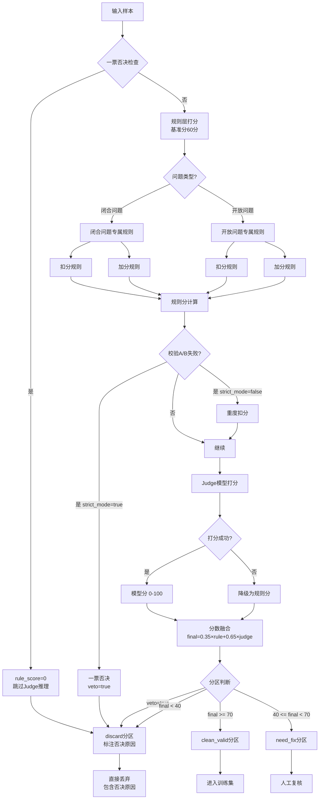

# 数据清洗系统详细报告

**文档版本**: 2.0.0
**更新日期**: 2026-08-04
**项目**: VLM知识蒸馏项目

---

## 目录

1. [概述](#1-概述)
2. [系统架构](#2-系统架构)
3. [清洗流程图](#3-清洗流程图)
4. [打分体系](#4-打分体系)
5. [一票否决项](#5-一票否决项)
6. [规则层打分](#6-规则层打分)
7. [模型层打分](#7-模型层打分)
8. [分区逻辑](#8-分区逻辑)
9. [校验机制](#9-校验机制)
10. [配置参数](#10-配置参数)
11. [使用示例](#11-使用示例)

---

## 1. 概述

### 1.1 系统定位

数据清洗系统是VLM知识蒸馏项目的**质量保障核心**，位于蒸馏生成之后、学生模型训练之前：

```
教师模型 → 数据蒸馏 → 数据清洗 → 质量验证 → 学生模型训练
                      ↑
                  当前模块
```

### 1.2 核心目标

- **质量保障**：移除低质量、异常、错误的数据样本
- **数据筛选**：通过混合打分机制筛选高质量训练数据
- **可追溯性**：记录清洗决策、生成详细报告

### 1.3 核心特性

| 特性 | 说明 |
|------|------|
| **混合打分** | 规则层（35%）+ 模型层（65%） |
| **一票否决** | 严重问题直接丢弃，节省算力 |
| **双校验机制** | 校验A（三元自洽）+ 校验B（GT一致性） |
| **分区存储** | clean_valid / need_fix / discard 三级分区 |

---

## 2. 系统架构

### 2.1 模块结构

```
src/cleaning/
├── reward_model_scorer.py       # 数据质量打分器（核心）
├── reward_model_judge.py        # Judge模型打分器
├── closed_sample_validator.py   # 闭合样本校验器
└── data_partitioner.py          # 数据分区器
```

### 2.2 核心类关系

```python
RewardModelScorer (数据质量打分器)
    ├── RewardModelJudge (模型打分器)
    │   └── Qwen2.5-VL-32B (打分模型)
    ├── ClosedSampleValidator (闭合样本校验器)
    │   └── 语义等价判断
    └── COCODataLoader (GT真值加载)
        └── build_gt_mapping() (构建GT映射)
```

### 2.3 数据流

```
输入样本
    ↓
【Step 1】一票否决检查
    ├─ 通过 → Step 2
    └─ 失败 → 直接丢弃（rule_score=0）
    ↓
【Step 2】规则层打分
    ├─ 通用扣分规则
    ├─ 闭合问题专属规则（扣分 + 加分）
    └─ 开放问题专属规则（扣分 + 加分）
    ↓
【Step 3】模型层打分
    └─ Judge模型推理（0-100分）
    ↓
【Step 4】分数融合
    └─ final = 0.35×rule + 0.65×judge
    ↓
【Step 5】分区判断
    ├─ final >= 70 → clean_valid
    ├─ final >= 40 → need_fix
    └─ final < 40 → discard
```

---

## 3. 清洗流程图

### 3.1 完整流程



### 3.2 流程说明

| 阶段 | 处理内容 | 输出 |
|------|---------|------|
| **Step 1** | 一票否决检查 | 是否跳过后续处理 |
| **Step 2** | 规则层打分 | rule_score (0-60) |
| **Step 3** | 模型层打分 | judge_score (0-100) |
| **Step 4** | 分数融合 | final_score (0-100) |
| **Step 5** | 分区判断 | clean_valid / need_fix / discard |

---

## 4. 打分体系

### 4.1 分数构成

```
总分 = 0.35 × 规则分 + 0.65 × 模型分
```

| 分数类型 | 范围 | 权重 | 说明 |
|---------|------|------|------|
| **规则分** | 0-60 | 35% | 基准分60 + 扣分 + 加分 |
| **模型分** | 0-100 | 65% | Judge模型推理打分 |
| **总分** | 0-100 | - | 加权融合后的最终分数 |

### 4.2 规则分计算公式

```python
rule_score = BASE_SCORE + deduction_score + bonus_score

其中:
- BASE_SCORE = 60 (基准分)
- deduction_score < 0 (扣分总和，负数)
- bonus_score > 0 (加分总和，正数)

最终钳位: rule_score = max(0, min(rule_score, 100))
```

### 4.3 打分策略

**规则层（快速筛选）**：
- ✅ 优势：速度快、成本低、规则明确
- ✅ 作用：过滤明显低质样本
- ✅ 机制：基准分 + 扣分制 + 加分制

**模型层（深度评估）**：
- ✅ 优势：语义理解、质量评估、幻觉检测
- ✅ 作用：评估样本整体质量
- ✅ 机制：Qwen2.5-VL-32B 模型打分（0-100）

---

## 5. 一票否决项

### 5.1 一票否决机制

**触发条件**：满足任意一条 → `rule_score = 0`，跳过Judge推理，直接存储到 discard

**设计目的**：
- ✅ 节省算力（严重问题无需模型推理）
- ✅ 提升效率（快速过滤无效样本）
- ✅ 可追溯（完整保存样本 + 否决原因）

**处理流程**：
```
触发一票否决 → 设置 veto=true → 跳过Judge → 直接存储到 discard/
                                          ↓
                                    包含否决原因
```

### 5.2 通用一票否决（开放 + 闭合）

| 序号 | 否决项 | 检查条件 | 原因 |
|------|--------|---------|------|
| 1 | 图像路径缺失 | `image_path` 为空或不存在 | 无法进行视觉推理 |
| 2 | question字段为空 | `question` 为空或仅空白 | 无效问题 |
| 3 | 复读System Prompt | 输出包含3个以上prompt关键词 | 模型输出异常 |
| 4 | 严重文本污染 | 控制字符占比 > 10% | 输出质量极差 |

**复读检测关键词**：
```python
['system', 'user', 'assistant', 'TASK:', 'CRITICAL RULES',
 'You are', 'Output only', 'FOUR NON-BREAKABLE', 'Rules:']
```

### 5.3 开放问题专属一票否决

| 序号 | 否决项 | 检查条件 | 原因 |
|------|--------|---------|------|
| 1 | answer为空 | `answer` 为空或仅空白 | 开放问题必须有文本答案 |

### 5.4 闭合问题专属一票否决

| 序号 | 否决项 | 检查条件 | 原因 |
|------|--------|---------|------|
| 1 | hard_label缺失 | `hard_label` 不存在或 `answer` 为空 | 缺少硬标签 |
| 2 | soft_label缺失 | `soft_label` 不存在或 `answer_distribution` 为空 | 缺少软标签 |
| 3 | cot_reasoning缺失 | `cot_reasoning` 不存在（强制CoT模式） | 缺少推理过程 |
| 4 | hard_label不在候选池 | `hard_label['answer'] not in candidate_pool` | 候选池外答案 |

### 5.5 一票否决示例

```python
# 示例1：图像路径缺失
{
    "image_id": "123456",
    "image_path": "",  # ← 一票否决
    "tasks": {...},
    "quality_score": {
        "final_score": 0.0,
        "rule_score": 0.0,
        "judge_score": 0.0,
        "veto": true,  # ← 标记为一票否决
        "deductions": {
            "veto": {
                "reason": "图像路径缺失"
            }
        }
    }
}
# 结果：直接存储到 discard/123456.json
# 文件包含否决原因：_removal_reason = "⚠️ 一票否决: 图像路径缺失"

# 示例2：hard_label不在候选池
{
    "image_id": "123457",
    "tasks": {
        "vqa": {
            "hard_label": {"answer": "red"},
            "candidate_pool": ["blue", "green", "yellow"]  # ← red不在其中
        }
    },
    "quality_score": {
        "veto": true,
        "deductions": {
            "veto": {
                "reason": "hard_label不在候选池: 'red' not in ['blue', 'green', 'yellow']"
            }
        }
    }
}
# 结果：直接存储到 discard/123457.json
# 文件包含否决原因：_removal_reason = "⚠️ 一票否决: hard_label不在候选池"
```

### 5.6 一票否决样本存储

**存储位置**: `discard/` 目录

**文件命名**: `{image_id}.json`

**文件内容**: 包含完整样本数据 + 否决原因

```json
// discard/123456.json
{
    "image_id": "123456",
    "image_path": "",
    "tasks": {...},
    "quality_score": {
        "final_score": 0.0,
        "veto": true,
        "deductions": {
            "veto": {
                "reason": "图像路径缺失"
            }
        }
    },
    "_removal_reason": "⚠️ 一票否决: 图像路径缺失"
}
```

**统计报告**: `partition_report.json` 中单独统计一票否决样本

```json
{
  "discard_reasons": {
    "⚠️ 一票否决: 图像路径缺失": 5,
    "⚠️ 一票否决: hard_label不在候选池": 8,
    "质量过低（25.1分）": 20
  }
}
```

---

## 6. 规则层打分

### 6.1 通用扣分规则（开放 + 闭合）

| 扣分项 | 扣分值 | 检查条件 | 说明 |
|--------|--------|---------|------|
| **Markdown符号** | -10分 | 文本包含 `#`、`**`、`-` 等符号 | 格式不规范 |
| **高度重复** | -12分 | question与输出相似度 > 0.75 | 复读问题 |
| **连续空行** | -6分/处 | 包含3个或以上连续换行 | 无意义空行 |

**Markdown检测模式**：
```python
markdown_patterns = [
    r'#{1,6}\s',        # 标题
    r'\*\*.*?\*\*',     # 加粗
    r'^\s*-\s',         # 列表
    r'^\s*\d+\.\s'      # 有序列表
]
```

### 6.2 闭合问题扣分规则

| 扣分项 | 扣分值 | 检查条件 | 说明 |
|--------|--------|---------|------|
| **置信度过低** | -14分 | `confidence < 0.4` | 教师模型不确定 |
| **分布平坦** | -10分 | `max_prob < 0.3` | 软标签分布不明确 |
| **CoT结构错乱** | -9分 | 缺失 observation/analysis/conclusion | 推理不完整 |
| **多token污染** | -11分 | 候选单字但答案多词 | 答案不符合候选集 |
| **校验A失败** | -22分 | hard/soft/cot三元不自洽 | 标签不一致 |
| **校验B失败** | -20分 | GT与Hard语义不等价 | 与标注不一致 |

**校验A失败特殊处理**：
```python
if strict_closed_mode:
    # 一票否决（rule_score = 0）
    return -BASE_SCORE
else:
    # 重度扣分（-22分）
    deduction_score -= 22
```

### 6.3 闭合问题加分规则

| 加分项 | 加分值 | 检查条件 | 说明 |
|--------|--------|---------|------|
| **高置信度** | +6分 | `confidence >= 0.75` | 教师模型确信度高 |
| **分布区分度高** | +5分 | `top1 - top2 > 0.4` | 软标签区分明显 |
| **三元一致性** | +7分 | hard/soft/cot完全一致 | 标签自洽 |

### 6.4 开放问题扣分规则

| 扣分项 | 扣分值 | 检查条件 | 说明 |
|--------|--------|---------|------|
| **答案过短** | -15分 | `token_count < 60` | 描述不充分 |
| **答案超长** | -12分 | `token_count > 1800` | 冗余灌水 |
| **单单词** | -16分 | `word_count <= 1` | 缺少完整描述 |

### 6.5 开放问题加分规则

| 加分项 | 加分值 | 检查条件 | 说明 |
|--------|--------|---------|------|
| **长度适中** | +6分 | `60 <= tokens <= 1200` | 长度合理 |
| **描述充分** | +5分 | `200 <= tokens <= 1000` | 细节丰富 |
| **段落流畅** | +7分 | 无Markdown + 平均句长 > 10词 | 质量优秀 |

### 6.6 扣分示例

```python
# 示例：闭合问题扣分计算
rule_score = 60  # 基准分

# 扣分项
confidence = 0.35  # < 0.4
rule_score -= 14   # 置信度过低

max_prob = 0.25  # < 0.3
rule_score -= 10  # 分布平坦

missing_sections = ['conclusion']
rule_score -= 9   # CoT结构错乱

# 加分项
triple_consistent = True
rule_score += 7   # 三元一致性

# 最终分数
rule_score = max(0, min(rule_score, 100))  # 34分
```

---

## 7. 模型层打分

### 7.1 Judge模型架构

```python
RewardModelJudge
    ├── 模型: Qwen2.5-VL-32B-Instruct-AWQ
    ├── 输入: 图像 + question + hard_label + soft_label + CoT
    ├── 输出: 质量分数（0-100整数）
    └── 推理: 贪婪解码（temperature=0）
```

### 7.2 打分标准

#### 闭合问题打分标准

| 分数段 | 质量等级 | 标准 |
|--------|---------|------|
| **90-100** | Perfect | hard在候选池、三元一致、无幻觉、CoT完整 |
| **70-89** | Good | 轻微格式缺陷、核心标签一致、无严重幻觉 |
| **50-69** | Acceptable | 明显缺陷、核心标签有效、无严重幻觉 |
| **30-49** | Poor | 严重缺陷（标签不一致/视觉依据弱） |
| **0-29** | Invalid | 严重幻觉、标签越界、严重不自洽 |

#### 开放问题打分标准

| 分数段 | 质量等级 | 标准 |
|--------|---------|------|
| **90-100** | Perfect | 无幻觉、完整段落、无Markdown |
| **70-89** | Good | 轻微措辞瑕疵、视觉依据可靠 |
| **50-69** | Acceptable | 可见瑕疵、无严重幻觉 |
| **30-49** | Poor | 部分幻觉、答案过短或不完整 |
| **0-29** | Invalid | 严重幻觉、无关内容、碎片化 |

### 7.3 Prompt约束

**Judge Prompt核心规则**（configs/prompts_en.yaml）：

```yaml
OUTPUT RULE (STRICT, VIOLATION = INVALID SCORE):
- Output ONLY ONE integer between 0 and 100
- NO MARKDOWN FORMATTING: Forbidden symbols **, *, #, `, -, (), [], {}
- NO text, NO explanation, NO image description, NO reasoning
- Any extra words or symbols make your score invalid
- Correct: 85
- WRONG: **85**, *85*, Score: 85, (85)
```

### 7.4 分数提取策略

**提取优先级**：

| 策略 | 格式 | 示例 | 优先级 |
|------|------|------|--------|
| 策略1 | `Score: X` | `Score: 90` | 最高 |
| 策略1.5 | Markdown格式 | `**90**` | 高 |
| 策略2 | 文本中的数字 | `The score is 90` | 中 |
| 策略3 | 独立行数字 | `90\n` | 低 |

**策略1.5（处理Markdown）**：
```python
# 新增：匹配Markdown格式的分数
match = re.search(r'\*{1,2}(\d{1,3})\*{1,2}', text)
if match:
    score = float(match.group(1))
    # **90** → 提取 90
```

### 7.5 缓存清理机制

**问题**：KV Cache / 图像特征缓存可能残留，导致上下文泄漏

**解决方案**（reward_model_judge.py）：

```python
# 5层缓存清理机制
try:
    # 方法1：重置推理状态
    if hasattr(model, 'reset_inference_state'):
        model.reset_inference_state()
    
    # 方法2：清空 past_key_values
    if hasattr(model, 'past_key_values'):
        model.past_key_values = None
    
    # 方法3：重置注意力缓存
    if hasattr(model, 'clear_cache'):
        model.clear_cache()
    
    # 方法4：遍历所有模块清空缓存
    for module in model.modules():
        if hasattr(module, 'reset_cache'):
            module.reset_cache()
    
    # 方法5：CUDA同步
    gc.collect()
    torch.cuda.empty_cache()
    torch.cuda.synchronize()  # 等待所有CUDA操作完成
except:
    pass
```

---

## 8. 分区逻辑

### 8.1 分区阈值

| 分区 | 分数范围 | 处理方式 | 说明 |
|------|---------|---------|------|
| **一票否决** | `veto=true` | 直接丢弃 | 严重问题，跳过分区判断 |
| **clean_valid** | `final_score >= 70` | 进入训练集 | 高质量样本 |
| **need_fix** | `40 <= final_score < 70` | 人工复核 | 待改进样本 |
| **discard** | `final_score < 40` | 直接丢弃 | 低质量样本 |

**分区优先级**：
1. **一票否决优先**：如果 `veto=true`，直接进入 discard，无需检查分数
2. **分数判断**：根据 final_score 进行正常分区

### 8.2 分区流程

```python
# 分区判断逻辑（优先级递减）
def _classify_sample(sample):
    quality_score = sample.get('quality_score', {})
    
    # 1. 一票否决优先判断
    if quality_score.get('veto', False):
        veto_reason = quality_score.get('deductions', {}).get('veto', {}).get('reason', '未知原因')
        return 'discard', f'⚠️ 一票否决: {veto_reason}'
    
    # 2. 正常分数判断
    final_score = quality_score.get('final_score', 0)
    
    if final_score >= 70:
        return 'clean_valid', '质量合格'
    elif final_score >= 40:
        return 'need_fix', '质量中等'
    else:
        return 'discard', '质量过低'
```

### 8.3 输出目录结构

```
outputs/cleaned/
├── clean_valid/          # 高质量样本（final_score >= 70）
│   ├── 123456.json
│   ├── 123457.json
│   └── ...
├── need_fix/             # 待改进样本（40 <= final_score < 70）
│   ├── 123460.json
│   └── ...
├── discard/              # 丢弃样本（final_score < 40）
│   ├── 123470.json
│   └── ...
└── train.jsonl           # 训练数据（仅包含clean_valid）
```

### 8.4 分区统计示例

```json
{
  "partition_stats": {
    "clean_valid": {
      "count": 850,
      "ratio": 0.85,
      "avg_score": 82.5
    },
    "need_fix": {
      "count": 100,
      "ratio": 0.10,
      "avg_score": 52.3
    },
    "discard": {
      "count": 50,
      "ratio": 0.05,
      "avg_score": 25.1,
      "veto_count": 15,        // 一票否决样本数
      "low_score_count": 35    // 分数过低样本数
    }
  },
  "discard_reasons": {
    "⚠️ 一票否决: 图像路径缺失": 5,
    "⚠️ 一票否决: hard_label不在候选池": 8,
    "⚠️ 一票否决: 校验A失败（三元不自洽）": 2,
    "质量过低（25.1分）": 20,
    "质量过低（18.5分）": 15
  }
}
```

**discard 统计细分**：

| 类型 | 说明 | 示例 |
|------|------|------|
| `veto_count` | 一票否决样本数 | 图像缺失、不在候选池等 |
| `low_score_count` | 分数过低样本数 | final_score < 40 |

**一票否决示例文件** (`discard/123456.json`)：

```json
{
  "image_id": "123456",
  "quality_score": {
    "final_score": 0.0,
    "rule_score": 0.0,
    "judge_score": 0.0,
    "veto": true,
    "deductions": {
      "veto": {
        "reason": "hard_label不在候选池: 'red' not in ['blue', 'green']"
      }
    }
  },
  "_removal_reason": "⚠️ 一票否决: hard_label不在候选池"
}
```

---

## 9. 校验机制

### 9.1 校验A：三元自洽校验

**目标**：验证 hard_label / soft_label / CoT conclusion 三者一致性

**检查内容**：
```python
# 1. hard_label_answer vs soft_label_primary_answer
# 2. hard_label_answer vs cot_conclusion
# 3. soft_label_primary_answer vs cot_conclusion
```

**实现位置**：`closed_sample_validator.py`

```python
def validate_triple_consistency(
    hard_label_answer,
    soft_label_primary_answer,
    cot_conclusion,
    candidate_pool
) -> Tuple[bool, str]:
    """
    三元自洽校验
    
    Returns:
        (是否一致, 不一致原因)
    """
```

**处理方式**：

| strict_closed_mode | 处理方式 | veto 标记 | 分数影响 |
|-------------------|---------|----------|---------|
| `true` | 一票否决 | `veto=True` | `final_score=0`，直接 discard |
| `false` | 重度扣分 | `veto=False` | 扣22分，继续打分 |

**代码逻辑**：

```python
# _apply_closed_rules() 中的实现
if not is_consistent_a:
    if self.strict_closed_mode:
        # strict_closed_mode=true: 一票否决
        deductions['validation_a_veto'] = {'veto': True, 'reason': reason_a}
        return -self.BASE_SCORE, issues, deductions, 0
    else:
        # strict_closed_mode=false: 重度扣分
        deduction = 22
        deductions['validation_a'] = {'deduction': deduction, 'reason': reason_a}
        return deduction, issues, deductions, 0
```

**一票否决流程**（`strict_closed_mode=true`）：
```
校验A失败 → deductions['validation_a_veto'] = {'veto': True, 'reason': ...}
           ↓
           score() 检测到 veto 标记
           ↓
           返回 {'veto': True, 'final_score': 0.0, 'bucket': 'discard'}
           ↓
           data_partitioner 检测到 veto=true
           ↓
           直接存储到 discard/，包含否决原因
```

**重度扣分流程**（`strict_closed_mode=false`）：
```
校验A失败 → deductions['validation_a'] = {'deduction': 22, 'reason': ...}
           ↓
           rule_score -= 22（扣分）
           ↓
           继续Judge打分、分数融合
           ↓
           根据 final_score 分区
```

### 9.2 校验B：GT真值与Hard标签校验

**目标**：验证模型预测答案与COCO标注真值是否语义等价

**数据来源**：
- GT真值：从COCO VQA标注加载（`build_gt_mapping()`）
- Hard标签：模型预测答案

**缓存机制**（coco_loader.py）：

```yaml
# configs/default.yaml
gt_mapping:
  cache_mode: "auto"  # 优先使用缓存
  cache_file: "./data/gt_mapping_cache.json"
```

**缓存模式**：

| cache_mode | 行为 |
|------------|------|
| `"auto"` | 优先读缓存，不存在才构建并保存 |
| `"rebuild"` | 强制从COCO构建，更新缓存 |
| `"disabled"` | 每次从COCO构建，不读写缓存 |

**实现位置**：`closed_sample_validator.py`

```python
def validate_gt_hard_consistency(
    ground_truth,
    hard_label_answer
) -> Tuple[bool, str]:
    """
    GT与Hard语义等价校验
    
    Returns:
        (是否等价, 不等价原因)
    """
```

**处理方式**：

| strict_closed_mode | 处理方式 | veto 标记 | 分数影响 |
|-------------------|---------|----------|---------|
| `true` | 一票否决 | `veto=True` | `final_score=0`，直接 discard |
| `false` | 重度扣分 | `veto=False` | 扣20分，继续打分 |

**代码逻辑**：

```python
# _apply_closed_rules() 中的实现
if not is_consistent_b:
    if self.strict_closed_mode:
        # strict_closed_mode=true: 一票否决
        deductions['validation_b_veto'] = {'veto': True, 'reason': reason_b}
        return -self.BASE_SCORE, issues, deductions, 0
    else:
        # strict_closed_mode=false: 重度扣分
        deduction = 20
        deductions['validation_b'] = {'deduction': deduction, 'reason': reason_b}
        return deduction, issues, deductions, 0
```

**一票否决流程**（`strict_closed_mode=true`）：
```
校验B失败 → deductions['validation_b_veto'] = {'veto': True, 'reason': ...}
           ↓
           score() 检测到 veto 标记
           ↓
           返回 {'veto': True, 'final_score': 0.0, 'bucket': 'discard'}
           ↓
           data_partitioner 检测到 veto=true
           ↓
           直接存储到 discard/，包含否决原因
```

**重度扣分流程**（`strict_closed_mode=false`）：
```
校验B失败 → deductions['validation_b'] = {'deduction': 20, 'reason': ...}
           ↓
           rule_score -= 20（扣分）
           ↓
           继续Judge打分、分数融合
           ↓
           根据 final_score 分区
```

### 9.3 校验示例

#### 示例1：校验A失败（三元不自洽）

```python
# 输入数据
{
    "hard_label": {"answer": "red"},
    "soft_label": {"primary_answer": "blue"},
    "cot_reasoning": {"conclusion": "green"}
}
```

**场景1：`strict_closed_mode=true`（一票否决）**

```python
# 处理流程：
# 1. _apply_closed_rules() 检测到三元不自洽
# 2. deductions['validation_a_veto'] = {'veto': True, 'reason': '三元不自洽'}
# 3. score() 检测到 veto 标记
# 4. 返回 quality_score = {'veto': True, 'final_score': 0.0, 'bucket': 'discard'}
# 5. data_partitioner 检测到 veto=true
# 6. 直接存储到 discard/

# 输出：discard/123456.json
{
    "quality_score": {
        "veto": true,  # ← 一票否决标记
        "final_score": 0.0,
        "bucket": "discard",
        "deductions": {
            "validation_a_veto": {
                "veto": true,
                "reason": "三元不自洽: hard=red, soft=blue, cot=green"
            }
        }
    },
    "_removal_reason": "⚠️ 一票否决: 校验A失败（三元不自洽）"
}
```

**场景2：`strict_closed_mode=false`（重度扣分）**

```python
# 处理流程：
# 1. _apply_closed_rules() 检测到三元不自洽
# 2. deductions['validation_a'] = {'deduction': 22, 'reason': '三元不自洽'}
# 3. rule_score -= 22（扣分）
# 4. 继续 Judge 打分、分数融合
# 5. 根据 final_score 分区

# 输出：可能进入 need_fix 或 discard（取决于最终分数）
{
    "quality_score": {
        "veto": false,  # ← 未触发一票否决
        "rule_score": 38,  # 60 - 22 = 38
        "judge_score": 45,
        "final_score": 42.05,  # 0.35×38 + 0.65×45
        "bucket": "need_fix",  # ← 根据分数判断
        "deductions": {
            "validation_a": {
                "deduction": 22,
                "reason": "三元不自洽"
            }
        }
    }
}
```

#### 示例2：校验B失败（GT与Hard不等价）

```python
# 输入数据
{
    "ground_truth": "two",
    "hard_label": {"answer": "three"}
}
```

**场景1：`strict_closed_mode=true`（一票否决）**

```python
# 处理流程：
# 1. _apply_closed_rules() 检测到GT与Hard语义不等价
# 2. deductions['validation_b_veto'] = {'veto': True, 'reason': 'GT与Hard语义不等价'}
# 3. score() 检测到 veto 标记
# 4. 返回 quality_score = {'veto': True, 'final_score': 0.0, 'bucket': 'discard'}
# 5. data_partitioner 检测到 veto=true
# 6. 直接存储到 discard/

# 输出：discard/123457.json
{
    "quality_score": {
        "veto": true,  # ← 一票否决标记
        "final_score": 0.0,
        "bucket": "discard",
        "deductions": {
            "validation_b_veto": {
                "veto": true,
                "reason": "GT与Hard语义不等价: 'two' vs 'three'"
            }
        }
    },
    "_removal_reason": "⚠️ 一票否决: 校验B失败（GT与Hard语义不等价）"
}
```

**场景2：`strict_closed_mode=false`（重度扣分）**

```python
# 处理流程：
# 1. _apply_closed_rules() 检测到GT与Hard语义不等价
# 2. deductions['validation_b'] = {'deduction': 20, 'reason': 'GT与Hard语义不等价'}
# 3. rule_score -= 20（扣分）
# 4. 继续 Judge 打分、分数融合
# 5. 根据 final_score 分区

# 输出：可能进入 need_fix 或 discard（取决于最终分数）
{
    "quality_score": {
        "veto": false,  # ← 未触发一票否决
        "rule_score": 40,  # 60 - 20 = 40
        "judge_score": 50,
        "final_score": 46.0,  # 0.35×40 + 0.65×50
        "bucket": "need_fix",  # ← 根据分数判断
        "deductions": {
            "validation_b": {
                "deduction": 20,
                "reason": "GT与Hard语义不等价"
            }
        }
    }
}
```

### 9.4 关键要点总结

| 要点 | 说明 |
|------|------|
| **veto 标记** | `quality_score.veto` 表示是否触发一票否决 |
| **配置控制** | `strict_closed_mode` 决定校验失败的处理方式 |
| **一票否决优先** | `veto=True` 时，跳过分数判断，直接 discard |
| **重度扣分** | `veto=False` 时，继续打分，根据最终分数分区 |
| **可追溯性** | 无论哪种模式，都保存详细的校验失败原因 |

---

## 10. 配置参数

### 10.1 配置层级结构

**配置文件**: `configs/default.yaml`

```
cleaning:
├── output:                     # 输出路径配置
│   ├── base_dir                # 清洗输出根目录
│   ├── clean_valid_dir         # 合格样本目录
│   ├── need_fix_dir            # 待修复样本目录
│   ├── discard_dir             # 丢弃样本目录
│   └── train_jsonl             # 训练数据文件
├── clean_valid_threshold       # 分区阈值（合格）
├── need_fix_threshold          # 分区阈值（待修复）
├── strict_closed_mode          # 校验严格模式
├── gt_mapping                  # GT映射缓存配置
│   ├── cache_mode              # 缓存模式（auto/rebuild/disabled）
│   └── cache_file              # 缓存文件路径
├── confidence                  # 置信度分层配置
│   ├── medium_zone             # 黄金区间
│   └── ultra_high_conf         # 超高置信度阈值
├── confidence_control          # 置信度限流配置
│   ├── max_high_conf_ratio     # 高置信度占比上限
│   ├── max_ultra_high_conf_ratio # 超高置信度占比上限
│   ├── ece_low_threshold       # ECE低阈值
│   └── ece_high_threshold      # ECE高阈值
├── enabled                     # 启用清洗
├── rule_scoring                # 规则打分配置
└── model_scoring               # 模型打分配置
```

### 10.2 核心配置详解

#### 输出路径配置

```yaml
cleaning:
  # ============================================================
  # 输出路径配置（统一管理）
  # ============================================================
  output:
    base_dir: "./outputs/cleaned"                    # 清洗输出根目录
    clean_valid_dir: "./outputs/cleaned/clean_valid" # 合格样本（≥70分）
    need_fix_dir: "./outputs/cleaned/need_fix"       # 待修复样本（40-69分）
    discard_dir: "./outputs/cleaned/discard"         # 丢弃样本（<40分）
    train_jsonl: "./outputs/cleaned/train.jsonl"     # 训练数据（JSON Lines）
```

**目录结构**:
```
outputs/cleaned/
├── clean_valid/          # 高质量样本
│   ├── 123456.json
│   └── ...
├── need_fix/             # 待改进样本
│   ├── 123460.json
│   └── ...
├── discard/              # 丢弃样本
│   ├── 123470.json
│   └── ...
└── train.jsonl           # 训练数据（仅clean_valid）
```

#### 分区阈值配置

```yaml
cleaning:
  # ============================================================
  # 分区阈值（基于 final_score）
  # ============================================================
  clean_valid_threshold: 70  # final_score ≥ 70 → clean_valid（合格样本）
  need_fix_threshold: 40     # 40 ≤ final_score < 70 → need_fix（待修复样本）
                              # final_score < 40 → discard（丢弃样本）
```

**配置读取路径对照表**:

| 配置项 | 配置路径 | 说明 |
|--------|---------|------|
| 合格样本目录 | `cleaning.output.clean_valid_dir` | final_score ≥ 70 |
| 待修复样本目录 | `cleaning.output.need_fix_dir` | 40 ≤ final_score < 70 |
| 丢弃样本目录 | `cleaning.output.discard_dir` | final_score < 40 |
| 训练数据文件 | `cleaning.output.train_jsonl` | 仅包含clean_valid样本 |

#### 校验配置

```yaml
cleaning:
  # ============================================================
  # 闭合样本校验配置
  # ============================================================
  # strict_closed_mode: 控制校验A和校验B的严格程度
  # - true: 一票否决（校验失败直接丢弃，veto=True）
  # - false: 重度扣分（校验A失败扣22分，校验B失败扣20分，veto=False）
  strict_closed_mode: true
```

**strict_closed_mode 影响详解**：

| 配置值 | 校验类型 | 处理方式 | veto 标记 | 分数影响 |
|--------|---------|---------|----------|---------|
| `true` | 校验A失败 | 一票否决 | `veto=True` | `final_score=0`，直接 discard |
| `true` | 校验B失败 | 一票否决 | `veto=True` | `final_score=0`，直接 discard |
| `false` | 校验A失败 | 重度扣分 | `veto=False` | 扣22分，继续打分 |
| `false` | 校验B失败 | 重度扣分 | `veto=False` | 扣20分，继续打分 |

**veto 标记含义**：

```python
# quality_score 中的 veto 字段
{
    'veto': True/False,  # 是否触发一票否决
    'final_score': 0.0,  # veto=True 时分数为0
    'bucket': 'discard', # veto=True 时直接丢弃
    ...
}
```

**配置逻辑关系**：

```python
# reward_model_scorer.py 中的逻辑

def _apply_closed_rules(self, sample, ground_truth):
    # ... 校验A检查
    if not is_consistent_a:
        if self.strict_closed_mode:  # ← 根据配置决定
            # 一票否决：设置 veto 标记
            deductions['validation_a_veto'] = {'veto': True, 'reason': reason_a}
            return -60, issues, deductions, 0
        else:
            # 重度扣分：不设置 veto 标记
            deductions['validation_a'] = {'deduction': 22, 'reason': reason_a}
            return -22, issues, deductions, 0
    
    # ... 校验B检查同理

def score(self, ...):
    # 检测 veto 标记
    if deductions.get('validation_a_veto') or deductions.get('validation_b_veto'):
        # veto 标记存在 → 一票否决
        return {
            'veto': True,
            'final_score': 0.0,
            'bucket': 'discard',
            ...
        }
```

#### GT映射缓存配置

```yaml
cleaning:
  # ============================================================
  # GT真值映射缓存配置
  # ============================================================
  # 避免每次运行都重新构建映射，节省时间
  gt_mapping:
    # 缓存模式（枚举）
    # - "auto": 优先使用缓存，缓存不存在才构建并保存（推荐）
    # - "rebuild": 强制重新构建，更新缓存文件
    # - "disabled": 禁用缓存，每次从COCO标注构建
    cache_mode: "auto"

    # 缓存文件路径
    cache_file: "./data/gt_mapping_cache.json"
```

**缓存模式说明**:

| cache_mode | 行为 | 适用场景 |
|------------|------|---------|
| `"auto"` | 优先读缓存，不存在才构建 | ✅ 日常运行（推荐） |
| `"rebuild"` | 强制从COCO构建，更新缓存 | COCO数据更新后 |
| `"disabled"` | 每次从COCO构建，不读写缓存 | 调试或临时禁用 |

**缓存文件格式** (JSON):
```json
{
  "123456||What color is the car?": "red",
  "789012||How many people are there?": "3",
  ...
}
```

#### 置信度分层配置

```yaml
cleaning:
  # ============================================================
  # 置信度分层策略
  # ============================================================
  # 黄金区间：全部保留
  # 高置信度：限流控制
  # 超高置信度：严格控制
  confidence:
    medium_zone: [0.4, 0.95]   # 黄金区间：[min, max]，全部保留
    ultra_high_conf: 0.98      # > ultra_high_conf: 超高置信度，严格控制

  # 置信度占比限流控制（在quality_validation阶段执行）
  confidence_control:
    max_high_conf_ratio: 0.35      # 高置信度（> 0.95）占比上限
    max_ultra_high_conf_ratio: 0.15  # 超高置信度（> 0.98）占比上限

    # ECE 动态调整阈值
    ece_low_threshold: 0.1   # ECE < 0.1: 校准良好，放宽占比上限
    ece_high_threshold: 0.2  # ECE > 0.2: 校准失效，收紧占比上限
```

**置信度分层策略**:

| 置信度范围 | 分类 | 处理策略 |
|-----------|------|---------|
| `[0.4, 0.95]` | 黄金区间 | 全部保留 |
| `(0.95, 0.98]` | 高置信度 | 限流控制（占比 ≤ 35%） |
| `> 0.98` | 超高置信度 | 严格控制（占比 ≤ 15%） |

#### 规则打分配置

```yaml
cleaning:
  # ============================================================
  # 奖励模型打分配置（混合打分系统）
  # ============================================================
  enable_reward_scoring: true    # 启用奖励模型打分

  # 混合打分权重
  scoring:
    rule_weight: 0.4            # 规则层权重
    model_weight: 0.6           # 模型层权重
    min_pass_score: 3.0         # 及格线（<3分为discard）

  # 规则层配置（5分制，扣分制）
  rule_scoring:
    # 通用规则扣分
    missing_field_penalty: 0.5     # 缺失关键字段扣分/个
    markdown_penalty: 0.3          # 包含markdown扣分
    truncation_penalty: 0.5        # 文本残缺扣分
    language_mixing_penalty: 0.3   # 中英混杂扣分

    # 开放问题阈值（使用tokenizer统计）
    open_min_tokens: 80            # 开放问题最小token数
    open_max_tokens: 1600          # 开放问题最大token数（不建议超过1800）

    # 闭合问题阈值（使用tokenizer统计）
    closed_min_answer_length: 2    # 闭合问题最小答案长度（字符）
    closed_min_cot_tokens: 30      # CoT最小token数（推理过于简略则丢弃）
    closed_max_cot_tokens: 600     # CoT最大token数（冗余灌水则丢弃）
```

#### 模型打分配置

```yaml
cleaning:
  # 模型打分配置
  model_scoring:
    enabled: true                  # 是否启用模型打分
    use_lightweight_fallback: true # 模型不可用时使用轻量级打分
    max_new_tokens: 50             # 打分模型最大输出token
    temperature: 0.0               # 确定性生成
```

### 10.3 Judge模型配置

**文件**: `configs/default.yaml`

```yaml
teacher:
  # ============================================================
  # Teacher模型配置（包括Judge打分模型）
  # ============================================================
  model_name: "models/Qwen2.5-VL-32B-Instruct-AWQ"
  device: "cuda"
  precision: "4bit"
  
  # 通用生成参数（适用于VQA、Captioning、Judge打分）
  temperature: 0.0       # 贪婪解码，确保结果确定性
  top_p: 1.0            # temperature=0时，top_p不生效
  top_k: 1              # temperature=0时，top_k不生效
  max_new_tokens: 768   # 32B模型：支持更长输出

  # 🔧 视觉特征缓存配置（性能优化）
  cache_visual_features: true      # 启用视觉特征缓存
  cache_max_size: 1000            # 最大缓存数量
```

**Judge推理特殊配置**（`reward_model_judge.py`）:

```python
# Judge推理参数（不同于普通VQA）
with torch.no_grad():
    outputs = model.generate(
        **inputs,
        max_new_tokens=8,        # 严格控制为8（打分仅需3-5个token）
        do_sample=False,         # 贪婪解码（确定性）
        top_p=1.0,
        repetition_penalty=1.15, # 抑制重复
        use_cache=False          # 禁用缓存，防止上下文泄漏
    )
```

### 10.4 配置迁移指南

#### 从旧配置迁移

如果您有自定义的配置文件，需要按以下步骤迁移：

**步骤1: 移动路径配置**

将 `output` 部分的清洗子目录配置移到 `cleaning.output`:

```yaml
# ❌ 删除这些行（旧配置）
output:
  clean_valid_dir: "..."
  need_fix_dir: "..."
  discard_dir: "..."

# ✅ 添加到 cleaning 部分（新配置）
cleaning:
  output:
    base_dir: "./outputs/cleaned"
    clean_valid_dir: "./outputs/cleaned/clean_valid"
    need_fix_dir: "./outputs/cleaned/need_fix"
    discard_dir: "./outputs/cleaned/discard"
    train_jsonl: "./outputs/cleaned/train.jsonl"
```

**步骤2: 检查阈值配置**

确认分区阈值只定义一次：

```yaml
cleaning:
  output:
    # ... 路径配置

  # ✅ 阈值（只定义一次）
  clean_valid_threshold: 70
  need_fix_threshold: 40

  # ❌ 不要在这里重复定义
```

### 10.5 向后兼容性

**DataPartitioner 支持两种配置读取方式**:

1. **新方式**（推荐）: 从 `cleaning.output.*` 读取
2. **旧方式**: 如果新路径不存在，会使用默认值（与旧配置路径一致）

**代码逻辑**:
```python
# 优先使用 output_dir 参数
if output_dir:
    # 使用参数构建路径
    self.clean_valid_dir = output_dir / "clean_valid"
else:
    # 从配置文件读取（使用新路径）
    self.clean_valid_dir = Path(config.get(
        'cleaning.output.clean_valid_dir', 
        './outputs/cleaned/clean_valid'  # 默认值兼容旧配置
    ))
```

### 10.6 配置验证方法

#### 检查配置文件语法

```bash
python -c "import yaml; yaml.safe_load(open('configs/default.yaml'))"
```

#### 测试配置读取

```python
from src.utils.config_manager import ConfigManager

config = ConfigManager('configs/default.yaml')

# 测试路径配置
print(config.get('cleaning.output.clean_valid_dir'))
print(config.get('cleaning.output.need_fix_dir'))
print(config.get('cleaning.output.discard_dir'))

# 测试阈值
print(config.get('cleaning.clean_valid_threshold'))
print(config.get('cleaning.need_fix_threshold'))

# 测试GT映射缓存
print(config.get('cleaning.gt_mapping.cache_mode'))
print(config.get('cleaning.gt_mapping.cache_file'))
```

#### 运行清洗流程验证

```bash
python scripts/run_full_pipeline.py --steps cleaning --max-samples 10
```

**预期输出**:
```
✓ DataPartitioner initialized
  - 合格样本（≥70）: ./outputs/cleaned/clean_valid
  - 待修复样本（40~69）: ./outputs/cleaned/need_fix
  - 丢弃样本（<40）: ./outputs/cleaned/discard

✓ GT映射加载成功
  - cache_mode: auto
  - 映射条目数: 20000
```

---

## 11. 使用示例

### 11.1 基本使用

```python
from src.cleaning import RewardModelScorer
from src.utils import ConfigManager

# 初始化
config = ConfigManager()
scorer = RewardModelScorer(config)

# 单样本打分
score_result = scorer.score(
    question="What color is the car?",
    answer="red",
    question_type="closed",
    sample=sample_data,
    image_path="./images/123456.jpg",
    ground_truth="red"  # 从COCO标注获取
)

print(f"总分: {score_result['final_score']}")
print(f"规则分: {score_result['rule_score']}")
print(f"模型分: {score_result['judge_score']}")
print(f"分区: {score_result['bucket']}")
```

### 11.2 批量打分

```python
# 批量打分
scored_samples = scorer.score_batch(samples)

# 统计结果
clean_valid_count = sum(1 for s in scored_samples 
                       if s['quality_score']['bucket'] == 'clean_valid')
print(f"合格样本: {clean_valid_count}/{len(scored_samples)}")
```

### 11.3 完整流程

```bash
# 运行完整清洗流程
python scripts/run_full_pipeline.py --steps cleaning

# 输出
[数据清洗] 开始...
  - 加载样本: 1000个
  - 加载GT映射: 缓存模式=auto
  
[数据清洗] 打分中...
  - 一票否决: 50个
  - 规则打分: 950个
  - Judge打分: 950个（失败降级: 20个）
  
[数据清洗] 分区结果:
  - clean_valid: 850个 (85%)
  - need_fix: 100个 (10%)
  - discard: 50个 (5%)

✓ 数据清洗完成
```

---

## 总结

### 核心机制

| 机制 | 说明 | 效果 |
|------|------|------|
| **混合打分** | 规则（35%）+ 模型（65%） | 快速筛选 + 深度评估 |
| **一票否决** | 严重问题直接丢弃 | 节省算力 + 提升效率 |
| **双校验机制** | 三元自洽 + GT一致性 | 确保标签质量 |
| **三级分区** | clean_valid / need_fix / discard | 分级处理数据 |

### 质量保障

- ✅ **规则层**：基准分60 + 扣分制 + 加分制，快速筛选明显问题
- ✅ **模型层**：Qwen2.5-VL深度评估，语义理解 + 幻觉检测
- ✅ **校验机制**：三元自洽 + GT一致性，确保标签可靠性
- ✅ **分区逻辑**：三级分区存储，分级处理不同质量样本

### 配置优化效果

#### 1. 配置更清晰

- ✅ 清洗相关的所有配置都在 `cleaning` 部分
- ✅ 路径配置有独立的子部分 `cleaning.output`
- ✅ 减少了配置重复

#### 2. 维护更简单

- ✅ 修改清洗路径只需要在一个地方修改
- ✅ 清洗配置与输出配置分离，职责明确
- ✅ 新增清洗相关配置有明确的位置

#### 3. 向后兼容

- ✅ 代码支持旧配置路径的默认值
- ✅ 已有的配置文件可以逐步迁移
- ✅ 不会影响现有功能

### 持续优化

- 根据清洗报告调整打分参数
- 优化Judge Prompt提升打分准确性
- 完善校验规则覆盖更多问题类型
- 调整分区阈值适配不同质量要求

---

**文档版本**: 2.0.0
**最后更新**: 2026-08-04
**维护说明**: 随着项目发展，本文档将持续更新。如有疑问或建议，请提交Issue或PR。