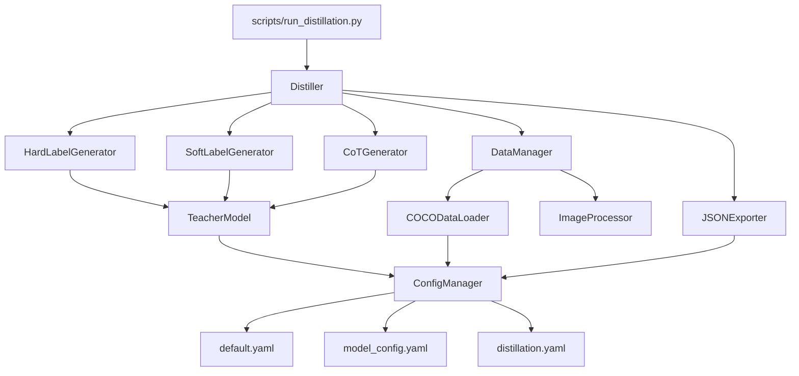

# VLM数据蒸馏系统详细设计报告

## 文档信息

| 项目名称 | VLM Data Distillation Pipeline |
| 版本 | 1.0.0 |
| 编写日期 | 2026年06月30日 |
| 作者 | VLM-Distillation Team |

---

## 1. 项目概述

### 1.1 项目背景与目标

本项目旨在构建一个完整的视觉语言模型(VLM)数据蒸馏管道，用于将大型教师模型(Qwen2.5-VL-7B-Instruct)的知识迁移到小型学生模型。系统通过生成**硬标签**、**软标签**和**思维链(CoT)**三种类型的标注数据，为下游学生模型训练提供高质量的监督信号。

### 1.2 系统目标

1. **知识蒸馏**：从大型VLM模型中提取高质量训练数据
2. **多任务支持**：支持VQA、图像描述、目标检测三种核心任务
3. **高效处理**：支持批量处理、断点续传、并行处理
4. **数据验证**：提供完整的数据质量检查机制

### 1.3 技术栈

| 层次 | 技术选型 |
|------|----------|
| 深度学习框架 | PyTorch 2.0+, Transformers 4.40+ |
| 模型架构 | Qwen2.5-VL-7B-Instruct (Vision-Language Model) |
| 数据处理 | pycocotools, Pillow, numpy |
| 配置管理 | YAML (pyyaml) |
| 日志系统 | Python logging |
| 开发语言 | Python 3.8+ |

---

## 2. 系统架构设计

### 2.1 总体架构

系统采用**分层架构**设计，分为以下五个核心层次：

```
┌─────────────────────────────────────────────────────────────┐
│                    应用层 (Application Layer)                │
│                 scripts/run_distillation.py                  │
│                  scripts/validate_data.py                    │
└─────────────────────────────────────────────────────────────┘
                              │
                              ▼
┌─────────────────────────────────────────────────────────────┐
│                    核心业务层 (Core Layer)                    │
│                          Distiller                           │
│              (蒸馏协调器 - 核心流程控制)                       │
└─────────────────────────────────────────────────────────────┘
                              │
                              ▼
┌─────────────────────────────────────────────────────────────┐
│                  生成器层 (Generator Layer)                  │
│   HardLabelGenerator   SoftLabelGenerator   CoTGenerator    │
│      (硬标签生成)          (软标签生成)        (思维链生成)    │
└─────────────────────────────────────────────────────────────┘
                              │
                              ▼
┌─────────────────────────────────────────────────────────────┐
│                  模型与数据层 (Model & Data Layer)            │
│       TeacherModel              COCODataLoader               │
│    (教师模型接口)               (数据加载器)                  │
│         DataManager            ImageProcessor               │
│      (数据管理器)               (图像处理器)                  │
└─────────────────────────────────────────────────────────────┘
                              │
                              ▼
┌─────────────────────────────────────────────────────────────┐
│                    基础设施层 (Infrastructure)                │
│    ConfigManager    JSONExporter    Logger    Visualization │
│     (配置管理)       (数据导出)      (日志)     (可视化)       │
└─────────────────────────────────────────────────────────────┘
```

### 2.2 模块依赖关系



---

## 3. 核心模块详细设计

### 3.1 配置管理模块 (ConfigManager)

#### 3.1.1 模块职责

负责加载、合并和管理所有YAML配置文件，为整个系统提供统一的配置访问接口。

#### 3.1.2 类设计

```python
class ConfigManager:
    """配置管理器 - 支持多配置文件合并与嵌套键访问"""

    属性:
    - config_root: Path          # 配置文件根目录
    - config_path: str           # 主配置文件路径
    - config: Dict[str, Any]     # 合并后的配置字典

    核心方法:
    + __init__(config_path: Optional[str])
    + _load_config() -> void                      # 加载并合并配置
    + _merge_config(base, new, section) -> void   # 配置合并逻辑
    + get(key: str, default: Any) -> Any          # 点号嵌套访问
    + set(key: str, value: Any) -> void           # 设置配置值
    + update(updates: Dict) -> void               # 批量更新
    + save(path: Optional[str]) -> void           # 保存配置
    + validate() -> bool                          # 配置验证
    + get_section(section: str) -> Dict           # 获取配置段
```

#### 3.1.3 配置访问机制

采用**点号分隔嵌套访问**设计，支持深层配置值的便捷访问：

```python
# 示例：访问嵌套配置
config.get("teacher.model_name")       # → "Qwen/Qwen2.5-VL-7B-Instruct"
config.get("distillation.soft_labels.temperature")  # → 2.0
config.get("data.batch_size", default=4)  # → 4 (带默认值)
```

#### 3.1.4 配置文件结构

| 配置文件 | 作用 | 关键配置项 |
|----------|------|------------|
| default.yaml | 主配置 | teacher, data, distillation, output, logging |
| model_config.yaml | 模型参数 | max_new_tokens, temperature, top_p, top_k |
| distillation.yaml | 蒸馏参数 | tasks, hard_labels, soft_labels, cot |

---

### 3.2 数据管理模块

#### 3.2.1 COCODataLoader 设计

```python
class COCODataLoader:
    """COCO数据集加载器 - 支持多任务数据加载"""

    属性:
    - coco_root: Path                     # COCO数据根目录
    - annotations_root: Path              # 标注文件目录
    - coco_caption: COCO                  # 标题标注API
    - coco_instance: COCO                 # 实例标注API
    - images_data: Dict[int, Dict]        # 图像信息映射
    - captions_data: Dict[int, List]      # 图像标题映射
    - instances_data: Dict[int, List]     # 实例标注映射
    - vqa_data_by_image: Dict[int, List]  # VQA问题映射
    - categories: Dict[int, str]          # 类别ID到名称映射

    核心方法:
    + initialize(split: str) -> void              # 初始化数据加载
    + get_image_path(image_id, split) -> Path     # 获取图像路径
    + load_image(image_id, split) -> PIL.Image    # 加载图像
    + get_captions(image_id) -> List[str]         # 获取标题
    + get_instances(image_id) -> List[Dict]       # 获取检测实例
    + get_vqa_questions(image_id) -> List[Dict]   # 获取VQA问题
    + sample_images(num_samples, task) -> List    # 采样图像ID
    + get_annotation_summary() -> Dict            # 获取统计摘要
```

#### 3.2.2 DataManager 设计

```python
class DataManager:
    """数据管理器 - 统筹数据加载与批处理"""

    核心职责:
    1. 协调COCODataLoader和ImageProcessor
    2. 创建批处理数据批次
    3. 管理检查点与断点续传
    4. 提供数据采样策略

    核心方法:
    + initialize(split: str) -> void
    + get_sample_ids() -> List[int]
    + get_remaining_ids(sample_ids, checkpoint) -> List[int]
    + create_batches(sample_ids) -> List[List[int]]
    + get_batch_data(batch_ids) -> Dict[str, Any]
    + load_checkpoint(checkpoint_path) -> Dict
    + save_checkpoint(processed_ids, checkpoint_path) -> void
```

---

### 3.3 教师模型模块 (TeacherModel)

#### 3.3.1 模块架构

```python
class TeacherModel:
    """教师模型接口 - 封装Qwen2.5-VL-7B-Instruct"""

    属性:
    - model_name: str              # 模型名称
    - device: str                  # 计算设备 (cuda/cpu)
    - precision: str               # 精度 (bf16/fp16/fp32)
    - model: AutoModelForVision2Seq  # 模型实例
    - tokenizer: AutoTokenizer     # 分词器
    - processor: AutoProcessor     # 图文处理器

    生成参数:
    - max_new_tokens: int          # 最大生成长度
    - temperature: float           # 生成温度
    - top_p: float                 # nucleus采样参数
    - top_k: int                   # top-k采样参数

    核心接口:
    + inference_vqa(image, question, return_logits, generate_cot) -> Dict
    + inference_captioning(image, return_logits, generate_cot, num_captions) -> Dict
    + inference_detection(image, return_logits, generate_cot) -> Dict
    + batch_inference(batch_data, task) -> List[Dict]
```

#### 3.3.2 推理流程设计

```
输入处理流程:
┌──────────┐     ┌───────────────┐     ┌─────────────┐
│  图像     │ --> │ Image Processor│ --> │  构建消息    │
│  文本     │     │  (resize, norm) │     │  (chat模板) │
└──────────┘     └───────────────┘     └──────┬──────┘
                                                │
                                                ▼
┌──────────┐     ┌───────────────┐     ┌─────────────┐
│ GPU内存   │ <-- │  移动到设备    │ <-- │  处理输入    │
│ Tensor   │     │  (cuda/cpu)   │     │  (processor)│
└──────────┘     └───────────────┘     └──────┬──────┘
                                                │
                                                ▼
                                         ┌─────────────┐
                                         │  模型生成    │
                                         │  (generate) │
                                         └──────┬──────┘
                                                │
                                                ▼
┌──────────┐     ┌───────────────┐     ┌─────────────┐
│ 输出文本  │ <-- │  解码token    │ <-- │  输出处理    │
│ 结果字典  │     │  (tokenizer) │     │  (解析)     │
└──────────┘     └───────────────┘     └─────────────┘
```

#### 3.3.3 多任务Prompt模板设计

| 任务类型 | Prompt模板 | CoT Prompt模板 |
|----------|------------|----------------|
| VQA | `Look at the image and answer the following question:\nQuestion: {question}\nAnswer:` | `Analyze this image step by step...\n1. First, identify...\n2. Next, analyze...\n3. Then, consider...\n4. Finally, answer...` |
| Captioning | `Describe this image in detail...` | `Describe systematically:\n1. Identify subjects\n2. Describe attributes\n3. Note scene\n4. Describe actions\n5. Combine...` |
| Detection | `Detect all objects. Provide bounding boxes in [x_min, y_min, x_max, y_max]...` | `Detect methodically:\n1. Scan systematically\n2. Identify objects\n3. Determine bboxes\n4. Classify...` |

---

### 3.4 蒸馏生成器模块

#### 3.4.1 HardLabelGenerator 设计

```python
class HardLabelGenerator:
    """硬标签生成器 - 生成最终预测结果"""

    配置参数:
    - confidence_threshold: float = 0.7   # 置信度阈值

    核心方法:
    + generate_vqa_hard_labels(image_path, question, image_id) -> Dict
        输出结构: {
            'image_id': str,
            'task': 'vqa',
            'question': str,
            'answer': str,
            'confidence': float,
            'full_response': str,
            'timestamp': str,
            'filtered': bool (可选)
        }

    + generate_captioning_hard_labels(image_path, num_captions, image_id) -> Dict
        输出结构: {
            'image_id': str,
            'task': 'captioning',
            'captions': List[str],
            'num_captions': int,
            'primary_caption': str,
            'caption_scores': List[float],
            'timestamp': str
        }

    + generate_detection_hard_labels(image_path, image_id) -> Dict
        输出结构: {
            'image_id': str,
            'task': 'detection',
            'objects': List[Dict],
            'num_objects': int,
            'total_detected': int,
            'timestamp': str
        }
```

#### 3.4.2 SoftLabelGenerator 设计

```python
class SoftLabelGenerator:
    """软标签生成器 - 生成概率分布"""

    配置参数:
    - temperature: float = 2.0            # 知识蒸馏温度
    - top_k: int = 100                    # 保留top-k概率
    - min_probability: float = 0.01       # 最小概率阈值

    核心方法:
    + generate_vqa_soft_labels(image_path, question, image_id) -> Dict
        输出结构: {
            'image_id': str,
            'task': 'vqa',
            'question': str,
            'temperature': float,
            'answer_distribution': Dict[str, float],
            'primary_answer': str,
            'confidence': float,
            'timestamp': str
        }

    + _apply_temperature(probs: Tensor) -> Tensor
        温度缩放公式: scaled_logits = logits / temperature
                     scaled_probs = softmax(scaled_logits)

    + _get_top_k_probabilities(probs: Tensor) -> Dict
        提取top-k概率用于存储效率优化
```

**温度缩放原理**：

温度参数T用于"软化"概率分布，使学生模型能学习更多细粒度信息：

$$P_{soft}(y) = \frac{\exp(z_y/T)}{\sum_j \exp(z_j/T)}$$

- T=1: 原始概率分布
- T>1: 分布更平滑，保留更多次要类别信息
- T<1: 分布更尖锐，聚焦主要类别

#### 3.4.3 CoTGenerator 设计

```python
class CoTGenerator:
    """思维链生成器 - 生成结构化推理过程"""

    配置参数:
    - max_length: int = 512               # 最大推理长度
    - include_intermediate_steps: bool    # 包含中间步骤
    - structured_output: bool             # 结构化输出
    - required_keywords: List[str]        # 推理关键词验证

    核心方法:
    + generate_vqa_cot(image_path, question, image_id) -> Dict
    + generate_captioning_cot(image_path, image_id) -> Dict
    + generate_detection_cot(image_path, image_id) -> Dict

    结构化方法:
    + _structure_vqa_reasoning(raw) -> Dict
        输出: {
            'observation': str,
            'analysis': str,
            'reasoning': str,
            'conclusion': str
        }

    + _extract_reasoning_steps(raw) -> List[Dict]
        输出: [{
            'step_number': int,
            'marker': str,
            'content': str
        }]

    + _validate_reasoning_quality(reasoning) -> Dict
        输出: {
            'length': int,
            'has_required_keywords': bool,
            'keyword_count': int,
            'step_count': int,
            'logical_flow_score': float,
            'is_valid': bool
        }
```

---

### 3.5 蒸馏协调器 (Distiller)

#### 3.5.1 核心流程设计

```python
class Distiller:
    """蒸馏主控制器 - 协调全流程"""

    属性:
    - teacher: TeacherModel
    - data_manager: DataManager
    - hard_label_gen: HardLabelGenerator
    - soft_label_gen: SoftLabelGenerator
    - cot_gen: CoTGenerator
    - exporter: JSONExporter

    配置参数:
    - tasks: List[str]                    # 任务列表
    - enable_hard_labels: bool
    - enable_soft_labels: bool
    - enable_cot: bool
    - checkpoint_interval: int = 100

    统计追踪:
    - stats: Dict[str, Any]               # 处理统计
```

#### 3.5.2 完整蒸馏流程

```
run_distillation() 流程:
┌────────────────────────────────────────────────────────────┐
│  1. 初始化                                                  │
│     ├── 初始化DataManager                                   │
│     ├── 获取sample_ids                                      │
│     ├── 如果有checkpoint, 加载并获取remaining_ids           │
│     ├── 创建batches                                         │
│     └── 记录start_time                                      │
└────────────────────────────────────────────────────────────┘
                         │
                         ▼
┌────────────────────────────────────────────────────────────┐
│  2. 批处理循环                                              │
│     FOR each batch:                                         │
│     ├── get_batch_data(batch_ids)                          │
│     ├── process_batch(batch_data)                          │
│     │      FOR each image in batch:                        │
│     │      ├── FOR each task:                              │
│     │      │   ├── _generate_task_hard_labels()            │
│     │      │   ├── _generate_task_soft_labels()            │
│     │      │   ├── _generate_task_cot()                    │
│     │      │   └── 记录各阶段耗时                           │
│     │      └── 添加metadata                                │
│     ├── _save_batch_results()                              │
│     ├── processed_ids.extend(batch_ids)                    │
│     ├── 检查checkpoint_interval → _save_checkpoint()       │
│     └── 更新stats                                           │
└────────────────────────────────────────────────────────────┘
                         │
                         ▼
┌────────────────────────────────────────────────────────────┐
│  3. 结束处理                                                │
│     ├── _save_checkpoint(processed_ids)                    │
│     ├── exporter.merge_all_results()                       │
│     ├── _compute_final_statistics()                        │
│     ├── 记录end_time                                        │
│     └── 返回结果摘要                                        │
└────────────────────────────────────────────────────────────┘
```

#### 3.5.3 批处理结果结构

```json
{
  "batch_id": "timestamp",
  "images": [
    {
      "image_id": "000000123456",
      "image_path": "val2017/COCO_val2017_000000123456.jpg",
      "tasks": {
        "vqa": {
          "hard_label": {...},
          "soft_label": {...},
          "cot_reasoning": {...},
          "hard_label_time": 0.5,
          "soft_label_time": 0.8,
          "cot_time": 1.2
        },
        "captioning": {...},
        "detection": {...}
      },
      "metadata": {
        "teacher_model": "Qwen/Qwen2.5-VL-7B-Instruct",
        "processing_timestamp": "2026-06-30T10:30:00",
        "total_time": 2.5
      }
    }
  ]
}
```

---

### 3.6 数据导出模块 (JSONExporter)

#### 3.6.1 设计架构

```python
class JSONExporter:
    """JSON导出器 - 处理结果保存与合并"""

    属性:
    - output_dir: Path                    # 输出根目录
    - merge_outputs: bool                 # 合并输出开关
    - compress_outputs: bool              # 压缩开关

    输出目录结构:
    outputs/
    ├── hard_labels/                      # 硬标签输出
    ├── soft_labels/                      # 软标签输出
    ├── cot_reasoning/                    # CoT输出
    ├── merged/                           # 合并结果
    ├── archive/                          # 批文件归档
    ├── checkpoint_latest.json            # 检查点
    ├── merged_summary.json               # 合并摘要
    └── distillation_report.json          # 蒸馏报告

    核心方法:
    + save_result(result, output_path) -> bool
    + save_batch(batch_results, output_path) -> bool
    + merge_all_results(batch_files) -> Dict
    + _cleanup_batch_files(batch_files) -> void
    + export_summary_report(statistics) -> str
    + get_output_statistics() -> Dict
```

#### 3.6.2 合并流程设计

```
merge_all_results() 流程:
1. 查找所有batch_*.json文件
2. 加载并提取所有image结果
3. 按image_id合并:
   - 相同image_id的tasks进行update合并
   - 不同image_id直接添加
4. 保存到merged/{image_id}.json
5. 创建merged_summary.json
6. 将批文件归档到archive/
7. 返回合并统计
```

---

## 4. 数据流程设计

### 4.1 整体数据流程图

```
COCO Dataset
     │
     ▼
COCODataLoader ───────────────────────────────────────────┐
     │                                                    │
     │ [image_id, image_path, annotations]                │
     ▼                                                    │
DataManager                                               │
     │                                                    │
     │ [batch_data: {images, annotations, metadata}]      │
     ▼                                                    │
Distiller                                                │
     │                                                    │
     ├──────────────┬──────────────┬─────────────────────┤
     │              │              │                       │
     ▼              ▼              ▼                       │
HardLabelGen    SoftLabelGen    CoTGenerator              │
     │              │              │                       │
     │              │              │                       │
     ▼              ▼              ▼                       │
TeacherModel.inference_vqa()                              │
TeacherModel.inference_captioning()                       │
TeacherModel.inference_detection()                        │
     │                                                    │
     │ [results with logits/probs/text]                   │
     ▼                                                    │
Processing & Extraction                                   │
     │                                                    │
     │ [hard_label, soft_label, cot_reasoning]            │
     ▼                                                    │
JSONExporter                                              │
     │                                                    │
     │ [save to outputs/]                                 │
     ▼                                                    │
outputs/batch_*.json ────────────────────────────────────│
     │                                                    │
     │ [merge_all_results()]                              │
     ▼                                                    │
outputs/merged/{image_id}.json                            │
                                                          │
                     ┌────────────────────────────────────┘
                     │
                     ▼
              Student Model Training
```

### 4.2 批处理数据结构

```python
batch_data = {
    'metadata': {
        'timestamp': str,
        'batch_size': int,
        'split': str
    },
    'images': [
        {
            'id': int,
            'path': str,
            'image': PIL.Image,
            'width': int,
            'height': int
        }
    ],
    'annotations': {
        'vqa': {
            image_id: [
                {'question': str, 'question_id': int}
            ]
        },
        'caption': {
            image_id: [
                {'caption': str, 'caption_id': int}
            ]
        },
        'instance': {
            image_id: [
                {'bbox': List, 'category_id': int, 'category_name': str}
            ]
        }
    }
}
```

---

## 5. 接口设计

### 5.1 主要对外接口

#### 5.1.1 Python API 接口

```python
# 初始化接口
from src import ConfigManager, TeacherModel, Distiller

config = ConfigManager(config_path='configs/default.yaml')
teacher = TeacherModel(config)
distiller = Distiller(teacher, config)

# 运行蒸馏
results = distiller.run_distillation(
    max_samples=100,
    checkpoint_path='./outputs/checkpoint_latest.json'
)

# 获取状态
status = distiller.get_processing_status()

# 验证结果
validation = distiller.validate_results('./outputs/merged')
```

#### 5.1.2 命令行接口

```bash
# 基础运行
python scripts/run_distillation.py

# 带参数运行
python scripts/run_distillation.py \
    --config configs/default.yaml \
    --samples 100 \
    --task vqa captioning \
    --output-dir ./outputs_test \
    --validate \
    --visualize

# 断点续传
python scripts/run_distillation.py \
    --resume ./outputs/checkpoint_latest.json

# 数据下载
python scripts/download_coco.py \
    --split val2017 \
    --output ./data/coco

# 数据验证
python scripts/validate_data.py \
    --input ./outputs/merged \
    --verbose
```

### 5.2 内部模块接口规范

#### 5.2.1 Generator接口

```python
# 所有Generator遵循统一接口模式
class GeneratorInterface:
    def generate_task_TYPE(
        self,
        image_path: str,
        **task_specific_params,
        image_id: Optional[str] = None
    ) -> Dict[str, Any]:
        """
        统一返回结构:
        {
            'image_id': str,
            'task': str,
            'timestamp': str,
            ...task_specific_fields
        }
        """

    def generate_batch_TYPE(
        self,
        batch_data: Dict[str, Any],
        tasks: List[str]
    ) -> Dict[str, List[Dict]]:
        """批量处理接口"""
```

#### 5.2.2 TeacherModel接口

```python
# 教师模型推理接口
def inference_TYPE(
    image: Union[Image.Image, str, Path],
    return_logits: bool = False,
    generate_cot: bool = False,
    **task_params
) -> Dict[str, Any]:
    """
    TYPE: vqa | captioning | detection

    返回结构:
    {
        'full_response': str,
        ...extracted_fields,
        'logits': Dict (if return_logits=True),
        'confidence': float (if return_logits=True)
    }
    """
```

---

## 6. 关键技术实现

### 6.1 温度缩放实现

```python
def _apply_temperature(self, probs: torch.Tensor) -> torch.Tensor:
    """温度缩放算法实现"""
    # 从概率反推logits (添加小常数防止log(0))
    logits = torch.log(probs + 1e-10)

    # 应用温度缩放
    scaled_logits = logits / self.temperature

    # 重新计算softmax
    scaled_probs = torch.softmax(scaled_logits, dim=-1)

    return scaled_probs
```

### 6.2 思维链结构化解析

```python
def _extract_reasoning_steps(self, raw_reasoning: str) -> List[Dict]:
    """步骤提取实现"""
    # 定义步骤标记关键词
    pattern = r'(Step \d+|First|Next|Then|Finally|Therefore)'

    # 分割文本
    parts = re.split(pattern, raw_reasoning)

    steps = []
    for i in range(1, len(parts), 2):
        marker = parts[i]
        content = parts[i + 1] if i + 1 < len(parts) else ''
        steps.append({
            'step_number': len(steps) + 1,
            'marker': marker.strip(),
            'content': content.strip()
        })

    # 如果未识别到步骤标记，按句子分割
    if not steps:
        sentences = raw_reasoning.split('.')
        for i, sentence in enumerate(sentences[:5]):
            if sentence.strip():
                steps.append({
                    'step_number': i + 1,
                    'marker': '',
                    'content': sentence.strip()
                })

    return steps
```

### 6.3 断点续传机制

```python
def load_checkpoint(self, checkpoint_path: str) -> Dict:
    """检查点加载"""
    with open(checkpoint_path, 'r') as f:
        checkpoint = json.load(f)
    return {
        'processed_ids': checkpoint['processed_ids'],
        'stats': checkpoint['stats'],
        'timestamp': checkpoint['timestamp']
    }

def get_remaining_ids(self, sample_ids: List, checkpoint_path: str) -> List:
    """获取未处理ID"""
    checkpoint = self.load_checkpoint(checkpoint_path)
    processed = set(checkpoint['processed_ids'])
    remaining = [id for id in sample_ids if id not in processed]
    return remaining
```

### 6.4 JSON序列化处理

```python
def _make_serializable(self, data: Dict) -> Dict:
    """处理PyTorch/Numpy张量的JSON序列化"""
    serializable = {}
    for key, value in data.items():
        if isinstance(value, torch.Tensor):
            serializable[key] = value.tolist()
        elif isinstance(value, np.ndarray):
            serializable[key] = value.tolist()
        elif isinstance(value, dict):
            serializable[key] = self._make_serializable(value)
        elif isinstance(value, list):
            serializable[key] = [
                self._make_serializable(v) if isinstance(v, dict) else
                v.tolist() if isinstance(v, (torch.Tensor, np.ndarray)) else v
                for v in value
            ]
        else:
            serializable[key] = value
    return serializable
```

---

## 7. 输出数据格式规范

### 7.1 最终合并输出格式

```json
{
  "image_id": "COCO_val2014_000000123456",
  "image_path": "val2014/COCO_val2014_000000123456.jpg",
  "tasks": {
    "vqa": {
      "hard_label": {
        "question": "What is the person doing?",
        "answer": "riding a bike",
        "confidence": 0.95
      },
      "soft_label": {
        "answer_distribution": {
          "riding a bike": 0.95,
          "standing": 0.03,
          "walking": 0.02
        },
        "temperature": 2.0
      },
      "cot_reasoning": {
        "raw_reasoning": "First, I identify...",
        "structured_reasoning": {
          "observation": "...",
          "analysis": "...",
          "reasoning": "...",
          "conclusion": "..."
        },
        "reasoning_steps": [
          {"step_number": 1, "content": "..."},
          {"step_number": 2, "content": "..."}
        ],
        "quality_metrics": {
          "length": 150,
          "step_count": 4,
          "is_valid": true
        }
      }
    },
    "captioning": {
      "hard_label": {
        "captions": ["A person riding...", "A cyclist on..."],
        "primary_caption": "A person riding..."
      },
      "soft_label": {
        "caption_distributions": [...]
      },
      "cot_reasoning": {...}
    },
    "detection": {
      "hard_label": {
        "objects": [
          {"class": "person", "bbox": [100, 150, 200, 300], "confidence": 0.98}
        ]
      },
      "soft_label": {
        "object_distributions": [...]
      },
      "cot_reasoning": {...}
    }
  },
  "metadata": {
    "teacher_model": "Qwen2.5-VL-7B-Instruct",
    "timestamp": "2026-06-30T10:30:00Z",
    "processing_time_ms": 245
  }
}
```

### 7.2 数据验证规范

```python
# 验证项清单
validation_checks = {
    'required_keys': ['image_id', 'tasks', 'metadata'],
    'task_structure': {
        'vqa': ['question', 'answer'],
        'captioning': ['captions'],
        'detection': ['objects']
    },
    'confidence_range': (0.0, 1.0),
    'bbox_format': ['x_min', 'y_min', 'x_max', 'y_max'],
    'timestamp_format': ISO8601
}
```

---

## 8. 性能优化设计

### 8.1 内存优化策略

| 策略 | 实现方式 | 效果 |
|------|----------|------|
| 模型量化 | bf16精度加载 | 内存减少50% |
| 批处理控制 | 可配置batch_size | 适应不同GPU |
| Top-k概率 | 只保留top_k=100 | 存储减少90% |
| 检查点间隔 | 每100张保存 | 平衡安全与效率 |

### 8.2 处理效率统计

```python
# 统计指标设计
statistics = {
    'total_images': int,
    'processed_images': int,
    'failed_images': int,
    'processing_time': str,
    'by_task': {
        'vqa': {
            'count': int,
            'avg_processing_time': float,
            'hard_labels_count': int,
            'soft_labels_count': int,
            'cot_count': int
        },
        ...
    }
}
```

---

## 9. 数据清洗模块详细设计

### 9.1 模块概述

数据清洗模块（DataCleaner）提供深度数据清洗功能，提升蒸馏数据质量。

#### 9.1.1 核心功能

| 功能 | 实现方式 | 效果 |
|------|----------|------|
| **多维度异常检测** | 7种异常类型检测 | 识别数据质量问题 |
| **综合质量评分** | 0-100分评分系统 | 精细化数据筛选 |
| **自动清洗规则** | 6条清洗规则 | 自动移除低质量数据 |
| **数据去重** | 答案相似度去重 | 减少冗余数据 |
| **数据修复** | bbox裁剪、字段补全 | 修复异常数据 |
| **清洗报告** | 详细统计和建议 | 清洗结果可视化 |

#### 9.1.2 模块架构

```python
class DataCleaner:
    """数据清洗器 - 位于 src/cleaning/data_cleaner.py"""

    核心方法:
    + clean_directory(data_dir, output_dir) -> Dict  # 主清洗流程
    + _detect_anomalies(all_data) -> Dict            # 异常检测
    + _compute_quality_scores(all_data) -> Dict      # 质量评分
    + _apply_cleaning_rules() -> Tuple               # 清洗规则应用
    + _deduplicate_data() -> Tuple                   # 数据去重
    + _repair_data() -> List                         # 数据修复
    + _generate_cleaning_report() -> Dict            # 报告生成

    配置参数:
    - min_confidence: float = 0.5
    - min_quality_score: float = 30.0
    - min_cot_quality: float = 0.5
    - auto_remove_invalid: bool = True
    - auto_repair_bbox: bool = True
    - deduplicate_answers: bool = True
```

### 9.2 异常检测详解

#### 9.2.1 异常类型定义

| 异常类型 | 检测标准 | 影响 |
|----------|----------|------|
| **low_confidence** | confidence < 0.5 | 低置信度预测 |
| **invalid_answers** | 答案为'unknown'/'N/A'/空 | 无效答案 |
| **empty_results** | 无caption/无检测结果 | 空结果 |
| **bbox_anomalies** | bbox超出范围/尺寸异常 | 异常检测框 |
| **cot_low_quality** | logical_flow_score < 0.5 | 低质量推理 |
| **length_anomalies** | 答案长度<3或>100 | 长度异常 |
| **format_errors** | bbox格式错误/字段缺失 | 格式错误 |

#### 9.2.2 异常检测流程

```
FOR each data in all_data:
    FOR each task in tasks:
        IF task == 'vqa':
            ├─ 检测低置信度
            ├─ 检测无效答案
            ├─ 检测答案长度异常
            └─ 检测CoT低质量
        
        IF task == 'captioning':
            ├─ 检测空caption
            ├─ 检测caption数量不足
            └─ 检测caption长度异常
        
        IF task == 'detection':
            ├─ 检测无检测结果
            ├─ 检测bbox格式错误
            ├─ 检测bbox超出范围
            ├─ 检测bbox尺寸异常
            └─ 检测bbox坐标异常
```

### 9.3 质量评分系统

#### 9.3.1 评分维度

```
质量评分计算 (总分100分):

1. 硬标签质量 (0-40分):
   ├─ 置信度贡献:
   │   - confidence >= 0.7: 30分
   │   - confidence >= 0.5: 20分
   │   - confidence >= 0.3: 10分
   └─ 答案长度合理性:
       - 3 <= length <= 100: 10分

2. 软标签质量 (0-20分):
   ├─ 温度参数合理性:
   │   - 1.5 <= T <= 3.0: 10分（推荐）
   │   - 1.0 <= T <= 5.0: 5分（可接受）
   └─ 分布完整性:
       - 非空分布: 10分

3. CoT质量 (0-30分):
   ├─ 逻辑流畅度:
   │   - logical_flow_score × 15分
   ├─ 步骤数量合理性:
   │   - 3-5步: 15分（最佳）
   │   - 2-6步: 10分（可接受）
   │   - 其他: step_count × 2分
   └─ 长度合理性:
       - 50-300字符: 5分

4. 任务特定加分 (0-5分):
   - VQA有效答案: 5分
   - Caption多样性(>=3): 5分
   - Detection多物体(>=2): 5分
```

#### 9.3.2 质量分布分类

| 质量等级 | 分数范围 | 数据处理策略 |
|----------|----------|--------------|
| **高质量** | ≥70分 | 优先用于训练 |
| **中等质量** | 50-70分 | 可用于训练 |
| **低质量** | <50分 | 标记警告，视情况保留 |
| **不合格** | <30分 | 自动移除 |

### 9.4 清洗规则详解

#### 9.4.1 自动移除规则

```python
# 规则1: 质量分数过低
IF quality_score < min_quality_score (30.0):
    REMOVE

# 规则2: 无效答案
IF answer in ['unknown', 'N/A', 'none', 'null', '']:
    REMOVE

# 规则3: 空结果
IF no_captions OR no_objects:
    REMOVE

# 规则4: 格式错误
IF bbox_format_invalid OR missing_required_fields:
    REMOVE

# 规则5: 多任务低置信度
IF low_confidence_count >= 2:
    REMOVE

# 规则6: CoT严重质量问题
IF cot_quality_score < 0.3:
    REMOVE
```

#### 9.4.2 数据修复规则

```python
# Bbox修复（超出范围裁剪）
IF bbox_out_of_range:
    x_min = max(0, min(x_min, 1000))
    y_min = max(0, min(y_min, 1000))
    x_max = max(x_min + 5, min(x_max, 1000))
    y_max = max(y_min + 5, min(y_max, 1000))

# 缺失字段补全
IF confidence_missing:
    confidence = 0.5  # 默认中等置信度

IF timestamp_missing:
    timestamp = datetime.now().isoformat()
```

### 9.5 数据去重机制

#### 9.5.1 答案标准化

```python
def normalize_answer(answer):
    # 小写化
    normalized = answer.lower().strip()
    
    # 移除冠词
    articles = ['a ', 'an ', 'the ', 'this ', 'that ']
    for article in articles:
        normalized = normalized.replace(article, '')
    
    # 移除标点
    normalized = remove_punctuation(normalized)
    
    # 移除多余空格
    normalized = ' '.join(normalized.split())
    
    return normalized

# 示例:
# "A kitchen" → "kitchen"
# "the bedroom" → "bedroom"
# "A person riding a bike" → "person riding bike"
```

#### 9.5.2 去重策略

```
去重逻辑（标记但不强制移除）:
1. 标准化答案 → 检查是否出现过
2. 如果重复:
   - 标记 is_duplicate = True
   - 记录 duplicate_matches
3. 保留数据供用户决策
```

### 9.6 清洗报告生成

#### 9.6.1 报告内容结构

```json
{
  "summary": {
    "total_input": 5000,
    "cleaned_count": 4500,
    "removed_count": 500,
    "removal_rate": 0.1,
    "duplicate_count": 150,
    "repaired_count": 80
  },
  
  "anomaly_statistics": {
    "low_confidence": 200,
    "invalid_answers": 50,
    "empty_results": 30,
    "bbox_anomalies": 100,
    "cot_low_quality": 80,
    "length_anomalies": 60,
    "format_errors": 20
  },
  
  "quality_statistics": {
    "average_quality_score": 65.5,
    "median_quality_score": 68.0,
    "min_quality_score": 30.0,
    "max_quality_score": 95.0,
    "quality_distribution": {
      "high_quality": 2000,
      "medium_quality": 2300,
      "low_quality": 200
    }
  },
  
  "recommendations": [
    "发现200个低置信度样本，建议提高confidence_threshold...",
    "发现50个无效答案，建议优化VQA Prompt...",
    ...
  ]
}
```

### 9.7 使用方法

#### 9.7.1 命令行使用

```bash
# 基础清洗
python scripts/clean_data.py --input ./outputs/merged

# 自定义阈值
python scripts/clean_data.py \
    --input ./outputs/merged \
    --min-confidence 0.6 \
    --min-quality 40

# 保留无效数据（仅标记）
python scripts/clean_data.py --input ./outputs/merged --keep-invalid

# 输出到自定义目录
python scripts/clean_data.py \
    --input ./outputs/merged \
    --output ./outputs/final

# Dry run（测试配置）
python scripts/clean_data.py --input ./outputs/merged --dry-run
```

#### 9.7.2 Python API使用

```python
from src.cleaning import DataCleaner
from src import ConfigManager

# 初始化
config = ConfigManager()
cleaner = DataCleaner(config)

# 执行清洗
report = cleaner.clean_directory(
    data_dir='./outputs/merged',
    output_dir='./outputs/cleaned'
)

# 查看报告
print(f"清洗后数据量: {report['summary']['cleaned_count']}")
print(f"移除率: {report['summary']['removal_rate']:.1%}")

# 查看建议
for rec in report['recommendations']:
    print(f"建议: {rec}")
```

### 9.8 输出文件结构

```
outputs/cleaned/
├── cleaned/                       # 清洗后的数据
│   ├── 000000000139.json          # 包含quality_score等标记
│   ├── 000000000285.json
│   └── ...
│
├── removed/                       # 被移除的数据
│   ├── 000000000105.json          # 包含removal_reasons
│   ├── 000000000220.json
│   └── ...
│
└── cleaning_report.json           # 清洗报告

# 清洗后数据示例结构
{
  "image_id": "000000000139",
  "quality_score": 75.5,           # 新增: 质量分数
  "anomaly_count": 0,              # 新增: 异常数量
  "anomalies": [],                 # 新增: 具体异常列表
  "repaired": false,               # 新增: 是否被修复
  "is_duplicate": false,           # 新增: 是否重复
  "tasks": {...},
  "metadata": {...}
}
```

---

## 10. 扩展性设计

### 10.1 新任务扩展

```python
# 添加新任务的步骤:
1. 在TeacherModel中添加inference_new_task()方法
2. 在HardLabelGenerator中添加generate_new_task_hard_labels()
3. 在SoftLabelGenerator中添加generate_new_task_soft_labels()
4. 在CoTGenerator中添加generate_new_task_cot()
5. 在Distiller中添加_generate_task_new_task()协调方法
6. 在DataCleaner中添加_detect_new_task_anomalies()异常检测
7. 在配置文件中添加任务参数
```

### 10.2 新数据集扩展

```python
# 支持新数据集:
1. 创建NewDataLoader类继承自COCODataLoader接口模式
2. 实现initialize(), get_image_path(), load_image()等核心方法
3. 在DataManager中添加数据集选择逻辑
4. 在配置文件中添加新数据集路径配置
```

---

## 10. 软件质量保证

### 10.1 代码质量措施

- **类型注解**: 所有函数参数和返回值使用Python类型注解
- **文档字符串**: 每个类和方法均有详细docstring
- **日志记录**: 关键操作均有日志输出，支持DEBUG/INFO/WARNING/ERROR级别
- **异常处理**: 使用try-except捕获关键异常，记录错误日志
- **参数验证**: 关键输入参数有有效性检查

### 10.2 数据验证措施

- **Schema验证**: 输出JSON数据结构验证
- **置信度阈值**: 低置信度结果标记过滤
- **CoT质量评估**: 推理链质量指标计算和验证
- **文件完整性**: 输出文件完整性检查

---

## 11. 总结

本VLM数据蒸馏系统采用分层架构设计，通过模块化的Generator组件实现硬标签、软标签和思维链三种知识蒸馏数据的生成。系统核心特点包括：

1. **完整的知识蒸馏支持**：提供硬标签、软标签(温度缩放)、思维链推理三种蒸馏数据
2. **多任务统一框架**：VQA、Captioning、Detection三种任务统一处理流程
3. **高效可靠的处理机制**：批量处理、断点续传、检查点管理保证大规模数据处理可靠性
4. **灵活可扩展架构**：模块化设计支持新任务、新数据集、新模型的便捷扩展
5. **完整的数据质量保障**：从生成、验证到导出的全流程质量控制

系统生成的蒸馏数据可用于训练更小型、更高效的VLM学生模型，实现知识迁移和模型压缩目标。

---

## 附录A: 项目文件结构

```
vlm-distillation/
├── configs/                  # 配置文件
│   ├── default.yaml          # 主配置（含清洗参数）
│   ├── model_config.yaml     # 模型参数配置
│   └── distillation.yaml     # 蒸馏参数配置
│
├── src/                      # 源代码
│   ├── data/                 # 数据处理模块
│   │   ├── coco_loader.py    # COCO数据加载
│   │   ├── image_processor.py# 图像处理
│   │   └── data_manager.py   # 数据管理
│   │
│   ├── models/               # 模型接口模块
│   │   ├── teacher_model.py  # 教师模型接口
│   │   ├── student_model.py  # 学生模型接口
│   │   └── model_utils.py    # 模型工具
│   │
│   ├── distillation/         # 蒸馏核心模块
│   │   ├── hard_label_gen.py # 硬标签生成
│   │   ├── soft_label_gen.py # 软标签生成
│   │   ├── cot_generator.py  # 思维链生成
│   │   └── distiller.py      # 蒸馏协调器
│   │
│   ├── cleaning/             # 数据清洗模块 ✨新增
│   │   ├── data_cleaner.py   # 数据清洗核心
│   │   └── __init__.py       # 模块初始化
│   │
│   ├── utils/                # 工具模块
│   │   ├── config.py         # 配置管理
│   │   ├── logger.py         # 日志系统
│   │   └── visualization.py  # 可视化
│   │
│   └── export/               # 导出模块
│       └── json_exporter.py  # JSON导出
│
├── scripts/                  # 执行脚本
│   ├── run_distillation.py   # 运行蒸馏
│   ├── clean_data.py         # 数据清洗 ✨新增
│   ├── download_coco.py      # 数据下载
│   └── validate_data.py      # 数据验证
│
├── outputs/                  # 输出目录
│   ├── merged/               # 蒸馏生成的数据
│   ├── cleaned/              # 清洗后的数据 ✨新增
│   │   ├── cleaned/          # 保留的数据
│   │   ├── removed/          # 移除的数据
│   │   └── cleaning_report.json
│   └── archive/              # 批文件归档
│
├── docs/                     # 文档目录
│   ├── 软件详细设计报告.md    # 设计文档
│   ├── 数据清洗模块设计方案.md # 清洗设计
│   └── 设计报告_第一部分_快速入门.md
│   └── 设计报告_第二部分_核心模块详解.md
│
├── tests/                    # 测试文件
├── examples.py               # 使用示例
├── README.md                 # 项目文档
├── requirements.txt          # 依赖清单
├── setup.py                  # 安装配置
└── LICENSE                   # 许可证
```

---

## 附录B: 关键配置参数说明

### B.1 蒸馏配置参数

| 参数路径 | 类型 | 默认值 | 说明 |
|----------|------|--------|------|
| teacher.model_name | str | Qwen/Qwen2.5-VL-7B-Instruct | 教师模型名称 |
| teacher.device | str | cuda | 计算设备 |
| teacher.precision | str | bf16 | 计算精度 |
| data.max_samples | int | 5000 | 最大处理样本数 |
| data.batch_size | int | 4 | 批处理大小 |
| distillation.tasks | List | [vqa, captioning, detection] | 任务列表 |
| distillation.hard_labels.confidence_threshold | float | 0.7 | 置信度阈值 |
| distillation.soft_labels.temperature | float | 2.0 | 蒸馏温度 |
| distillation.soft_labels.top_k | int | 100 | Top-k概率保留 |
| distillation.cot.max_length | int | 512 | CoT最大长度 |
| distillation.checkpoint_interval | int | 100 | 检查点间隔 |
| output.merge_outputs | bool | true | 合并输出开关 |

### B.2 数据清洗配置参数 ✨新增

| 参数路径 | 类型 | 默认值 | 说明 |
|----------|------|--------|------|
| cleaning.enabled | bool | true | 启用数据清洗 |
| cleaning.min_confidence | float | 0.5 | 异常检测置信度阈值 |
| cleaning.min_quality_score | float | 30.0 | 最低质量分数阈值（0-100） |
| cleaning.min_cot_quality | float | 0.5 | 最低CoT逻辑流畅度 |
| cleaning.min_answer_length | int | 3 | 最短答案长度（字符） |
| cleaning.max_answer_length | int | 100 | 最长答案长度（字符） |
| cleaning.auto_remove_invalid | bool | true | 自动移除无效数据 |
| cleaning.auto_repair_bbox | bool | true | 自动修复异常bbox |
| cleaning.deduplicate_answers | bool | true | 答案去重 |
| cleaning.save_removed_data | bool | true | 保存移除的数据 |
| cleaning.max_removed_samples_display | int | 20 | 报告展示的最大移除样本数 |

### B.3 参数调优指南

#### 蒸馏参数调优

| 场景 | 建议配置 | 原因 |
|------|----------|------|
| GPU显存不足 | batch_size=1, precision=fp16 | 降低内存占用 |
| 追求高质量 | temperature=1.5, confidence_threshold=0.8 | 更严格筛选 |
| 大规模处理 | batch_size=8, checkpoint_interval=200 | 提升效率 |
| 快速测试 | max_samples=50, tasks=['vqa'] | 精简流程 |

#### 清洗参数调优 ✨新增

| 场景 | 建议配置 | 原因 |
|------|----------|------|
| 严格清洗 | min_quality_score=50, min_confidence=0.7 | 只保留高质量数据 |
| 宽松清洗 | min_quality_score=20, keep-invalid模式 | 最大化数据保留 |
| 异常修复 | auto_repair_bbox=true, no-deduplicate | 修复但不去重 |
| 快速清洗 | dry-run先测试, --verbose查看详情 | 先预览再执行 |

### B.4 质量分数对照表

| 质量分数 | 数据质量 | 推荐处理 |
|----------|----------|----------|
| 80-100 | 极优 | 优先用于训练核心模型 |
| 70-80 | 优良 | 适合用于训练 |
| 50-70 | 中等 | 可用于训练，建议人工复核 |
| 30-50 | 较差 | 保留供分析，不建议训练 |
| <30 | 不合格 | 自动移除 |

### B.5 异常类型权重

| 异常类型 | 质量扣分 | 清洗动作 |
|----------|----------|----------|
| invalid_answers | -100（强制移除） | 自动移除 |
| empty_results | -100（强制移除） | 自动移除 |
| low_confidence | -10~30 | 视数量决定移除 |
| bbox_anomalies | -5~15 | 自动修复 |
| cot_low_quality | -10~20 | 视严重程度决定 |
| length_anomalies | -5~10 | 标记警告 |
| format_errors | -100（强制移除） | 自动移除 |
